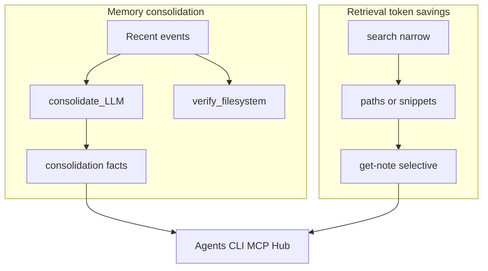

# Token savings branch — how the system works and what to improve

## Goals (original intent, full circle)

Knowtation began around **spending fewer tokens** while still giving agents the right context. Much of the work since has been **environment, Hub, billing, memory, and tooling**. This workstream **closes the loop**: explain the mechanisms in **plain language**, map them to **what shipped**, and **recommend changes** (docs-only at minimum; code when justified) so the **token savings story** matches reality and gets stronger.

**Deliverables**

- **Git:** All changes for this narrative live on branch **`feature/token-savings`** so they do not cross with unrelated repo work.
- **Minimum:** Documentation updates that unify consolidation, retrieval, and agent paths (CLI/MCP/Hub) under one “how we save tokens” explanation.
- **Likely:** Concrete improvements (config, prompts, privacy alignment, tests) discovered during review — same branch, each with tests where code changes.

---

## Git workflow (first step when you execute)

1. From your current base branch (e.g. `main` or your integration branch), run: `git fetch` and `git checkout -b feature/token-savings`.
2. Open PRs from **`feature/token-savings`** only for this theme (docs + any token-savings-related code).
3. Keep other feature work on separate branches to avoid merge noise.

---

## How the system saves tokens / API cost (simple but precise)

**A — Memory consolidation (daemon / Hub cron)**

Raw **memory events** pile up. The **consolidate** pass groups them by **topic** and makes **one LLM call per topic** (only topics with **2+** events), producing a few **fact strings** stored as `consolidation` events. That **compresses history** so future context is smaller than replaying every event.

**Default “two passes”:** **consolidate** (LLM) + **verify** (filesystem only — stale path detection). Optional **discover** adds **another LLM call** across topics; it is **off** by default.

**Guardrails that also cap spend:** lookback hours, max events/topics per pass, optional **daily USD cap** ([`lib/daemon.mjs`](lib/daemon.mjs)), hosted **cooldown** ([`hub/bridge/server.mjs`](hub/bridge/server.mjs)), Hub billing meters ([`hub/gateway/billing-middleware.mjs`](hub/gateway/billing-middleware.mjs)).

**B — Retrieval “two-step” (not the same as consolidation)**

[`docs/GETTING-STARTED.md`](docs/GETTING-STARTED.md) and [`docs/RETRIEVAL-AND-CLI-REFERENCE.md`](docs/RETRIEVAL-AND-CLI-REFERENCE.md): narrow **`search`** (e.g. paths only, small `--limit`) then **`get-note`** for full content. That saves **retrieval tokens** for agents; it complements consolidation rather than replacing it.

**C — Using “all the tools” together**

- **CLI / MCP:** tiered search + get-note; optional memory-aware tools where configured.
- **Hub:** hosted consolidation + billing; same mental model: **compress memory**, **retrieve narrowly**, **expand on demand**.

Implementation anchors: [`lib/memory-consolidate.mjs`](lib/memory-consolidate.mjs), [`docs/MEMORY-CONSOLIDATION-GUIDE.md`](docs/MEMORY-CONSOLIDATION-GUIDE.md), [`docs/DAEMON-CONSOLIDATION-SPEC.md`](docs/DAEMON-CONSOLIDATION-SPEC.md).

---

## Recommended improvements (for implementation on this branch)

1. **Docs — single narrative:** One short doc (or a clear section in an existing doc) that states **three levers**: (1) consolidation passes and defaults, (2) retrieval two-step, (3) when to enable **discover** vs cost. Link to config keys and Hub limits.

2. **`memory.encrypt` vs consolidate:** **Discover** can send topic-only prompts when encrypt is on; **consolidate** still builds prompts from event `data` ([`buildConsolidationPrompt`](lib/memory-consolidate.mjs)). Either **document** the real boundary (at-rest vs LLM egress) or **align behavior** so expectations match — pre-launch important.

3. **Model routing per pass (optional):** [`completeChat`](lib/llm-complete.mjs) defaults; consider different models for consolidate vs discover after measuring quality.

4. **Verification:** `dry_run` consolidation, then real pass on a **copy** vault; run [`test/memory-consolidate.test.mjs`](test/memory-consolidate.test.mjs) and hub consolidation tests in CI locally.

5. **Hosted vs self-hosted:** Bridge cooldown/cost persistence vs local hub ([`hub/bridge/server.mjs`](hub/bridge/server.mjs), [`hub/server.mjs`](hub/server.mjs)) — document differences so “token savings” claims are accurate per deployment.

---

## Review workflow: Sonnet vs Opus

- **Faster models:** Code reading, test runs, doc drafting.
- **Stronger models (e.g. Opus):** Threat modeling, privacy policy alignment, abuse scenarios — use for a structured **pre-launch** pass alongside the table below.

---

## Security, safety, and privacy — verify before public launch

| Area | Why it matters |
|------|----------------|
| **Data sent to LLM providers** | Consolidate prompts include serialized event `data` (truncated per event in [`buildConsolidationPrompt`](lib/memory-consolidate.mjs)). Subprocessor disclosure must match. |
| **`memory.encrypt` semantics** | At-rest encryption vs **egress to OpenAI/Anthropic/Ollama** — document or fix (see improvements). |
| **Auth and scheduling** | Service JWTs per user ([`netlify/functions/consolidation-scheduler.mjs`](netlify/functions/consolidation-scheduler.mjs)); no sensitive vault content in logs. |
| **Rate limits and billing** | Cooldown, caps, `BILLING_ENFORCE` behavior vs product terms. |
| **Hub client tokens** | `localStorage` bearer tokens ([`web/hub/hub.js`](web/hub/hub.js)) — XSS/CSP posture. |

Product/legal: privacy policy, retention/deletion, incident contact, DPA/subprocessors where applicable.

---

## Suggested execution order (when you leave plan-only mode)

1. Create **`feature/token-savings`** and push.
2. Land **documentation** first (coherent token savings story + encrypt/LLM boundary).
3. Run **tests** + **manual dry_run** consolidation.
4. Implement **targeted code/config** improvements with tests; keep security table as gate for launch messaging.
