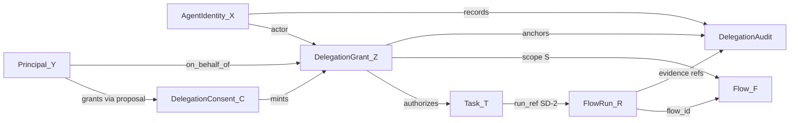

# Agent Delegation v0 — Canonical Spec (Knowtation)

Status: **Contract only — Thinking step (7C-2).** This is the frozen, canonical spec for **agent
identity, ownership, delegation consent, runtime grants, and tamper-evident audit** — the composition
layer above Phase 7A Flow, **SD-2** (task↔run linkage), **SD-5** (external-agent Flow access grants),
Phase 2G Tasks, and Phase 7 orchestration. **No implementation, no routes, no MCP/CLI wiring, no
posture flip, and no live delegation capability ships in this step.** Mechanical implementation
(identity/delegation store, handlers, seven-tier test bodies) is **7C-6 (Thinking → Auto)**, written
to this contract without redesigning it.

Authored on branch **`feat/agent-delegation-v0-spec`** (Knowtation). Always target the repo
explicitly with `muse -C ~/knowtation …`.

Related:

- `scooling/docs/AGENT-OWNERSHIP-AND-DELEGATION-PLAN.md` — architecture plan (7C-1, accepted).
- `scooling/docs/CROSS-REPO-COORDINATION.md` — **SD-2** (task↔run), **SD-5** (external grants),
  **SD-4** (proposals write path); **SD-9** and **SD-10** recorded on spec acceptance (7C-3).
- `docs/FLOW-V0-SPEC.md` — Flow scope, runs, procedure portability substrate.
- `docs/FLOW-EXTERNAL-AGENT-CONTRACT-7A-L2.md` — SD-5 grant-gated external access (independent gate).
- `docs/FLOW-EXECUTION-GATE-CONTRACT-7A-L3.md` — SD-6 automatable execution (independent gate).
- `scooling/docs/AGENT-ARCHITECTURE.md` — external agents as scoped clients; review-before-write.
- `scooling/docs/ADAPTER-CONTRACTS.md` — `AgentIdentityAdapter`, `DelegationAdapter` (7C-4, inert-first).

**Scope fence (7C-2):** wire schemas + identity/delegation model + consent/grant lifecycle + audit
rules + separation from SD-5/SD-6 + error taxonomy + security/privacy checklist + seven-tier test
matrix **only**. **Not** in scope: store impl, routes, MCP/CLI wiring, OpenAPI edits (land **with**
routes in 7C-6), Scooling adapter impl (7C-4), or flipping `DELEGATION_ENABLED`.

---

## Simple summary

Today an agent can follow a saved workflow (a **Flow**) and work on a to-do (**task**). What is
missing is a clear, enforceable answer to: **who owns this agent**, **who is it acting for**, and
**what proof exists that the action was authorized**.

This spec defines four canonical records — all owned by Knowtation, never by Scooling:

1. **Agent identity** — is this agent *mine*, *the team's*, or a *delegate*?
2. **Delegation consent** — did the principal *explicitly* permit someone to act on their behalf?
3. **Delegation grant** — a short-lived runtime ticket that binds actor + principal + task/run scope.
4. **Delegation audit** — a pointer-safe log entry for every delegated action.

Nothing turns on in this step. The rules are frozen so implementation (7C-6) and inert Scooling
adapters (7C-4) can be built mechanically without redesign.

## Technical summary

Agent Delegation v0 adds a **canonical identity + consent + audit substrate** in Knowtation. Four
open wire schemas, each discriminated by `schema`:

- `knowtation.agent_identity/v0` — registry entry: kind (`user_owned` \| `org_owned` \| `delegate`),
  owner ref (hashed), scope ceiling, status.
- `knowtation.delegation_consent/v0` — durable principal permission: who may delegate, to which agent,
  at which scope, with optional Flow/task constraints; created via SD-4 proposals.
- `knowtation.delegation_grant/v0` — short-lived runtime authority minted from consent; pins optional
  `task_ref` / `run_ref` (SD-2); version-pinned `flow_id` + `flow_version` when Flow-bound.
- `knowtation.delegation_audit/v0` — append-only operational entry: ids/hashes/pointers only.

**Principal vs actor:** the **principal** is the human (or org role) on whose behalf work is
authorized; the **actor** is the `agent_identity` performing steps. They differ whenever delegation
is in play.

**Gate independence:** SD-5 (`flow_external_grant/v0`) governs *Flow access* for third-party agents;
7C delegation governs *on-behalf-of principal binding*. SD-6 (`flow_execution_consent/v0`) governs
*automatable server orchestration*. None substitutes for another.

Scooling mirrors with compile-time `DELEGATION_AUTHORIZED` + env double-lock (consumer contract in
7C-4); all effects default **off**.

---

## 0. Design decisions (recorded as SD-9 and SD-10)

**How are agent identity and ownership canonical?** Recorded once in
`scooling/docs/CROSS-REPO-COORDINATION.md` → Standing Decisions as **SD-9** (7C-3).

**How is delegation consent captured and enforced?** Recorded once as **SD-10** (7C-3).

See §12 Acceptance for the exact SD-9/SD-10 wording ratified with this spec.

---

## 1. Identity model

### 1.1 Agent identity kinds

| Kind | Wire value | Definition | Typical owner | Scope ceiling default |
| --- | --- | --- | --- | --- |
| **User-owned** | `user_owned` | Agent instance bound to one human principal | The user | `personal` |
| **Org-owned** | `org_owned` | Agent provisioned by workspace/org policy | Organization / workspace admin | `project` or `org` |
| **Delegate** | `delegate` | Agent explicitly authorized to act **on behalf of** another principal | Delegator grants; agent owned by delegatee or org | Never wider than delegator's visible scope ∩ grant |

### 1.2 Principal vs actor

| Role | Definition | Resolved from |
| --- | --- | --- |
| **Principal** | Human (or org role) **on whose behalf** work is authorized | Verified session + vault/workspace binding — **never** from Flow step text, task title, or agent `label` |
| **Actor** | `agent_identity` performing steps (orchestrator dispatch, external MCP client, automatable runner) | Valid `agent_id` in identity registry + optional valid `delegation_grant/v0` when actor ≠ principal |

**Rule:** `actor_ref` ≠ `principal_ref` unless the agent is `user_owned`, the session principal
matches the owner, and **no** delegation grant is required for the action.

### 1.3 Procedure ownership and portability (extends Flow scope)

Flow scope (`personal` \| `project` \| `org`) from 7A is unchanged. This spec adds **ownership and
carry rules** for procedures and optional default agent bindings:

| Flow scope | Owned by | Travels with user | On user departure |
| --- | --- | --- | --- |
| `personal` | Authoring user | Yes — across vaults/workspaces where user retains membership + read/run tier | Personal Flows remain user's |
| `project` | Project/workspace | While project membership + run authority hold | Canonical project Flow **stays**; user may retain personal export/fork only |
| `org` | Organization | No — org asset | Org Flows do not depart; personal exports only where export policy allows |

**Default agent binding** (optional metadata on Flow or user preference): records which
`agent_identity` normally runs a Flow for a principal. Canonical in Knowtation; changing a binding
is an **SD-4 proposal**, not a silent UI toggle.

---

## 2. Delegation chain (required reconstructability)

Every delegated action MUST be reconstructable from canonical records:

```text
agent_identity (actor, owned-by X)
  → acts on-behalf-of principal (Y)
  → authorized by delegation_grant (Z) ← minted from delegation_consent (C)
  → on task (T) ↔ flow_run (R)   [SD-2 linkage when run exists]
  → executing Flow (F) at scope (S) [optional version pin]
  → step evidence / verification pointers
  → audit record (delegation_audit)
```



### 2.1 Task integration (SD-2)

Phase 2G tasks link to Flow runs by id (both canonical in Knowtation):

- `task.run_ref` → `flow_run.run_id`
- `flow_run.task_ref` → `task.task_id`

Delegation grants MAY pin:

- `allowed_task_ids[]` on consent (optional allowlist), or
- `task_ref` on grant (optional single-task pin), or
- `allowed_flow_ids[]` + scope tier on consent (broader pattern),

but **never** widen scope beyond principal authority. A task may exist before any run; delegation
may authorize task-level actions before `run_ref` is set — run creation still follows 7A/SD-6 gates.

---

## 3. Wire schemas (v0, open, versioned)

All four shapes carry a `schema` discriminator. Field tables are normative; `jsonc` blocks are
illustrative fixtures.

### 3.1 Pinned enums (v0)

| Enum | Field | Values (v0) | Notes |
| --- | --- | --- | --- |
| `AgentKind` | `agent_identity.kind` | `user_owned` \| `org_owned` \| `delegate` | |
| `IdentityStatus` | `agent_identity.status` | `active` \| `suspended` \| `revoked` | `revoked` is terminal |
| `Scope` | consent/grant `scope` | `personal` \| `project` \| `org` | Aligns with Flow scope; default `personal` |
| `ConsentStatus` | derived | `active` \| `revoked` \| `expired` | `revoked_at` set ⇒ revoked; past `expires_at` ⇒ expired |
| `GrantStatus` | derived | `active` \| `revoked` \| `expired` \| `exhausted` | `action_count >= max_actions` ⇒ exhausted |
| `AuditAction` | `delegation_audit.action` | `advance_step` \| `complete_task` \| `propose_outcome` \| `invoke_tool` \| `mint_subgrant` | Bounded enum; extend only via new schema version |
| `ExecutionLocation` | `delegation_audit.execution_location` | `local` \| `hosted` \| `hybrid` | Optional; Phase 8B vocabulary — does not replace consent checks |

### 3.2 Pinned id formats (v0)

| Object | `*_id` format | Example |
| --- | --- | --- |
| Agent identity | `agent_<token>` — `token` is `[a-z0-9_]{8,48}` | `agent_tutor_01` |
| Delegation consent | `dcons_<token>` — `token` is `[a-z0-9_]{8,48}` | `dcons_class_fall` |
| Delegation grant | `dgrnt_<token>` — `token` is `[a-z0-9_]{8,48}` | `dgrnt_session_x` |
| Delegation audit | `daud_<token>` — `token` is `[a-z0-9_]{8,48}` | `daud_20260621_01` |
| Owner/principal ref | `uid_hash:<64-hex>` only in v0 delegation paths; `org_ref:<workspace_id>` is **reserved, not accepted in v0** | `uid_hash:abc…` |
| Workspace | `ws_<slug>` | `ws_class_101` |

**Ref fields** (`task_ref`, `run_ref`, `flow_id`) reuse formats from FLOW-V0-SPEC §1.2 and Phase 2G
task ids (`task_<token>`).

### 3.3 `knowtation.agent_identity/v0` — who owns this agent instance

| Field | Type | Req | Description |
| --- | --- | --- | --- |
| `schema` | const `knowtation.agent_identity/v0` | yes | Discriminator |
| `agent_id` | string (`agent_<token>`) | yes | Stable id |
| `kind` | `AgentKind` | yes | |
| `owner_ref` | string (`uid_hash:…` only in v0) | yes | Hashed user id — **never** raw PII; `org_ref:` is reserved, not accepted in v0 |
| `vault_id` | string | yes | Binding vault |
| `scope_ceiling` | `Scope` | yes | Max scope this agent may operate in |
| `label` | string | no | Untrusted display; **never** used for auth |
| `status` | `IdentityStatus` | yes | |
| `created` | ISO8601 | yes | |
| `updated` | ISO8601 | yes | |

```jsonc
{
  "schema": "knowtation.agent_identity/v0",
  "agent_id": "agent_tutor_01",
  "kind": "user_owned",
  "owner_ref": "uid_hash:0123456789abcdef0123456789abcdef0123456789abcdef0123456789abcdef",
  "vault_id": "default",
  "scope_ceiling": "personal",
  "label": "My tutor agent",
  "status": "active",
  "created": "2026-06-21T00:00:00Z",
  "updated": "2026-06-21T00:00:00Z"
}
```

| Rule | Contract |
| --- | --- |
| **Registry authority** | Identity records are canonical in Knowtation only; Scooling never stores them |
| **Durable changes** | Create/update/revoke identity routes through **SD-4 proposals** (`intent: agent_identity_register` / `agent_identity_update`) |
| **Label untrusted** | `label` is display-only; principal/owner resolution ignores it |
| **Cross-scope deny** | An agent's effective scope = `scope_ceiling` ∩ caller visible tier ∩ grant scope |
| **No client principal** | Handlers reject client-supplied `principal_ref` not derivable from verified session; `org_ref:` is **reserved, not accepted in v0** |

### 3.4 `knowtation.delegation_consent/v0` — principal explicitly permits delegation

| Field | Type | Req | Description |
| --- | --- | --- | --- |
| `schema` | const `knowtation.delegation_consent/v0` | yes | |
| `consent_id` | string (`dcons_<token>`) | yes | |
| `principal_ref` | string | yes | Hashed principal — server-derived |
| `delegate_agent_id` | string | yes | Must reference an `active` `agent_identity` |
| `scope` | `Scope` | yes | |
| `workspace_id` | string | no | Required when `scope` is `project` or `org` |
| `allowed_flow_ids` | string[] | no | Optional allowlist; empty/absent = no Flow-id pin (scope still bounds) |
| `allowed_task_kinds` | string[] | no | Optional Phase 2G task kind filter |
| `allowed_task_ids` | string[] | no | Optional explicit task allowlist |
| `expires_at` | ISO8601 | no | Absent = no time expiry (policy may still cap) |
| `revoked_at` | ISO8601 \| null | yes | Set on revoke; terminal |
| `evidence_ref` | string | yes | `proposal:<id>` — SD-4 review-before-write promotion |
| `created` | ISO8601 | yes | |

```jsonc
{
  "schema": "knowtation.delegation_consent/v0",
  "consent_id": "dcons_class_fall",
  "principal_ref": "uid_hash:0123456789abcdef0123456789abcdef0123456789abcdef0123456789abcdef",
  "delegate_agent_id": "agent_tutor_01",
  "scope": "project",
  "workspace_id": "ws_class_101",
  "allowed_flow_ids": ["flow_weekly_review"],
  "allowed_task_kinds": ["assignment", "personal"],
  "expires_at": "2026-12-31T23:59:59Z",
  "revoked_at": null,
  "evidence_ref": "proposal:prop_abc123",
  "created": "2026-06-21T00:00:00Z"
}
```

| Rule | Contract |
| --- | --- |
| **Explicit only** | No silent delegation; no default org-wide "act for everyone" |
| **Proposal-backed** | Durable consent creation requires SD-4 approve/apply; no adapter writes canonical vault directly |
| **Revocable** | Revoke sets `revoked_at`; subsequent grant mint fails `403 DELEGATION_CONSENT_REVOKED` |
| **Scope-bound** | Consent scope = principal visible tier ∩ requested scope; never widened by agent or Flow text |
| **Classroom policy** | Org policy may forbid consent entirely ⇒ `403 DELEGATION_POLICY_FORBIDDEN` |

**Resolved open decision (7C-1 #2):** consent is **long-lived** (proposal-backed, optional `expires_at`);
runtime **`delegation_grant/v0`** is **short-lived** (default TTL 3600s, policy max 86400s) — mirrors
SD-5 grant TTL pattern.

### 3.5 `knowtation.delegation_grant/v0` — runtime authority for on-behalf-of actions

| Field | Type | Req | Description |
| --- | --- | --- | --- |
| `schema` | const `knowtation.delegation_grant/v0` | yes | |
| `grant_id` | string (`dgrnt_<token>`) | yes | |
| `consent_id` | string | yes | Must reference active consent |
| `actor_agent_id` | string | yes | Must match consent's `delegate_agent_id` |
| `principal_ref` | string | yes | Copied from consent; server-verified |
| `scope` | `Scope` | yes | ⊆ consent scope |
| `workspace_id` | string | no | When scope is `project` or `org` |
| `task_ref` | string | no | Optional pin to one task |
| `run_ref` | string | no | Optional pin; SD-2 link |
| `flow_id` | string | no | When Flow-bound |
| `flow_version` | semver | no | **Pinned** when `flow_id` set — mismatch ⇒ `403 DELEGATION_GRANT_FLOW_MISMATCH` |
| `expires_at` | ISO8601 | yes | Short-lived |
| `revoked_at` | ISO8601 \| null | yes | |
| `max_actions` | int | no | Optional cap; `0` = unlimited (policy may forbid) |
| `action_count` | int | yes | Server-maintained; never client-writable |
| `issued_at` | ISO8601 | yes | |

```jsonc
{
  "schema": "knowtation.delegation_grant/v0",
  "grant_id": "dgrnt_session_x",
  "consent_id": "dcons_class_fall",
  "actor_agent_id": "agent_tutor_01",
  "principal_ref": "uid_hash:0123456789abcdef0123456789abcdef0123456789abcdef0123456789abcdef",
  "scope": "project",
  "workspace_id": "ws_class_101",
  "task_ref": "task_hw_week3",
  "run_ref": "run_2026w25",
  "flow_id": "flow_weekly_review",
  "flow_version": "1.4.0",
  "expires_at": "2026-06-22T00:00:00Z",
  "revoked_at": null,
  "max_actions": 50,
  "action_count": 0,
  "issued_at": "2026-06-21T09:00:00Z"
}
```

| Rule | Contract |
| --- | --- |
| **Mint from consent** | Grant mint requires active, non-revoked, non-expired consent matching actor + scope |
| **Short-lived** | Default TTL 3600s; policy max 86400s; expired ⇒ `403 DELEGATION_GRANT_EXPIRED` |
| **Version-pinned Flow** | When `flow_id` present, `flow_version` required; bump requires re-mint (anti-drift, SD-5 parity) |
| **Revocable** | Revoke immediate; subsequent actions fail `403 DELEGATION_GRANT_REVOKED` |
| **No bearer in records** | Optional one-time mint secret (7C-6) follows SD-5 pattern: returned once at mint, hashed server-side, never in list/audit/projection |
| **In-flight on revoke** | **Resolved (7C-1 #3):** in-flight run on pinned grant **may finish** steps already authorized on that grant version; new steps/actions fail closed (mirror SD-5 version-pin policy) |

### 3.6 `knowtation.delegation_audit/v0` — pointer-safe audit entry

| Field | Type | Req | Description |
| --- | --- | --- | --- |
| `schema` | const `knowtation.delegation_audit/v0` | yes | |
| `audit_id` | string (`daud_<token>`) | yes | |
| `grant_id` | string | yes | |
| `actor_agent_id` | string | yes | |
| `principal_ref` | string | yes | Hashed |
| `task_ref` | string | no | When task-scoped |
| `run_ref` | string | no | When run exists (SD-2) |
| `flow_id` | string | no | |
| `flow_version` | semver | no | |
| `step_id` | string | no | `<flow_id>#<n>` when step-scoped |
| `action` | `AuditAction` | yes | |
| `evidence_refs` | string[] | yes | `proposal:…`, artifact hashes — **pointers only** |
| `occurred_at` | ISO8601 | yes | |
| `execution_location` | `ExecutionLocation` | no | Phase 8B metadata |

```jsonc
{
  "schema": "knowtation.delegation_audit/v0",
  "audit_id": "daud_20260621_01",
  "grant_id": "dgrnt_session_x",
  "actor_agent_id": "agent_tutor_01",
  "principal_ref": "uid_hash:0123456789abcdef0123456789abcdef0123456789abcdef0123456789abcdef",
  "task_ref": "task_hw_week3",
  "run_ref": "run_2026w25",
  "flow_id": "flow_weekly_review",
  "flow_version": "1.4.0",
  "step_id": "flow_weekly_review#1",
  "action": "advance_step",
  "evidence_refs": ["proposal:prop_xyz"],
  "occurred_at": "2026-06-21T09:00:00Z",
  "execution_location": "hosted"
}
```

| Rule | Contract |
| --- | --- |
| **Append-only** | Audit entries are never mutated or deleted (org retention export may archive separately) |
| **Content minimization** | No raw note bodies, prompts, completions, PII, or secrets |
| **Grant-anchored** | Every entry references a valid-at-time-of-action `grant_id` |
| **MuseHub enrichment** | Provenance anchoring (7A-L5) enriches audit for replay — MuseHub does not own permission |

---

## 4. Surfaces (triple-exposed when gate is ON — design only in 7C-2)

All surfaces require **`DELEGATION_ENABLED`** (default off, §8) and resolve authority server-side.
**7C-2 freezes shapes; 7C-6 wires them.**

| Surface | Register identity | Record consent | Mint grant | Revoke grant/consent | Append audit | List (metadata) |
| --- | --- | --- | --- | --- | --- | --- |
| **MCP** | `agent_identity_register` | `delegation_consent_propose` | `delegation_grant_mint` | `delegation_grant_revoke` / `delegation_consent_revoke` | `delegation_audit_append` | `agent_identity_list`, `delegation_grant_list` |
| **Hub REST** | `POST /api/v1/agents/identities` | `POST /api/v1/delegation/consents` | `POST /api/v1/delegation/grants` | `DELETE …/grants/{id}`, `DELETE …/consents/{id}` | `POST /api/v1/delegation/audit` | `GET …/identities`, `GET …/grants` |
| **CLI** | `knowtation agent identity register …` | `knowtation delegation consent propose …` | `knowtation delegation grant mint …` | `knowtation delegation grant revoke …` | `knowtation delegation audit append …` | `knowtation agent identity list` |

Consent propose/create converges on **SD-4 proposal machinery** (`intent: delegation_consent_create`);
grant mint/revoke/list and audit append converge on **one handler family** each. No surface
re-implements scope math — parity is proven by deep-equality (§10 tier 2).

### 4.1 Request — grant mint (`delegation_grant_mint`)

```jsonc
{
  "consent_id": "dcons_class_fall",     // REQUIRED — must be active
  "actor_agent_id": "agent_tutor_01",   // REQUIRED — must match consent.delegate_agent_id
  "task_ref": "task_hw_week3",          // OPTIONAL pin
  "run_ref": "run_2026w25",             // OPTIONAL pin; must match task.run_ref when both set (SD-2)
  "flow_id": "flow_weekly_review",      // OPTIONAL
  "flow_version": "1.4.0",              // REQUIRED when flow_id set
  "ttl_seconds": 3600                   // OPTIONAL; server caps at policy max
}
```

- Caller never supplies `principal_ref` or `scope` as authority — both derived from consent +
  verified session.
- `task_ref` not on consent allowlist (when allowlist non-empty) ⇒ `403 DELEGATION_TASK_DENIED`.
- `flow_id` not on consent allowlist ⇒ `403 DELEGATION_FLOW_DENIED`.

### 4.2 Response — mint (`knowtation.delegation_grant_mint/v0`)

```jsonc
{
  "schema": "knowtation.delegation_grant_mint/v0",
  "grant": { /* knowtation.delegation_grant/v0 — §3.5 */ },
  "bearer": "dgrnt_bearer_<opaque>",    // OPTIONAL one-time; 7C-6; never logged or listed
  "expires_at": "2026-06-22T00:00:00Z"
}
```

List/revoke responses use **`knowtation.delegation_grant/v0` only** — never `bearer`.

---

## 5. Separation from SD-5, SD-6, and SD-2

### 5.1 vs SD-5 (external-agent Flow access)

| Concern | External-agent gate (SD-5) | Delegation gate (7C) |
| --- | --- | --- |
| **Purpose** | Third-party agent may **read/run a pinned Flow version** with allowlisted tools | Actor may **act on behalf of principal** on scoped tasks/runs |
| **Authority record** | `knowtation.flow_external_grant/v0` | `knowtation.delegation_grant/v0` |
| **Consent record** | — (mint is operator-initiated) | `knowtation.delegation_consent/v0` (principal-backed) |
| **Typical bearer header** | `X-Flow-External-Bearer` | `X-Delegation-Bearer` (7C-6; design only here) |
| **Posture flag** | `FLOW_EXTERNAL_AGENT_ENABLED` | `DELEGATION_ENABLED` |
| **Cross-use** | **Forbidden** — SD-5 grant does not satisfy delegation; delegation grant does not authorize `external_tool` invoke |

A delegate external agent performing Flow work needs **both** gates when applicable: 7C for
on-behalf-of binding, SD-5 for external tool/harness access.

### 5.2 vs SD-6 (automatable execution)

| Concern | Execution gate (SD-6) | Delegation gate (7C) |
| --- | --- | --- |
| **Purpose** | Server orchestrates `automatable` steps | Records **who** acted for **whom** on task/run |
| **Authority** | `knowtation.flow_execution_consent/v0` | `knowtation.delegation_grant/v0` |
| **Trigger** | Knowtation automatable runner | Any delegated action (including manual/agent_assisted steps) |
| **Cross-use** | **Forbidden** — execution consent ≠ delegation grant; automatable path may **append** delegation audit when actor ≠ principal but does not mint delegation grants |

### 5.3 SD-2 (task ↔ run linkage)

Unchanged. Delegation audit references both `task_ref` and `run_ref` when a run exists. Grant mint
MAY validate `run.task_ref === task_ref` when both pins supplied.

---

## 6. Storage

**Decision: operational index (calendar/Flow parity).** Identity, consent, grant, and audit records
live in the Knowtation Hub/canister index — **not** in Scooling, **not** as MuseHub canonical state.

| Record | Index keys | Query patterns |
| --- | --- | --- |
| `agent_identity` | `agent_id`, `owner_ref`, `vault_id`, `kind`, `status` | by owner, by vault, by kind |
| `delegation_consent` | `consent_id`, `principal_ref`, `delegate_agent_id`, `scope`, `workspace_id` | by principal, by agent, active consents |
| `delegation_grant` | `grant_id`, `consent_id`, `actor_agent_id`, `principal_ref`, `expires_at` | active grants for actor/principal |
| `delegation_audit` | `audit_id`, `grant_id`, `principal_ref`, `task_ref`, `occurred_at` | timeline by principal/task/grant |

Durable consent and identity changes that affect vault notes still route through **SD-4 proposals**;
the index updates on approve/apply only.

---

## 7. Posture / gating (default off)

| Control | Where | Default | Tier to enable |
| --- | --- | --- | --- |
| **`DELEGATION_ENABLED`** | Knowtation Hub/CLI/MCP policy | **off** | Tier 3 |
| **`DELEGATION_AUTHORIZED`** | Scooling compile-time | **false** | Tier 3 (7C-4 consumer) |
| **`FLOW_EXTERNAL_AGENT_ENABLED`** | Knowtation | **off** | SD-5 — independent |
| **`FLOW_AUTOMATABLE_EXECUTION_ENABLED`** | Knowtation | **off** | SD-6 — independent |
| **Classroom / minor policy** | Org policy | may forbid delegation | `DELEGATION_POLICY_FORBIDDEN` |

Enabling any control above is **out of scope** for 7C-2 and 7C-6 initial impl — handlers ship with
gates off.

---

## 8. Error taxonomy (opaque codes; no scope/id/secret leak)

| Code | Status | When |
| --- | --- | --- |
| `DELEGATION_DISABLED` | 403 | gate off |
| `DELEGATION_POLICY_FORBIDDEN` | 403 | org/classroom policy forbids |
| `DELEGATION_IDENTITY_DENIED` | 403 | agent not found, suspended, or revoked |
| `DELEGATION_IDENTITY_SCOPE_DENIED` | 403 | agent `scope_ceiling` insufficient |
| `DELEGATION_CONSENT_REQUIRED` | 403 | no active consent for mint |
| `DELEGATION_CONSENT_REVOKED` | 403 | consent `revoked_at` set |
| `DELEGATION_CONSENT_EXPIRED` | 403 | past consent `expires_at` |
| `DELEGATION_GRANT_DENIED` | 403 | mint denied (tier, mismatch, etc.) |
| `DELEGATION_GRANT_EXPIRED` | 403 | past grant `expires_at` |
| `DELEGATION_GRANT_REVOKED` | 403 | grant `revoked_at` set |
| `DELEGATION_GRANT_EXHAUSTED` | 403 | `action_count >= max_actions` |
| `DELEGATION_GRANT_FLOW_MISMATCH` | 403 | flow/version pin mismatch |
| `DELEGATION_TASK_DENIED` | 403 | task not on consent allowlist |
| `DELEGATION_FLOW_DENIED` | 403 | flow not on consent allowlist |
| `DELEGATION_ACTOR_MISMATCH` | 403 | actor ≠ consent.delegate_agent_id |
| `DELEGATION_PRINCIPAL_MISMATCH` | 403 | session principal ≠ grant principal |
| `DELEGATION_CHAIN_INVALID` | 403 | validateChain failed (7C-4) |
| `unknown_agent` | 404 | missing **or** scope-invisible |
| `unknown_consent` | 404 | missing **or** scope-invisible |
| `unknown_grant` | 404 | missing **or** scope-invisible |

Codes never carry vault ids, grant bearers, raw identities, task bodies, or Flow instruction text.

---

## 9. Security and privacy checklist (sign-off required before 7C-L1)

| # | Requirement | Enforcement |
| --- | --- | --- |
| S1 | Scope is authorization (`personal` \| `project` \| `org`); deny by default | Server-side on every handler; UI filters never trusted |
| S2 | No silent delegation | Consent + grant required; org policy may forbid entirely |
| S3 | Principal from verified session only | Never from Flow text, task title, or agent `label` |
| S4 | Audit minimization | Hashes and ids only; no PII, prompts, completions, secrets |
| S5 | Review-before-write for durable consent/identity | SD-4 proposals; no new write path |
| S6 | Untrusted input posture | Flow instructions, task titles, labels = data; injection inert |
| S7 | Revocation immediate for new actions | In-flight pinned-grant finish per §3.5 (SD-5 parity) |
| S8 | SD-5 / SD-6 / 7C independence | No cross-substitution of grants or consents |
| S9 | Classroom / minors | Delegation may be disabled; teacher actions use org-owned agents + role authority |
| S10 | No Scooling canonical store | Identity, consent, grants, audit in Knowtation only |
| S11 | MuseHub enrich only | Provenance anchoring; never canonical grant/consent authority |
| S12 | Delegate agent ownership (7C-1 #1) | **Classroom:** org-owned delegate agents only; **personal:** user-owned with explicit consent |

---

## 10. Seven-tier test matrix (what each tier proves — design only)

Per project test standards. 7C-6 ships all seven tiers under `test/agent-delegation-*.test.mjs`,
with posture OFF by default and toggled ON only inside gated live tests (Tier 3). **No network in
unit tests.**

| Tier | File | What it proves (representative cases) |
| --- | --- | --- |
| **unit** | `test/agent-delegation-unit.test.mjs` | Four schemas validate; bearer never on grant list; scope intersection deterministic; `validateChain` rejects actor=principal mismatch when grant required; enum bounds enforced |
| **integration** | `test/agent-delegation-parity-integration.test.mjs` | MCP, Hub REST, CLI produce deep-equal grant/consent metadata; gate off ⇒ identical `DELEGATION_DISABLED` across surfaces |
| **e2e** | `test/agent-delegation-e2e.test.mjs` | propose consent → approve → mint grant → append audit → delegated action accepted; revoke ⇒ fail; consent expiry ⇒ mint fails; SD-2 task/run pin round-trip |
| **stress** | `test/agent-delegation-stress.test.mjs` | concurrent mints; grant table bounded; `action_count` atomic; expired grants cleaned; no bearer logged under load |
| **data-integrity** | `test/agent-delegation-data-integrity.test.mjs` | audit append preserves grant/task/run/flow pins; SD-2 reciprocal link validated when both refs set; consent→grant field copy integrity; export fixtures round-trip schema |
| **performance** | `test/agent-delegation-performance.test.mjs` | grant mint + validateChain p95 bounded on 1000-consent fixture; audit append O(1) index |
| **security** | `test/agent-delegation-security.test.mjs` | scope denial; no existence leak; injection in `label`/task title inert; **SD-5/SD-6/7C separation**; expired/revoked/mismatch denied; **no secrets** in list/audit/logs; client-supplied principal rejected; classroom policy deny |

---

## 11. Open decisions resolved in this spec

| # | Topic | Resolution |
| --- | --- | --- |
| 1 | Delegate agent ownership (classroom) | Classroom contexts: **org-owned delegate agents only**; personal contexts: user-owned with explicit consent (§9 S12) |
| 2 | Grant vs consent TTL | Consent long-lived (proposal-backed); runtime grants short-lived (default 3600s, max 86400s) — §3.4, §3.5 |
| 3 | In-flight run on revoke | Finish steps authorized on pinned grant version; new actions fail closed — §3.5 |
| 4 | Audit retention | Org retention export includes delegation audit separately from note bodies (align Phase 2G org policy) — §3.6 |
| 5 | SD-9 / SD-10 wording | Finalized in §12 and recorded in `CROSS-REPO-COORDINATION.md` (7C-3) |

---

## 12. Acceptance (7C-2)

- Four wire schemas (`agent_identity`, `delegation_consent`, `delegation_grant`, `delegation_audit`),
  identity/delegation model, consent/grant lifecycle, audit rules, SD-5/SD-6/SD-2 separation, posture
  defaults, error taxonomy, security checklist (§9), and seven-tier test matrix are frozen here —
  **contract only, no implementation, no route, no OpenAPI edit, no posture flip.**
- Ratified against `scooling/docs/AGENT-OWNERSHIP-AND-DELEGATION-PLAN.md` (7C-1),
  `docs/FLOW-V0-SPEC.md`, `docs/FLOW-EXTERNAL-AGENT-CONTRACT-7A-L2.md` (SD-5),
  `docs/FLOW-EXECUTION-GATE-CONTRACT-7A-L3.md` (SD-6), and SD-2 in
  `scooling/docs/CROSS-REPO-COORDINATION.md`.
- **SD-9** and **SD-10** recorded in `scooling/docs/CROSS-REPO-COORDINATION.md` (7C-3):

> **SD-9 — Agent identity and ownership are canonical in Knowtation, not embedded in Flows or
> Scooling.** Every acting agent resolves to a `knowtation.agent_identity/v0` record with kind
> `user_owned`, `org_owned`, or `delegate`, an hashed `owner_ref`, and a server-enforced
> `scope_ceiling`. **Principal** (on whose behalf work is authorized) and **actor** (the agent
> performing steps) are distinct unless the user-owned agent is acting for its owner with no
> delegation grant. Procedure ownership follows Flow scope: personal/project Flows travel with the
> user per membership and tier; org Flows remain org assets. Durable identity registry changes route
> through SD-4 proposals; Scooling orchestrates UI and dispatch only — never a second identity store.
> MuseHub enriches provenance only.

> **SD-10 — Delegation consent is explicit, revocable, scope-bound, and independent of Flow access
> grants.** A principal authorizes on-behalf-of work only via an approved
> `knowtation.delegation_consent/v0` (SD-4 proposal-backed, long-lived, optional expiry). Runtime
> authority is a short-lived `knowtation.delegation_grant/v0` minted from active consent — default
> TTL 3600s, policy max 86400s (SD-5 parity). No silent or org-wide default delegation. Revocation
> is immediate for new actions; in-flight work on a pinned grant may finish per grant version. Every
> delegated action appends a pointer-safe `knowtation.delegation_audit/v0` entry. SD-5
> `flow_external_grant/v0` governs external Flow/tool access only — it does **not** substitute for
> delegation consent or grants. SD-6 execution consent governs automatable orchestration only — it
> does **not** substitute for delegation. Implementation posture-gated OFF until Tier 3 (7C-L1).

- Muse-committed on `feat/agent-delegation-v0-spec`; handover regenerated to point at **7C-3** (done)
  then **7C-4** (Scooling inert adapters, after Phase 2G TaskAdapter).

## Non-goals (7C-2)

- No identity/delegation store impl, routes, or MCP/CLI wiring (7C-6).
- No Scooling `AgentIdentityAdapter` / `DelegationAdapter` impl (7C-4 — after 2G TaskAdapter).
- No flip of `DELEGATION_ENABLED` or Scooling `DELEGATION_AUTHORIZED` — enabling is Tier 3 (7C-L1).
- No replacement of SD-5, SD-6, SD-2, or 7A Flow store — compose only.
- No hosted workspace placement detail beyond audit metadata vocabulary (Phase 8B).

---

## Handoff notes (for 7C-6 — Thinking → Auto)

1. Branch is **`feat/agent-delegation-v0-spec`** (or successor impl branch); this spec is
   Muse-committed. Always target Knowtation with `muse -C ~/knowtation …`.
2. Add `lib/agent/delegation.mjs` (identity registry, consent proposal hook, grant mint/revoke,
   audit append, `validateChain`) per §3–§5.
3. Wire routes/MCP/CLI/OpenAPI **in the same change** as handlers (no docs-only PR to `main`).
4. Mirror Scooling consumer types in 7C-4 `AgentIdentityAdapter` + `DelegationAdapter` — all effects
   `false` until 7C-L1.
5. Ship all seven tiers green with gates off before handover regen.
