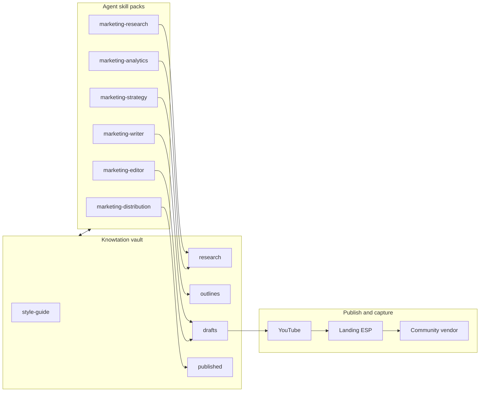

# Agent marketing structure and birth plan

**Branch:** `agent-birthday`  
**Audience:** Internal team standing up marketing agents for the first time, using **Knowtation** as the knowledge spine and third-party tools for capture, creative, and distribution.

This document merges two approaches: a **YouTube-first growth** narrative (long-form video, repurposing, lead magnet, email ladder, paid offers, scale) and a **content multiplication** playbook (curation, script pipeline, optional avatar + cloned voice, 30-day operational rhythm). 

---

## 1. Mission: give birth to agents, not only a plan

**In plain language:** We are not stopping at a written roadmap. We are **turning on** a small team of AI-assisted marketing roles (research, strategy, writing, editing, distribution, analytics), **connecting each role to Knowtation** so every draft and decision can be grounded in your vault, and **running the stack for real** so we learn how the product behaves with live data, real indexes, and real handoffs. Along the way we connect **MCP** (Knowtation server in the host), **CLI** (`knowtation` where MCP is not available), optional **Hub API** flows from [AGENT-INTEGRATION.md](./AGENT-INTEGRATION.md), and external products (Claude, YouTube, ESP, avatar tools, etc.).

**In technical terms:**

- **Agents** = configured runtimes (e.g. Cursor) + [skill packs](../.cursor/skills/packs/) under `.cursor/skills/packs/` (marketing-research through marketing-analytics) + the base [knowtation skill](../.cursor/skills/knowtation/SKILL.md) for vault I/O.
- **Knowtation** = Markdown vault + semantic search + optional MCP tools (`search`, `get_note`, `list_notes`, `write`, `index`, etc.); see [AGENT-ORCHESTRATION.md](./AGENT-ORCHESTRATION.md) and [AGENT-INTEGRATION.md](./AGENT-INTEGRATION.md).
- **Test flight** = each phase below includes **Knowtation actions** (read/write/index) and **connection checks** (MCP roots, `KNOWTATION_VAULT_PATH`, ESP webhooks only if you add them—never commit secrets).

**Success looks like:** agents routinely **read** `style-guide/`, `research/`, `outlines/`; **write** drafts and logs under `drafts/` and `published/` (or your template’s equivalents); you **re-index** after bulk imports; you can demonstrate one full loop: *curation note → script → repurposing packet → publish checklist → phase retrospective in vault*.

---

## 2. Beginner setup: skills, MCP, templates, Cursor, and Abacus

This section answers “what is what?” in **slow steps**. We will extend it as you get more detailed instructions from Abacus, your Hub host, and your vault.

### 2.1 Simple picture: three different things

Think of three layers that **sound** similar but are **not** the same:

| Layer | What it is | Who owns it | Analogy |
|-------|------------|-------------|---------|
| **A. Agent skills** | Short instruction files (usually `SKILL.md`) that tell an AI *how to behave* in a role: what to read, what order to work in, what to output. | **This repo (Knowtation)** under [`.cursor/skills/`](../.cursor/skills/): base [knowtation](../.cursor/skills/knowtation/SKILL.md) + [marketing packs](../.cursor/skills/packs/) (`marketing-research`, `marketing-strategy`, …). **Cursor** is the app that *loads* those skills when you or the agent use them—it is the “reader,” not the author of our marketing playbooks. | **Recipe cards** you wrote and keep in the kitchen drawer. |
| **B. MCP (Model Context Protocol)** | A **wire protocol** so an app (Cursor, Abacus, etc.) can call **tools** on a **server**: search a vault, read a note, write a note, index, … | The **Knowtation MCP server** is part of **this product** (see [AGENT-ORCHESTRATION.md](./AGENT-ORCHESTRATION.md)). Cursor (or Abacus) is just a **client** that connects to it if you add it to MCP settings. | **Power tools** plugged into the wall: the wall socket is MCP; Knowtation is one appliance. |
| **C. Vault templates** | Starter **folder layouts and example Markdown** for your *notes* (drafts, research, outlines, …). | **This repo** under `vault/templates/` (see [TEMPLATES-AND-SKILLS.md](./TEMPLATES-AND-SKILLS.md)). You **copy or seed** them into **your** vault path. **Cursor does not supply** these templates for Knowtation. | **Pantry labels and shelf layout** for where food goes—not the same as the recipe cards. |

**Direct answers to your questions:**

1. **“Are MCP skills something Cursor has?”**  
   Cursor has **MCP support** (it can talk to MCP servers). Cursor also has **Skills** (in Cursor’s sense: optional project or user skills, often `SKILL.md`). Our **marketing skill packs are not “Cursor’s” content**—they live in **this repository**. Cursor is where you often **invoke** them together: skills tell the model *what to do*; Knowtation MCP *tools* let it *search/read/write* the vault.

2. **“Are these the skills that are part of our MCP connection that we created ourselves?”**  
   **Partially.** We created **both** (a) **skill files** = behavior docs, and (b) **Knowtation MCP** = real tools hitting your vault/index. They work **together** but are **not the same file**. MCP is not “inside” a skill file; you **configure** MCP separately (e.g. Cursor MCP config pointing at `knowtation mcp`).

3. **“Are we using our templates or Cursor’s?”**  
   For the **Knowtation vault**, use **Knowtation’s templates** (`content-creation`, `business-ops`, etc.) from this repo. Cursor may have its own unrelated templates for *other* workflows; for **this** marketing system, the source of truth for folder structure and example notes is **Knowtation** ([TEMPLATES-AND-SKILLS.md](./TEMPLATES-AND-SKILLS.md)).

### 2.2 Seven marketing roles ↔ our skill packs

These match the “seven agents” workflow (research → … → analytics) that is our agent crew. Each row is **one skill pack** you can enable in Cursor; the same roles can be mirrored in [Abacus](https://apps.abacus.ai/) as separate deep agents or stages.

| # | Role | Skill pack path (this repo) | Main job |
|---|------|------------------------------|----------|
| 1 | Research | `.cursor/skills/packs/marketing-research` | Briefs, competitors, trends → `research/` |
| 2 | Strategy | `.cursor/skills/packs/marketing-strategy` | Positioning, calendar, personas → `outlines/` |
| 3 | Writing | `.cursor/skills/packs/marketing-writer` | Drafts, email, social, scripts → `drafts/` |
| 4 | Editor | `.cursor/skills/packs/marketing-editor` | Quality, style, claims → revises `drafts/` |
| 5 | Visual | `.cursor/skills/packs/marketing-visual` | Image briefs, brand notes |
| 6 | Distribution | `.cursor/skills/packs/marketing-distribution` | Channel plans, checklists → `published/` / playbooks |
| 7 | Analytics | `.cursor/skills/packs/marketing-analytics` | KPIs, reports → `research/` or reports |

The base **[knowtation skill](../.cursor/skills/knowtation/SKILL.md)** teaches *how* to call the CLI/MCP (search, `get-note`, tiered retrieval). Use it alongside any pack.

### 2.3 MCP prompts (optional fourth layer—easy to confuse)

Knowtation can also expose **MCP prompts** (server-side prompt templates that pull vault context)—listed in [TEMPLATES-AND-SKILLS.md](./TEMPLATES-AND-SKILLS.md) (`content-plan`, `search-and-synthesize`, etc.). Those are **not** the same as `.cursor/skills/` files; they are **invoked through the Knowtation MCP server** when your host lists them. If your Cursor build only shows **tools** and not prompts, rely on skills + tools first.

### 2.4 Setup path A — Cursor first (recommended for beginners)

Do these in order. Stop if any step fails and fix it before moving on.

**Step A1 — Open the correct folder in Cursor (the application repo root)**

**What “Knowtation” means here:** two different things confuse people:

| Name | What it is | Typical path on disk |
|------|------------|----------------------|
| **Knowtation application repo** | The **full source tree** you clone from git: Hub, MCP server, CLI, `docs/`, `.cursor/skills/`, `vault/templates/`, etc. | A folder whose **root** contains `package.json` with `"name": "knowtation"` and this file at `docs/AGENT-MARKETING-STRUCTURE.md`. |
| **Your vault** | The **Markdown notes** Knowtation indexes (can live **inside** this repo under `vault/` or **outside** it—your choice via `KNOWTATION_VAULT_PATH`). | e.g. `…/knowtation/vault/` or `…/MyNotes/` |

**You must open the application repo root in Cursor** (or a multi-root workspace that **includes** that root). If you open only a subfolder (e.g. only `hub/`) or only an **external** vault directory, you will **not** see `docs/` and `.cursor/skills/` next to each other—they are not generated on demand; they ship in the clone.

**Quick checks you are in the right place:**

1. In Cursor’s file explorer, you see **`docs/`** at the top level of the open folder.  
2. You see **`vault/`** at the same level (templates live at `vault/templates/…`).  
3. You see **`.cursor/skills/`** — a folder whose name **starts with a dot**. If you use macOS **Finder**, dot folders are **hidden** by default; use Cursor’s tree or Terminal: `ls -la` at the repo root. Some editors also hide dotfiles in settings—turn “show hidden” on if needed.  
4. At the repo root, **`package.json`** exists and starts with `"name": "knowtation"`.

If **none** of the above is true, you are not in the application repo root: clone your team’s Knowtation **application** repository (full tree, not a vault-only export), then use **File → Open Folder** in Cursor and select that clone’s **top-level** directory—the one that contains `package.json`, `docs/`, and `vault/`.

**Step A2 — Choose your vault directory**  
Knowtation needs a folder of Markdown notes. Either use an existing vault or create an empty folder and point config at it. Your env or `config/local.yaml` should set vault path per [AGENT-INTEGRATION.md](./AGENT-INTEGRATION.md) (`KNOWTATION_VAULT_PATH`).

**Step A3 — (Optional) Seed vault layout from our templates**  
Copy or seed from `vault/templates/content-creation/` (and optionally `business-ops/`) so you get `drafts/`, `research/`, `outlines/`, etc. This uses **our** templates, not Cursor’s.

**Step A4 — Index once**  
From a terminal in the project (with deps configured): run `knowtation index` so search works. If this fails, MCP search will also fail until indexing succeeds.

**Step A5 — Connect Knowtation MCP in Cursor**  
Add the Knowtation MCP server to your Cursor MCP settings (same pattern as [AGENT-ORCHESTRATION.md](./AGENT-ORCHESTRATION.md): `command` + `args` + `env` including `KNOWTATION_VAULT_PATH`). Restart or reload MCP if needed.

**Step A6 — Smoke test**  
In chat, ask the agent to run a **small** search and open **one** note (tiered retrieval: low limit, then `get_note` for one path). Confirm you see real vault paths.

**Step A7 — Use one skill pack intentionally**  
For example, `@marketing-research` (or your Cursor UI equivalent) and ask for a brief on one topic; confirm outputs reference vault paths you expect.

**What “done” means for Step 2.4:** you can search, read, and (if policy allows) write notes from Cursor via MCP, and at least one marketing skill has been used end-to-end.

### 2.5 Setup path B — Abacus + Knowtation (after Cursor works)

Abacus ([apps.abacus.ai](https://apps.abacus.ai/)) can participate in the same system, but cloud agents often **cannot** reach a MCP server running only on your laptop unless Abacus supports your transport (see [Abacus MCP documentation](https://abacus.ai/help/chatllm-ai-super-assistant/mcp-servers/)).

**Step B1 (usually easiest)** — Give Abacus **Hub URL + token** so agents call the same APIs humans use: search, read, proposals. Your Hub UI already describes this pattern for Abacus (`Hub URL + KNOWTATION_HUB_TOKEN`); see the “Abacus” card in the Hub how-to (mirrored conceptually in [AGENT-INTEGRATION.md](./AGENT-INTEGRATION.md)).

**Step B2** — Create **seven** Abacus agents (or one workflow with seven stages) whose instructions match the table in §2.2 and require them to **cite vault paths** in outputs.

**Step B3** — Optional: add **Knowtation MCP** inside Abacus when their UI supports a reachable MCP endpoint for your deployment.

**Update log:** As Abacus or Hub gives you click-by-click screenshots or JSON samples, paste summaries into `docs/` or your vault `playbooks/` and we will fold them into this §2.

### 2.6 Hosted Knowtation vs local repo (what you need to know)

You can have **both** at once: the **git clone** on your laptop (with `.cursor/skills/`, `docs/`, source code) and the **hosted Hub** in the browser where teammates and agents actually work. They are not the same layer.

| Topic | **Local (self-hosted / dev clone)** | **Hosted (cloud Hub + canister)** |
|--------|--------------------------------------|-----------------------------------|
| **Where you work** | Cursor opened on the **repo root**; optional Hub at `http://localhost:3333` | Browser: **knowtation.store/hub/** (see [TWO-PATHS-HOSTED-AND-SELF-HOSTED.md](./TWO-PATHS-HOSTED-AND-SELF-HOSTED.md)) |
| **Where notes live** | A **folder on disk** you set (`KNOWTATION_VAULT_PATH`) | **Canister / cloud storage** behind the gateway—Settings shows vault as **“Canister”** |
| **Teammates** | Everyone needs the same vault path + Hub deploy (you operate infra) | **Sign in** (e.g. Google/GitHub via gateway); isolation and roles are **our** hosted backend |
| **Indexing / embeddings** | You configure `config/local.yaml`, run `npm run index` or Hub **Re-index** | **We run indexing** for you; you do not need local Qdrant/Ollama for normal hosted use |
| **Backup** | Git in vault folder, `knowtation vault sync`, etc. | Optional **Connect GitHub** so your notes are also pushed to **your** repo |

**How this still “applies” if you use hosted:**

1. **`.cursor/skills/` in the repo** — These files are **instructions** for AI behavior. They do **not** move into the canister by themselves. You still use them from **Cursor** when you want the model to follow the marketing playbooks; they are versioned in **git**. Teammates get the same behavior if they open the **same repo** in Cursor or if you copy the skill text into your team wiki—**the hosted Hub does not replace skill files**; it replaces **where the Markdown vault lives** and **how search/write hit the backend**.

2. **Agents (Cursor, Abacus, scripts) → hosted data** — They should talk to Knowtation over the **network**, not `KNOWTATION_VAULT_PATH` on disk:  
   - **Hub REST API** — `KNOWTATION_HUB_URL` + `Authorization: Bearer <JWT>` + `X-Vault-Id`; copy from Hub **Settings → Integrations → Hub API** ([AGENT-INTEGRATION.md](./AGENT-INTEGRATION.md) §3).  
   - **Hosted MCP** — `POST /mcp` on the gateway with **OAuth or Hub JWT** ([AGENT-INTEGRATION.md](./AGENT-INTEGRATION.md) §2 “Hosted MCP”). Same tools as local MCP, but **no** local vault path in the MCP env—the session is tied to **your logged-in user and vault**.

3. **JWT lifetime** — Hub API tokens **expire**. When tools return `401`, sign in again and **re-copy** URL + token + vault from Integrations.

4. **Roles** — Hosted MCP sessions respect **viewer / editor / admin** tool access; align teammate permissions with what they should automate vs approve.

5. **Why keep the local clone at all?** — Product development, reading/updating `docs/`, running tests, and optionally pointing **local** MCP at a **test** vault. **Day-to-day marketing vault + collaboration** = hosted Hub.

**Practical split for your team:** use **hosted Hub** as the **system of record** for notes; use **Hub API or hosted MCP** for Abacus and automation; use **Cursor + this repo** for engineering and for agent sessions that should follow the **skill packs**—configured to hit **hosted** via JWT/OAuth, not only local disk.

---

## 3. Layman’s overview: what we are building

1. **Pick one flagship channel** (recommended: long-form YouTube) and publish **consistently** so the algorithm and audience know what to expect.  
2. **Plan topics on purpose** (short weekly curation ritual) so you are not guessing titles at midnight.  
3. **Use AI for heavy drafting** (scripts, emails, social variants) while a human **approves voice, facts, and claims**.  
4. **Optional:** use an **avatar + synthetic voice** stack so the same face and voice can deliver scripts without a full film crew every time—still reviewed by a human before publish.  
5. **Offer something specific for an email** (lead magnet) tied to each video’s topic, not a generic “subscribe to updates.”  
6. **Automate a short email sequence** that teaches, builds trust, and introduces a paid offer.  
7. **Sell a small paid product** (community + curriculum style) and, later if it fits, a **higher-touch service**.  
8. **Document everything in Knowtation** so the next agent session (or human teammate) does not start from zero.

---

## 4. Technical overview: systems map

- **Creative IP and SOPs** live in the vault; **agents** pull context via MCP/CLI and write back structured Markdown.  
- **YouTube** is the primary **attention** engine; **landing + ESP** is **permission** and **conversion**; **community / course host** is **delivery** for paid tiers.

---

## 5. Knowtation integration (use the product to the fullest)

| Area | Doc or path | What to do in each phase |
|------|-------------|---------------------------|
| Vault layout | [TEMPLATES-AND-SKILLS.md](./TEMPLATES-AND-SKILLS.md) | Prefer **`content-creation`** folders: `drafts/`, `research/`, `outlines/`, `published/`, `style-guide/`. Add **`business-ops`** (`decisions/`, `playbooks/`, `customers/`) if you track GTM decisions and customers. |
| Marketing agents | Same doc, “Marketing and organization agents” table | Enable packs in order: research → strategy → writer → editor → distribution → analytics. |
| MCP vs CLI | [AGENT-ORCHESTRATION.md](./AGENT-ORCHESTRATION.md) | Cursor: configure Knowtation MCP server; headless scripts: use `knowtation` CLI with `--json`. |
| Hub / proposals | [AGENT-INTEGRATION.md](./AGENT-INTEGRATION.md) | If your deployment gates writes, use proposal/capture APIs where your policy requires—do not bypass audit rules. |
| Token-efficient retrieval | [RETRIEVAL-AND-CLI-REFERENCE.md](./RETRIEVAL-AND-CLI-REFERENCE.md), [knowtation SKILL](../.cursor/skills/knowtation/SKILL.md) | Search with small `--limit` and shallow `--fields`, then `get-note` only for winners. |
| MCP prompts (examples) | [TEMPLATES-AND-SKILLS.md](./TEMPLATES-AND-SKILLS.md) | `content-plan`, `search-and-synthesize`, `project-summary`, `daily-brief`, `knowledge-gap`, `extract-entities`, `temporal-summary`—invoke from agents where the host exposes Knowtation MCP prompts. |

**Birth checklist (run once, then per sprint):**

1. Vault path set (`KNOWTATION_VAULT_PATH` or config); MCP server starts without errors.  
2. `knowtation index` (or host-driven index) completes after large imports.  
3. One **style-guide** note exists and is cited in agent instructions.  
4. One **decision** note records: flagship channel, ESP choice, avatar yes/no.  
5. After each weekly sprint: **`knowtation write`** a short retrospective (what shipped, metrics, next experiments).

---

## 6. Master timeline (merged: pre-flight, 30 days, then months)

This table **layers** a blueprint-style first month onto a longer GTM ramp. Dates are **relative** (start = Day 1 when you commit).

| When | Focus | Exit criteria (examples) |
|------|--------|---------------------------|
| **Days −7–0** | Pre-flight audit; vault seeded; style guide v0; pillars and ICP drafted | Knowtation searchable; `outlines/positioning-*` or equivalent exists; channel choice documented in `decisions/` |
| **Days 1–7** | AI script workspace live; optional avatar account + first test render; **parallel** lead magnet + landing + ESP account | One sample script in vault; magnet PDF or page spec in `research/`; ESP receives a test double opt-in |
| **Days 8–14** | Curation ritual weekly; script QC checklist; first **real** long-form script approved | Three curation logs in `research/`; one script in `drafts/` promoted to `published/` as “approved master” |
| **Days 15–21** | First flagship video **published** (human on camera **or** avatar+polish); begin repurposing packet | Video URL + title stored in `published/`; shorts/thread drafts in `drafts/` |
| **Days 22–30** | Nurture sequence live (≥5 emails); analytics baseline (YouTube + ESP); phase retrospective | Automation documented in `playbooks/`; week-4 retro note written |
| **Month 2** | Cadence: 1–2 long videos per week if sustainable; grow list; tighten CTAs | Magnet variants tested; conversion events named in ESP |
| **Months 3–4** | Paid cohort or community launch (see Phase G); consider first contractor (editor or VA) | Offer page copy in `drafts/` + approved in `published/`; support SOP in `playbooks/` |
| **Months 5–6+** | Optional high-ticket; scale content or production budget per data | Pipeline notes in `customers/`; hiring decisions in `decisions/` |

**Two tracks (pick one and document it):**

- **Track A — Human on camera first:** Faster trust for many niches; less vendor lock; lower initial cost.  
- **Track B — Avatar first:** Higher setup (training audio/video, voice verification); use when on-camera time is the bottleneck **and** disclosure/platform rules are satisfied.

---

## 7. Phased implementation

Each phase has: **Layman** → **Steps** → **Knowtation** → **Technical** → **Test / verify**.

### Phase A — Knowledge and voice foundation

**Layman:** We teach the AI “how we sound and what we never say” before we ask it to write customer-facing copy.

**Steps:**

1. Open a **persistent AI workspace** (e.g. Claude **Projects** at [Claude](https://claude.ai/)) for long-lived context.  
2. Paste **5–15** representative pieces: past scripts, emails, posts that sound right.  
3. Write **forbidden claims**, **disclaimers**, and **tone rules** (humor level, taboo topics).  
4. Mirror the same rules into vault `style-guide/` as the canonical source agents must read first.

**Knowtation:** Create `style-guide/voice-and-boundaries.md`; optional `outlines/positioning-v1.md`; run `knowtation search "forbidden OR disclaimer" --limit 5` to confirm retrieval.

**Technical:** Treat the Claude Project as a **session-long cache**; treat the vault as **durable source of truth** for multi-agent and headless runs. Prefer MCP `memory-informed-search` / `memory-context` when your host maps memory into prompts (per marketing skill packs).

**Test:** Agent session with only `style-guide` in context produces copy that passes your **red-team** checklist (no medical/legal/financial promises you cannot support).

---

### Phase A2 — Strategic curation (weekly, ~15 minutes)

**Layman:** We stop relying on random inspiration. Once a week we scan a **small fixed list** of sources (newsletters, competitors, communities, search trends) and pick **few** topics that fit our brand **and** we can actually produce.

**Three-pillar filter (conceptual):**

1. **Audience and demand** — Will this topic help someone we care about **this quarter**?  
2. **Brand and strategy** — Does it reinforce our positioning and promises?  
3. **Production feasibility** — Can we script, film or avatar-render, and ship on schedule?

**Steps (minutes 1–5 / 6–10 / 11–15):**

1. Scan your **12** (or fewer) trusted sources; capture links and one-line hooks in a scratch note.  
2. Score candidates against the three pillars; **kill** most ideas.  
3. For survivors, drop a **research packet** (links, quotes, your opinion, desired CTA) into Knowtation.

**Knowtation:** `research/curation-YYYY-MM-DD.md`; link each chosen topic to a future `drafts/script-<slug>.md`.

**Technical:** Optional MCP: `search-and-synthesize`, `knowledge-gap`, `extract-entities` on prior interview notes—see [TEMPLATES-AND-SKILLS.md](./TEMPLATES-AND-SKILLS.md).

**Test:** Every published video has a **matching** curation note or a deliberate “evergreen replay” tag in `research/`.

---

### Phase B — Lead magnet, landing page, email capture

**Layman:** We trade **one specific useful thing** for an email address, then store that relationship in an email platform.

**Steps:**

1. Define the magnet (template pack, checklist, short Loom-style outline, mini course, tiny tool).  
2. Build a **single** landing page with one CTA. Tools: [Carrd](https://carrd.co/), [Replit](https://replit.com/) if you prefer code, or your existing site.  
3. Connect an ESP: [Beehiiv](https://www.beehiiv.com/) or [Kit](https://kit.com/) (formerly ConvertKit)—pick one and finish setup (domain authentication, physical address for compliance, double opt-in if you want higher quality).  
4. Write the thank-you page and first automation trigger.

**Knowtation:** `research/lead-magnet-spec.md` (what it is, who it is for, URL); `playbooks/esp-field-map.md` (which custom fields/tags mean what).

**Technical:** Tag subscribers with **source = video slug** where possible for attribution. Do not embed secrets in the vault; store **names** of ESP segments only.

**Test:** Submit a test email through the form; confirm tag and automation entry; GDPR/CAN-SPAM: obtain **professional** guidance if unsure (this doc is not legal advice).

---

### Phase C — Script pipeline (brain dump → draft → QC)

**Layman:** You ramble your real take into a recorder or doc; the model turns it into a tight script; a human checks it still sounds like you and is accurate.

**Steps:**

1. **Brain dump** (voice memo or messy bullets): thesis, stories, objections, CTA intent.  
2. **Model pass:** ask for long-form YouTube structure: hook, teaching blocks, examples, recap, CTA to magnet.  
3. **QC checklist:** authenticity, factual claims, hook strength, CTA match to magnet, length.  
4. Store **approved** script version in vault.

**Knowtation:** `drafts/script-<slug>-v1.md` → after approval `published/script-<slug>-approved.md` (or your naming convention).

**Technical:** Maintain a **pattern library** in vault (headings only, not copied proprietary hook lists): e.g. `style-guide/hook-patterns-we-use.md` with *your* examples only.

**Test:** `marketing-editor` skill run compares draft to `style-guide`; forbidden phrases flagged.

---

### Phase D — Flagship video and three-stage production

**Layman:** We turn the script into a watchable episode, polish it so it does not look like a rough demo, then export versions for other channels.

**Three stages (conceptual):**

1. **Generate** — Record yourself **or** generate avatar footage from script.  
2. **Enhance** — Editor adds B-roll, graphics, mix, pacing, legal disclaimers on screen if needed.  
3. **Adapt** — Produce derivatives (shorts, stills, description, chapter markers).

**Steps (human on camera):**

1. Record (phone or camera); edit in [CapCut](https://www.capcut.com/) or any editor you prefer.  
2. Upload to [YouTube Studio](https://studio.youtube.com/); set title, description, end screens, magnet link.

**Steps (optional avatar + cloned voice):**

1. **Voice:** Providers such as [ElevenLabs](https://elevenlabs.io/) require clean training audio and **identity verification** per their current policy—follow their docs, not this file.  
2. **Avatar:** [HeyGen](https://www.heygen.com/) (alternatives include [Synthesia](https://www.synthesia.io/)). Train with **several** short takes, stable lighting, direct address, minimal jump cuts—per vendor guides.  
3. **Integrate** voice + avatar only through **supported** vendor flows (e.g. third-party voice integration where offered).  
4. **Never** publish raw generative output without human review (facts, lip sync, artifacts, background).

**Knowtation:** `published/video-<slug>-metadata.md` (URL, title, magnet used, script path, editor changelog).

**Technical:** Label AI-assisted or synthetic media **where platform policy or law requires**; keep platform Community Guidelines in mind: [YouTube](https://www.youtube.com/) policy pages apply to your account.

**Test:** One full pipeline timing run; log minutes per stage in `decisions/` for future hiring math.

---

### Phase E — Repurposing factory

**Layman:** One long video becomes many smaller assets so you multiply reach without multiplying research.

**Steps:**

1. From the **approved script**, generate: 5–8 short vertical scripts, one thread-style breakdown, one professional-network post, one promo email.  
2. Human trims for platform norms (character limits, tone).  
3. Schedule via native tools or your ESP + social scheduler of choice.

**Knowtation:** `drafts/repurpose-<slug>.md` bundling all variants; link from `published/video-<slug>-metadata.md`.

**Technical:** Keep **one canonical** URL for the long-form video in every derivative’s first comment or bio link where the platform allows.

**Test:** Every derivative links back to the same canonical video and magnet.

---

### Phase F — Nurture automation (email sequence)

**Layman:** After someone opts in, they get a short automated story: deliver the gift, teach, show proof, handle objections, invite to the paid offer.

**Steps:**

1. Outline 5–7 emails (deliver value → introduce paid product → clear deadline if you use one—only if honest).  
2. Load into ESP; set triggers on tag `magnet-<slug>`.  
3. QA every link and unsubscribe footer.

**Knowtation:** `drafts/email-sequence-<slug>/` individual files; after legal/marketing approval, `published/email-sequence-<slug>/`.

**Technical:** Separate **transactional** (delivery) from **promotional** if your ESP distinguishes them; track opens/clicks with sane privacy defaults.

**Test:** Full walkthrough with a fresh test address; mobile rendering check.

---

### Phase G — First paid offer (community + curriculum)

**Layman:** A small paid product proves willingness to pay and funds better production. Price is **your** choice; many teams anchor a first cohort in the low hundreds of dollars USD—tune to your market.

**Steps:**

1. Define outcome (“after 4 weeks you can X”), syllabus, live call rhythm, refund policy (get legal review).  
2. Choose host: [Circle](https://circle.so/), Discord ([Discord](https://discord.com/)), or course tools you already use.  
3. Payment: Stripe or platform-native billing—outside Knowtation; document **support** contacts in `playbooks/`.

**Knowtation:** `outlines/offer-one-pager-v1.md`; `customers/` note template for first ten buyers’ feedback.

**Technical:** If Hub proposals govern `outlines/`, follow [AGENT-INTEGRATION.md](./AGENT-INTEGRATION.md) for gated writes.

**Test:** One dry run with a friendly beta buyer through checkout and onboarding.

---

### Phase H — Scale levers (people, production budget, analytics)

**Layman:** When revenue and time-on-camera justify it, hire an editor or community manager so principals stay on strategy.

**Steps:**

1. Pick **one** bottleneck (editing, ops, community).  
2. Write a concise SOP in `playbooks/` before delegating.  
3. Review weekly metrics: CTR, view duration, opt-in rate, email-to-sale.

**Knowtation:** `marketing-analytics` outputs as dated notes under `research/` or `published/` per your template.

**Technical:** Build a **feedback loop**: store “winning hooks” and “failed hooks” as structured entries so `knowtation search` can find them next quarter.

**Test:** Can a new contractor complete week one using only vault `playbooks/` + Loom?

---

### Phase I — High-ticket offer (optional)

**Layman:** Some buyers want done-with-you help. Same content engine can attract them if you add clear **apply / book** CTAs and a sales process you can fulfill.

**Steps:**

1. Define ICP for high-ticket (team size, budget, urgency).  
2. Add second CTA paths on long-form descriptions (book a call).  
3. Use CRM or simple spreadsheet until volume warrants more tooling.

**Knowtation:** `outlines/high-ticket-icp.md`; call scripts in `drafts/` after review.

**Technical:** Keep **single** source of truth for pricing and scope in vault to avoid agent drift.

**Test:** Role-play three sales calls against objections documented in `research/`.

---

## 8. Connecting platforms and tools (canonical entry points)

Use these **root** URLs when bookmarking or linking internally; **re-check** pricing and feature names before purchase—they change.

| Role | Tool examples | URL |
|------|----------------|-----|
| AI chat / projects | Claude | [https://claude.ai/](https://claude.ai/) |
| Anthropic product info | Anthropic | [https://www.anthropic.com/](https://www.anthropic.com/) |
| Video host | YouTube Studio | [https://studio.youtube.com/](https://studio.youtube.com/) |
| Avatar video | HeyGen | [https://www.heygen.com/](https://www.heygen.com/) |
| Avatar video (alt) | Synthesia | [https://www.synthesia.io/](https://www.synthesia.io/) |
| Voice cloning | ElevenLabs | [https://elevenlabs.io/](https://elevenlabs.io/) |
| Quick landing | Carrd | [https://carrd.co/](https://carrd.co/) |
| Code / app shell | Replit | [https://replit.com/](https://replit.com/) |
| Email / newsletter | Beehiiv | [https://www.beehiiv.com/](https://www.beehiiv.com/) |
| Email / automation | Kit | [https://kit.com/](https://kit.com/) |
| Edit (consumer) | CapCut | [https://www.capcut.com/](https://www.capcut.com/) |
| Community | Circle | [https://circle.so/](https://circle.so/) |
| Community (chat) | Discord | [https://discord.com/](https://discord.com/) |

**Knowtation** itself: product docs in this repo’s `docs/`; CLI and MCP per [AGENT-INTEGRATION.md](./AGENT-INTEGRATION.md).

---

## 9. Recommendations (first rodeo)

1. **Ship the capture path before perfecting avatar tech** unless your niche truly requires a synthetic presenter on day one.  
2. **Write short, dated retros** in the vault after every publish; agents retrieve them as “institutional memory.”  
3. **Run `knowtation index`** after any bulk import of transcripts or scripts so search matches reality.  
4. **Never paste secrets** (ESP API keys, webhooks) into Markdown notes; use env vars and password managers.  
5. **Claims discipline:** only state performance numbers you can **prove** from your own analytics exports stored (sanitized) under `research/`.  
6. **Disclosure:** mark AI-assisted and synthetic media per platform rules; when in doubt, disclose more rather than less.  
7. **MCP health check:** from Cursor, run a trivial `list_notes` or `search` against Knowtation MCP after config changes; from CI or a server, run the same via CLI.  
8. **Use tiered retrieval** for cost control: small limits on search, then fetch full bodies for 1–2 notes—see [RETRIEVAL-AND-CLI-REFERENCE.md](./RETRIEVAL-AND-CLI-REFERENCE.md).

---

## 10. First-rodeo appendix

- **Audio for voice training:** follow vendor requirements for length, format (often WAV), silence, and single speaker—see ElevenLabs documentation.  
- **Video for avatar training:** stable camera, even lighting, multiple outfits if you want variety; avoid repetitive gestures that confuse the model.  
- **Music and B-roll:** use licensed assets; keep licenses linked from `research/` (not raw license keys).  
- **Thumbnails:** simple readable text; test at small size on phone.  
- **When to hire:** if you miss publish dates twice in a row for the same bottleneck, delegate that bottleneck first.

---

## 11. Optional math (hypothetical only)

Use a spreadsheet; do not treat these as benchmarks.

- If **V** monthly views, **r_optin** opt-in rate on video traffic to landing, **L = V × r_optin** new leads per month.  
- If **r_sale** is lead-to-customer for a paid product priced **P**, rough paid units **≈ L × r_sale** (ignores lag, seasonality, and overlap).  
- Tune **r_optin** and **r_sale** from **your** YouTube and ESP exports after 8–12 weeks of consistent publishing.

---

## 12. Document control

| Version | Branch | Notes |
|---------|--------|--------|
| 1.0 | `agent-birthday` | Initial merged playbook + agent birth / Knowtation test-flight framing |
| 1.1 | `agent-birthday` | §2 beginner setup (skills vs MCP vs templates; Cursor vs Abacus); seven-role table; staged setup steps—extend §2 as detailed vendor instructions arrive |
| 1.2 | `agent-birthday` | §2.4 A1: clarify app repo root vs vault-only folder; dot-folder `.cursor`; open full clone in Cursor |
| 1.3 | `agent-birthday` | §2.6 hosted vs local: canister, teammates, Hub API / hosted MCP vs local vault path |

When this merges to `main`, update the table row if your process requires it.

---

*End of playbook.*
