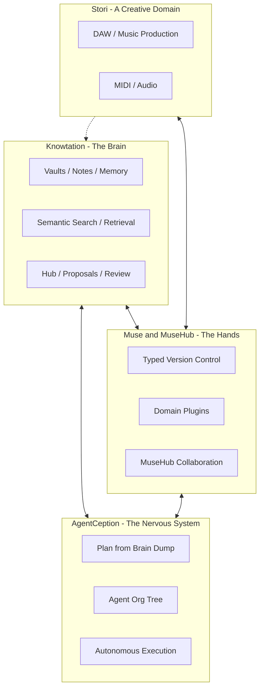

# Ecosystem vision — Knowtation, Muse, MuseHub, AgentCeption, and Stori

**What this document is:** A vision piece (not a spec) describing how these sister projects can work together across life, work, research, and creative domains. The first sections are plain language; later sections go deeper for builders.

**External references:** [Muse](https://github.com/cgcardona/muse) · [MuseHub (staging explore)](https://staging.musehub.ai/explore) · [AgentCeption](https://github.com/cgcardona/agentception) · [Stori](https://github.com/cgcardona/Stori)

---

## Part 1 — The elevator pitch

Imagine one place where your notes, decisions, and research live in files you actually own, where version control understands structure (not just lines of text), and where software agents can plan work, run in parallel, and hand results back for human review before anything becomes official. That is the direction this ecosystem points: **Knowtation** holds what you know; **Muse** and **MuseHub** version and collaborate on multidimensional work (code today, more domains tomorrow); **AgentCeption** turns rough ideas into structured plans and dispatched agents; **Stori** is the professional music surface where Muse’s original MIDI domain meets real production.

For a person or team, it means you are not choosing between “a notes app,” “GitHub,” and “AI helpers.” You get a **brain** (knowledge + search + memory), **hands** (typed history and merge), **orchestration** (who does what, when), and optionally **creative tooling** (DAW + versioned musical state) that can all reinforce each other. The same patterns that save tokens and context in development—pull little, fetch precisely, review before commit—apply to knowledge work at large.

Why it matters: serious work is **multi-actor** (people + agents), **multi-artifact** (docs, code, data, media), and **long-horizon** (months of decisions). Line-oriented tools and chat-only assistants lose the thread. This stack is built so **intention, lineage, and curation** stay visible: AI proposes; humans (and policy) curate; history stays inspectable.

---

## Part 2 — The stack at a glance

| Layer | Project | Role |
|-------|---------|------|
| Brain | **Knowtation** | Vaults, semantic search, optional memory, Hub proposals, MCP/CLI for agents |
| Hands | **Muse / MuseHub** | Domain-agnostic VCS: snapshots, typed diffs, merge, hosting and collaboration on MuseHub |
| Nerves | **AgentCeption** | Brain dump → plan → GitHub issues → org tree of agents → PRs and execution |
| Creative surface | **Stori** | macOS DAW; natural home for Muse’s MIDI-oriented workflows alongside lyrics and production notes in the vault |

---

## Part 3 — Use cases (plain language)

Each subsection is a short “day in the life,” then bullets on how the pieces fit.

### 1. Personal knowledge and life management

You are juggling health notes, travel plans, home projects, and a journal. You want one searchable place that agents can help research and summarize without overwriting what you already trust.

- **Knowtation:** Inbox captures, projects/areas, semantic search, imports (e.g. chat exports), optional memory across sessions.
- **AgentCeption:** Optional agents to turn rough voice or text dumps into checklists, research briefs, or structured plans (with your review).
- **Muse:** Version “living” documents—budget scenarios, renovation specs, trip iterations—as structured change history instead of fifty copies in a folder.
- **MuseHub:** If you collaborate with family or a VA, host and review changes the same way teams review code.

### 2. Launching a business

You start with a messy idea and end up with a plan, a pitch, early product artifacts, and a codebase.

- **Knowtation:** Market notes, competitor clips, decision log, meeting summaries; tiered retrieval keeps agent context small and precise ([WHITEPAPER.md](./WHITEPAPER.md)).
- **AgentCeption:** PlanSpec, issues, coordinator/worker agents, isolated worktrees, PRs—documented integration paths in [AGENT-ORCHESTRATION.md](./AGENT-ORCHESTRATION.md).
- **Muse / MuseHub:** Version product and code with symbol- or domain-aware history (Muse **Code** domain); merge proposals on MuseHub where that fits your workflow.
- **Closing the loop:** Approve agent output into the vault (and/or Hub proposals) so the next phase searches a richer, grounded base.

### 3. Financial planning and analysis

You track thesis, positions, budgets, and tax-relevant notes—sensitive, longitudinal, and branching (“what if we relocate?”).

- **Knowtation:** Imports such as wallet CSV (see [IMPORT-SOURCES.md](./IMPORT-SOURCES.md)), tagged projects, dated notes; **do not** treat agents as fiduciaries—human judgment stays primary.
- **Muse:** Branch alternative models or document sets; compare structured diffs between scenarios.
- **AgentCeption:** Automate repetitive research formatting, reconciliation drafts, or checklist generation—always under human review for anything that touches real money.

### 4. Scenario planning and decision-making

You need parallel futures: Person A’s priorities vs Person B’s, or Strategy 1 vs Strategy 2, without mixing them into one muddy doc.

- **Knowtation:** Multi-vault or scoped projects ([MULTI-VAULT-AND-SCOPED-ACCESS.md](./MULTI-VAULT-AND-SCOPED-ACCESS.md)) so people see only what they should.
- **Muse:** Branches or parallel histories as first-class; merges when a decision is made.
- **AgentCeption:** Run separate agent tracks per scenario; write back summaries with clear `source` and dates for auditability.

### 5. Scientific and academic research

Literature piles up; protocols change; lab notes and code diverge.

- **Knowtation:** Literature notes, methods, meeting outcomes; causal / entity tags where you use them ([INTENTION-AND-TEMPORAL.md](./INTENTION-AND-TEMPORAL.md)).
- **Muse:** Version protocols, analysis scripts, and datasets as typed state (today code; future domains Muse targets include simulation and genomics per upstream docs).
- **AgentCeption:** Dispatch literature passes, boilerplate methods sections, or reproducibility checklists—supervised by PIs and institutional policy.

### 6. Engineering and cross-discipline collaboration

Scientists, designers, and engineers share a product surface; knowledge and code must stay aligned.

- **Knowtation:** Shared vault or Hub team spaces ([TEAMS-AND-COLLABORATION.md](./TEAMS-AND-COLLABORATION.md)); ADRs and specs agents can search before coding.
- **MuseHub:** Review merges and proposals for repositories; vector and symbol intelligence on the Hub matches the “agent era” narrative of the staging product.
- **AgentCeption:** Engineers implement in worktrees; reviewers stay in the loop; vault records **why** merges happened.

### 7. Political campaigns and policy analysis

High tempo, many drafts, strict messaging discipline, and heavy research.

- **Knowtation:** Research memos, speech fragments, stakeholder notes; fast capture and search under campaign security practices (hosting, access, and legal compliance are operator choices).
- **Muse:** Track draft evolution and branching lines (e.g. messaging tracks); structured diff reduces accidental contradictions when merging input from many writers.
- **AgentCeption:** Generate first drafts of briefs or timelines from structured briefs in the vault; humans approve every external-facing artifact.

### 8. Legal practice

Precedent, clauses, and matter-specific facts need strong provenance and version discipline.

- **Knowtation:** Case notes, research, and clause libraries with clear dating and optional vault Git history ([PROVENANCE-AND-GIT.md](./PROVENANCE-AND-GIT.md)).
- **Muse:** Version contracts and templates as structured artifacts; three-way merge when multiple editors touch related clauses.
- **AgentCeption:** Assist with research memos or first-pass drafts; **never** replace licensed attorneys for advice—workflow only.

### 9. Education and learning

Courses, projects, and tutoring across a term.

- **Knowtation:** Course vaults, flashcard-style notes, imports from LMS exports where supported.
- **Muse:** Version projects (code for CS, written artifacts for other fields as plugins mature).
- **AgentCeption:** Tutoring agents with bounded tasks; instructors review outputs; academic integrity policies remain institution-specific.

### 10. Healthcare and clinical research

Protocols, literature, and de-identified artifacts must change safely and traceably.

- **Knowtation:** Research synthesis, SOP notes, IRB-related documentation in markdown you control; comply with HIPAA/GDPR and local rules—this doc does not prescribe a particular deployment.
- **Muse:** Version protocols and analysis code; structural merge reduces silent drift between sites in multi-center studies (operational detail belongs in validated SOPs).
- **AgentCeption:** Literature monitoring or draft tables under human and compliance review.

### 11. Creative production with Stori (Muse + Knowtation + agents)

Music is **not** the only story for Knowtation—but Stori is the natural DAW sibling: Muse was shaped for multidimensional music state; Stori ships a professional macOS surface.

- **Stori:** Arrange, mix, MIDI, instruments—[Stori README](https://github.com/cgcardona/Stori).
- **Muse:** MIDI and musical dimensions as a native domain; version sessions and merges across independent musical axes per upstream design.
- **Knowtation:** Lyrics, production notes, references, collaboration agreements—searchable and linkable to releases or stems.
- **AgentCeption (optional):** Agents that propose arrangement ideas or documentation; human producers approve; no substitute for ears and taste.

### 12. Software development (the native case)

This is where Muse’s **Code** domain and Knowtation’s agent docs already meet daily practice.

- **Muse:** Symbol-level diff, AST-aware merge, rename tracking—agents editing different functions merge more cleanly than with line-only Git semantics for many cases.
- **MuseHub:** Host repos, browse symbols, merge proposals—aligned with staging MuseHub capabilities.
- **Knowtation:** Architecture decisions, runbooks, onboarding—all retrieved with tiered search to save tokens ([RETRIEVAL-AND-CLI-REFERENCE.md](./RETRIEVAL-AND-CLI-REFERENCE.md)).
- **AgentCeption:** Full loop from plan to PRs; engineers use CLI in containers while planners use MCP where available.

---

## Part 4 — Integration architecture (technical)

This section ties the vision to **today’s Knowtation design** and **plausible bridges**. Authoritative implementation status remains in the linked specs.

### Knowtation ↔ Muse / MuseHub

- **Implemented today:** Hub proposals carry `base_state_id`, `intent`, and optional `external_ref`. Canonical state stays the vault and Hub; [Muse](https://github.com/cgcardona/muse) is optional. See [AGENT-INTEGRATION.md](./AGENT-INTEGRATION.md) §4 and [HUB-API.md](./HUB-API.md).
- **Optional operator linkage:** Read-only Muse connectivity for lineage; on approve, `external_ref` may point at a Muse commit or branch id. Same section in [AGENT-INTEGRATION.md](./AGENT-INTEGRATION.md) §4; optional Muse merge-engine integration remains deferred — see [MUSE-THIN-BRIDGE.md](./MUSE-THIN-BRIDGE.md) and §4 in [AGENT-INTEGRATION.md](./AGENT-INTEGRATION.md).
- **Full Knowtation domain plugin in Muse (deferred):** Snapshot/diff/merge of vault-shaped state inside Muse’s DAG—large effort; pursued when ecosystem or partner need is concrete.
- **MuseHub hosting:** Vaults in Git today can live on any host; MuseHub as a **home for repos** that include markdown knowledge trees is a product direction, not a Knowtation requirement.
- **CRDT / multi-agent writes:** Muse documents CRDT-style plugins for convergent collaboration; pairing that with Hub proposals would be a deliberate product decision.

### Knowtation ↔ AgentCeption

- **Implemented patterns:** Shared vault path, CLI `--json` in worktrees, MCP where the runtime supports it; write-back with `source=agentception` and dates. See [AGENT-ORCHESTRATION.md](./AGENT-ORCHESTRATION.md), [GETTING-STARTED.md](./GETTING-STARTED.md), and `scripts/write-to-vault.sh`.
- **Longer-term ideas (GitHub Issue #2):** “AgentCeption × Knowtation — The Infinite Machine Brain” tracks cognitive identity from vault, causal chains, async messaging, indexed codebases, and similar themes—intentionally sequenced after hosted stability. Sequencing rationale is summarized in [IMPLEMENTATION-PLAN.md](./IMPLEMENTATION-PLAN.md) and [STATUS-HOSTED-AND-PLANS.md](./STATUS-HOSTED-AND-PLANS.md).

### Muse / MuseHub ↔ AgentCeption

- Agents run where Muse CLI runs; Muse’s **machine-readable JSON** on commands fits pipelines and headless workers.
- **Code domain:** Multiple agents touching distinct symbols can merge more predictably than naive line conflicts; MuseHub can be the review surface for proposals.
- **Operational split:** AgentCeption today centers on **GitHub** issues and PRs; MuseHub is a parallel or future remote depending on how repos are hosted—both can coexist (e.g. code on MuseHub, issues on GitHub until unified workflows exist).

### The triple loop (Knowtation + AgentCeption + Muse/MuseHub)

1. Humans capture intent and evidence in the **Knowtation** vault (and optionally Hub proposals).
2. **AgentCeption** ingests that context, produces structured plans and dispatches agents.
3. Agents mutate **code or other Muse-versioned artifacts**; history is structural, not only textual.
4. **MuseHub** (or Git host) holds review and merge proposals.
5. Decisions and summaries are **written back** to the vault with provenance.
6. The next search starts from a denser, grounded knowledge base—**token-efficient** if retrieval stays tiered.

### Stori as a fourth node

- **Muse MIDI domain** matches Stori’s MIDI-centric production model; export/import and versioning boundaries are integration design work, not assumed shipped features.
- **Knowtation** stores non-audio narrative and production metadata; **AgentCeption** could coordinate tasks (e.g. stem checks, changelog generation) with human approval.

---

## Part 5 — What makes this different

| Theme | Why it matters |
|-------|----------------|
| **Data ownership** | Knowtation’s vault is markdown and files you can move, back up, and host—see SPEC §0 in [SPEC.md](./SPEC.md). |
| **Domain agnosticism** | Muse’s plugin model targets code, music, and future domains (genomics, 3D, simulation per upstream)—same core, different semantics. |
| **Agent-native surfaces** | Knowtation MCP/CLI JSON; Muse CLI `--format json`; AgentCeption’s MCP and HTTP API—automation-friendly by design. |
| **Human-in-the-loop** | Hub proposals: propose → review → commit; see [AGENT-INTEGRATION.md](./AGENT-INTEGRATION.md) §4 and [PROPOSAL-LIFECYCLE.md](./PROPOSAL-LIFECYCLE.md). |
| **Token and cost discipline** | Consolidation, tiered retrieval, and lean search fields are first-class in Knowtation ([WHITEPAPER.md](./WHITEPAPER.md), [MEMORY-CONSOLIDATION-GUIDE.md](./MEMORY-CONSOLIDATION-GUIDE.md)); the same discipline applies when agents pull vault context into any orchestrator. |
| **Open source** | Knowtation, Muse, AgentCeption, and Stori are MIT-licensed public repos—interop does not depend on a single vendor’s API. |

---

## Part 6 — Roadmap and phasing

This is a **coordination sketch** across repos. Knowtation’s delivery phases: [IMPLEMENTATION-PLAN.md](./IMPLEMENTATION-PLAN.md). **Agent integration (CLI, MCP, Hub API, proposals):** [AGENT-INTEGRATION.md](./AGENT-INTEGRATION.md). Muse optional linkage: [MUSE-THIN-BRIDGE.md](./MUSE-THIN-BRIDGE.md).

| Phase | Scope |
|-------|--------|
| **0 — Today** | Knowtation: vault, Hub, MCP, proposals with Muse-aligned metadata. AgentCeption: documented CLI/MCP + vault write-back. Muse/MuseHub: usable independently for code/music. |
| **1 — Thin bridge** | Optional Muse linkage and `external_ref` population on approve; operator-only credentials; no Muse on the critical path for login or search. |
| **2 — MuseHub × knowledge repos** | Treat knowledge repositories (markdown trees, optional index sidecars) as first-class citizens on MuseHub where product choices allow; may mirror or complement vault Git remotes. |
| **3 — Full domain plugin** | Knowtation-as-Muse-domain when cost/benefit clears—shared DAG and merge engine with Muse core. |
| **4 — Deep AgentCeption × Knowtation** | Issue #2 slices: cognitive identity, causal intelligence, async messaging, indexed code in vault context, etc.—after hosted parity and multi-vault per [IMPLEMENTATION-PLAN.md](./IMPLEMENTATION-PLAN.md). |
| **5 — Cross-domain creative loop** | Stori ↔ Muse ↔ Knowtation ↔ agents for production workflows with clear human approval and export contracts. |

---

## Related docs (Knowtation repo)

- [AGENT-INTEGRATION.md](./AGENT-INTEGRATION.md) — Single entry for CLI, MCP, Hub API, proposals, hosted MCP  
- [AGENT-ORCHESTRATION.md](./AGENT-ORCHESTRATION.md) — Multi-agent patterns (containers, worktrees, write-back)  
- [WHITEPAPER.md](./WHITEPAPER.md) — Thesis, retrieval, agents  
- [TEAMS-AND-COLLABORATION.md](./TEAMS-AND-COLLABORATION.md) — Hub roles and shared vaults  

---

*Document version: 1.0 (April 2026). Vision only—implementation status is always defined by the linked specs and issue trackers.*
