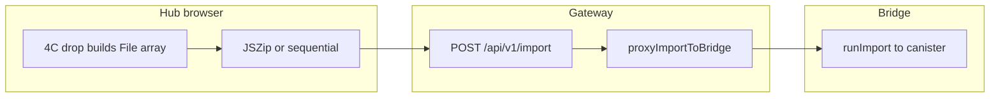

# Import roadmap: URL, documents, bulk UX (phased)

**Branch:** `feat/import-url-documents-mcp`  
**Policy:** Do **not** push or open a PR until there is solid, testable work worth review. **Commit after each phase** (or each shippable slice within a phase) on this branch.

This doc splits work so each phase matches how Knowtation already works: **`lib/importers/`** + **`runImport`**, Hub / bridge / gateway HTTP, hosted MCP parity, and tests.

---

## Current behavior (baseline — no new code)

| Path | Folder import | Multiple files at once |
|------|----------------|-------------------------|
| **CLI** (`knowtation import …`) | **Yes** for types that accept a directory (e.g. `markdown` walks a folder of `.md` files; see [`lib/importers/markdown.mjs`](../lib/importers/markdown.mjs)). | Run import multiple times or point at a folder. |
| **Hub (browser)** | **ZIP:** uploads whose name ends in `.zip` are extracted server-side; `runImport` receives the **extracted directory** (see [`hub/server.mjs`](../hub/server.mjs) and bridge). That matches **folder-capable** importers (e.g. **markdown** walks `.md`/`.markdown`; ChatGPT/Claude exports). **pdf** and **docx** importers require a **single file path** and **reject a directory** ([`lib/importers/pdf.mjs`](../lib/importers/pdf.mjs), [`lib/importers/docx.mjs`](../lib/importers/docx.mjs)), so in practice Hub **PDF/DOCX** = one document per request (4B: **N** sequential `POST` for many files), **not** a server **ZIP** of a folder. **4A₂** builds a **client** ZIP for tree-shaped types. | **Yes (4B + 4A₂ + 4C):** `multiple`, **Choose folder** (`webkitdirectory`), the Import modal **drop** zone (§4C), in-browser **JSZip** when `getHubImportFileMode` says `client_zip` — see [`web/hub/hub.js`](../web/hub/hub.js) and [`web/hub/hub-client-import-zip.mjs`](../web/hub/hub-client-import-zip.mjs). |
| **Hosted MCP `import`** | One **base64 file** (or ZIP) per tool call. | Agents can call **`import`** repeatedly (no `import_batch`). |

So: **entire-folder ingest already exists on the CLI** for supported types. **In the Hub**, the practical “folder” paths are **pre-made ZIP**, **Choose folder** / **multi-select**, or the **4C** drop target in the Import modal (same in-memory file pipeline and caps as 4A₂/4B; **Chromium** is best for full directory-tree paths from a drag; **Safari** / **Firefox** may see flatter `File` lists, same as a non-Chromium multi-file pick).

---

## Phase 1 — URL import (highest adoption leverage)

**Outcome:** Paste an HTTPS URL → one or more vault notes (article text when possible, bookmark fallback).

**Status on branch `feat/import-url-documents-mcp`:** **Shipped** (single implementation commit: core `lib/`, `POST /api/v1/import-url` on Hub + bridge + gateway, Hub modal fields, hosted MCP `import_url`, self-hosted MCP `url_mode`, tests, docs).

**Work (representative):**

- `lib/url-fetch-safe.mjs` — SSRF-safe fetch (HTTPS, DNS, redirects, size, timeout).
- `lib/importers/url.mjs` — fetch + Readability-style extraction + `writeNote` / frontmatter.
- `lib/import-source-types.mjs` + [`lib/import.mjs`](../lib/import.mjs) — register `url`.
- `POST /api/v1/import-url` (JSON) on self-hub + bridge + gateway proxy (multipart import stays file-only).
- Hub UI: URL field + submit; optional copy when extract fails.
- Hosted MCP: **`import_url`** tool → same JSON route.
- Self-hosted MCP: extend **`import`** with `source_type: "url"` and `input` = URL string.
- Tests: unit (safe fetch + importer), bridge/gateway integration, update [`test/import-source-types.test.mjs`](../test/import-source-types.test.mjs) for `url`.
- Docs: [`IMPORT-SOURCES.md`](./IMPORT-SOURCES.md), [`AGENT-INTEGRATION.md`](./AGENT-INTEGRATION.md), [`PARITY-MATRIX-HOSTED.md`](./PARITY-MATRIX-HOSTED.md), [`openapi.yaml`](./openapi.yaml).

**Commit suggestion:** `feat(import): url importer + import-url API + Hub + MCP + tests` (or split into 2 commits: lib first, then HTTP/UI).

---

## Phase 2 — PDF → Markdown notes

**Outcome:** `source_type: pdf`, upload `.pdf` (Hub multipart / MCP base64 / CLI path) → note body with extracted text.

**Status on branch `feat/import-url-documents-mcp`:** **Shipped** (commit `feat(import): pdf source type and importer` — core `lib/importers/pdf.mjs`, `unpdf`, Hub option + copy, hosted MCP enum via `IMPORT_SOURCE_TYPES`, tests, docs).

**Work:**

- `lib/importers/pdf.mjs` + dependency (e.g. `pdf-parse` / `unpdf` — choose in implementation).
- Register in `import.mjs` / `import-source-types.mjs`.
- Hub: allow source type + file; hosted uses existing **`import`** MCP with new `source_type`.
- Fixture PDFs + tests; docs row in IMPORT-SOURCES.

**Commit suggestion:** `feat(import): pdf source type and importer`.

---

## Phase 3 — DOCX → Markdown notes

**Outcome:** `source_type: docx`, upload `.docx` → note(s) via Mammoth (or equivalent).

**Status on branch `feat/import-url-documents-mcp`:** **Shipped** (commit `feat(import): docx source type and importer` — `lib/importers/docx.mjs`, `mammoth`, Hub option + copy, hosted MCP enum via `IMPORT_SOURCE_TYPES`, tests, docs).

**Work:**

- `lib/importers/docx.mjs` + `mammoth` (typical).
- Same registration / Hub / MCP pattern as PDF.
- Tests + docs.

**Commit suggestion:** `feat(import): docx source type and importer`.

---

## Phase 4 (optional) — Bulk UX: folder picker & multi-file

**Goal:** Make “bring my whole pile of documents” as easy in the **Hub** as it already is on the **CLI** (folder) or via **ZIP**.

### 4A — Low cost (recommend first)

**Status on branch `feat/import-url-documents-mcp`:** **Shipped** (Hub Import modal + docs: explain **one multipart upload**; **ZIP** for folder-capable types; **PDF/DOCX** = single file, not ZIP—see [`IMPORT-SOURCES.md`](./IMPORT-SOURCES.md) § “Hub browser: ZIP and bulk”.)

- **Document clearly** in Hub and `IMPORT-SOURCES.md`: ZIP a folder of **Markdown** (or use ZIP for exports that expect a directory); **PDF** and **DOCX** = upload **one `.pdf` / `.docx` per import** (ZIP extracts to a directory; those importers require a file).

**Complexity:** **Low** (copy/docs only). **4A does not go obsolete** when 4A₂ or 4B land: exports still arrive as ZIPs; the copy stays the contract for server-side extraction.

### 4A₂ — Client-side ZIP (JSZip) — optional supplement

**Status on branch `feat/import-url-documents-mcp`:** **Shipped** — `web/hub/hub-client-import-zip.mjs` (mode rules, `buildImportZipBlobWithJsZip`, default caps) + UMD **JSZip** (CDN) + `hub-import-zip-shim.mjs`; one `POST /api/v1/import` with `file` = `hub-bulk.zip` when `getHubImportFileMode` returns `client_zip` (e.g. **markdown** + multiple files, **chatgpt** without a server `.zip`, **claude** + all `.md`, **mif** / **gdrive** / **notebooklm** trees). **Not** for PDF/DOCX.

**Goal:** User drags a **folder** (or many files) in the browser; the Hub builds **one** `.zip` and POSTs the existing multipart `POST /api/v1/import` once—**no new server route** if the payload is still one `file` field.

- **Hub:** **“Choose folder (ZIP in browser)”** (`webkitdirectory`); **size / file-count** caps; duplicate path renames with optional warning text; large selections stay in **browser memory** (prefer a desktop-made ZIP for huge trees).
- **Tests:** [`test/hub-client-import-zip.test.mjs`](../test/hub-client-import-zip.test.mjs).

**Complexity:** **Low–medium** (limits and UX). **Scope:** folder-capable `source_type` values only—not PDF/DOCX (see `lib/importers/pdf.mjs` / `docx.mjs`).

### 4B — Native multi-file / folder picker (`webkitdirectory`)

**Status on branch `feat/import-url-documents-mcp`:** **Shipped** — `web/hub/hub.js` + Import modal: **`multiple`** on the main file field; **sequential** `POST /api/v1/import` for `pdf`, `docx`, `mem0-export`, `linear-export`, `jira-export`, `wallet-csv`, `supabase-memory`, `audio`, and `claude-export` when the selection is **not** all-`.md` (multiple JSON → one import per file). **Max 200** files per batch in UI; per-file cap **~100MB** (multer on Hub/bridge). Live region `#import-batch-aria`, **Stop batch** (Abort). **MCP:** no `import_batch`; agents use repeated **`import`** as before.

**Goal:** Users can pick **many files** or a **folder** without pre-zipping, within caps.

- **Hub:** `multiple` and `webkitdirectory`; per-file outcome summary.
- **Server approach:** **sequential** `POST /api/v1/import` (N requests; reuses multer + `runImport` on Hub and bridge).
- **Progress / partial failure:** “`Batch: x of n` …” and named failure snippets.
- **Limits:** 200/batch, ~100MB/file, hosted time limits (~26s common on serverless) — see modal copy and [`IMPORT-SOURCES.md`](./IMPORT-SOURCES.md).
- **Parity:** [`PARITY-MATRIX-HOSTED.md`](./PARITY-MATRIX-HOSTED.md).

**Complexity:** **Medium** (client loop + caps + UX).

### 4C — Import modal drop zone (drag files or a folder)

**Status:** **Shipped** — the Import dialog includes a **drop** region (`#import-drop-zone` in `web/hub/index.html`); `web/hub/hub.js` uses `DataTransfer` / `webkitGetAsEntry` where available to build a `File[]` with relative paths (Chromium: recursive directory walk; flat `files` fallback otherwise). The same `getHubImportFileMode` + JSZip/sequential pipeline as 4A₂/4B applies. **No new** HTTP route or canister. Clear drop state on modal close and when the file inputs change.

**Goal:** Same outcome as **Choose folder** or multi-file without a click, **inside** the Import modal only (not page-level drop).

- **Parity / caps:** Same as 4A₂/4B (100MB, 200 sequential, JSZip limits, etc.).

**Complexity:** **Low–medium** (80–150 lines of client wiring + HTML/CSS; browser variance in directory drops).

### 4V — Pre-merge hosted verification

**Status:** **Operational** — this subsection is the full 4V gate. This is the **import** verification track, **not** [HUB-WIZARD-HOSTED-STORY.md](./HUB-WIZARD-HOSTED-STORY.md) “Phase 5” (wizard).

**Goal:** Before merge (or before relying on a hosted release), **prove** bridge-backed `POST /api/v1/import` works in the real gateway + static Hub bundle, including **4C** (same HTTP path as **Choose folder**; client-only diff).

**Premises (code):** Hosted `POST /api/v1/import` is `proxyImportToBridge` on the gateway when `BRIDGE_URL` is set ([`hub/gateway/server.mjs`](../hub/gateway/server.mjs)). If `BRIDGE_URL` is unset, the gateway returns **501** and `code: NOT_AVAILABLE`. **4C** only changes how the browser builds `File[]` in [`web/hub/hub.js`](../web/hub/hub.js).



**4V checks (copy into PR as evidence):** **V1** `BRIDGE_URL` on the **gateway** = bridge **origin** only (`https://…`, no path) — [hub/gateway/README.md](../hub/gateway/README.md). **V2** (optional) env without `BRIDGE_URL` → `POST /api/v1/import` returns **501** + `NOT_AVAILABLE`. **V3** With bridge: **Markdown** + small `.md` tree — **Choose folder** once, **4C** drop once (Chromium) — same Network pattern for `client_zip` (e.g. one `hub-bulk.zip`) and >0 notes. **V4** After deploy, `hub.js?v=…` and `#import-drop-zone` in the Import modal. **V5** (optional) `GET {BRIDGE}/api/v1/bridge-version`. **V6** If `BILLING_ENFORCE`, import not blocked. **V7** Small fixtures (hosted timeouts). **Waiver:** If time-critical, state in the PR; follow up in an issue.

### Recommended order (next implementation pass) — 4A₂/4B/4C done; 4V before merge

1. **4A₂ (JSZip)** — **shipped.**
2. **4B** (multi + folder) — **shipped** (sequential, no new HTTP body).
3. **4C** (import modal drop zone) — **shipped.**
4. **4V** (hosted verification) — complete **§4V** checks above before merge of Hub import or gateway `proxyImport` changes.
5. **Optional next:** documented limits in [`openapi.yaml`](./openapi.yaml) / [`HUB-API.md`](./HUB-API.md) (HTTP shape unchanged; limits are product caps).

**Recommendation:** Treat **4A + 4A₂ + 4B + 4C** as a stacked story: copy explains behavior; JSZip reduces friction for ZIP-shaped flows; 4B/4C cover users who never zip. None of these replace the others.

---

## MCP summary (after phases land)

| Capability | Hosted MCP | Self-hosted MCP |
|-------------|------------|-------------------|
| URL | **`import_url`** (new) | **`import`** + `source_type: url` |
| PDF / DOCX | **`import`** + `source_type` `pdf` or `docx` + base64 file | **`import`** + path or local workflow |

---

## Adoption note

Ease of import **does** affect adoption. Order of impact:

1. **URL** (paste) — removes “save as Markdown” friction for web content.  
2. **PDF + DOCX** — removes external converter for the two most common office formats (both shipped on this branch).  
3. **Bulk** — ZIP (and later multi-file) removes friction for migrations and “dump folder here.”

---

## Git workflow (recommended)

- **Branch:** Stay on **`feat/import-url-documents-mcp`** for Phase 2 (PDF) and Phase 3 (DOCX). **One PR at the end** is a good default: reviewers see URL + PDF + DOCX together or you can open the PR after Phase 2 if you want PDF reviewed before DOCX.
- **Commits:** Keep **one commit per phase** (or per logical slice). Phase 1 is already committed; add **`feat(import): pdf …`** (and later **`feat(import): docx …`**) on the same branch.
- **Push / merge to `main`:** **Not required** between phases for local or CI testing. Push when you want backup, CI on the remote, or a **draft PR** for early feedback. Merge to `main` when you are ready to **release** (hosted bridge/gateway deploy coordination).

---

## Testing, merge, and what’s next (after 4A₂ + 4B)

### The “failed” `importUrl` test

- [`test/import-url-importer.test.mjs`](../test/import-url-importer.test.mjs) does a **real** HTTPS request to `https://example.com/` (with `dryRun`). If your environment **blocks DNS or outbound HTTPS** (e.g. some local sandboxes), the test can fail with `getaddrinfo ENOTFOUND` or similar. **That is not a regression from the Hub bulk work.**
- **CI** (see [`.github/workflows/ci.yml`](../.github/workflows/ci.yml) `npm test` on `ubuntu-latest`) has normal network, so this test is expected to **pass** there.
- **New code tests:** `node --test test/hub-client-import-zip.test.mjs` (mode rules + small JSZip build). There is no browser E2E in the repo for the Hub UI; use [`IMPORT-MANUAL-CHECKLIST.md`](./IMPORT-MANUAL-CHECKLIST.md) § “Hub — Phase 4A₂, 4B, and 4C” and **§4V** (hosted) above.

### Canister / on-chain

- **No ICP canister changes** are required for 4A₂/4B/4C: the same `POST /api/v1/import` and bridge `runImport` path is used. Hosted behavior still depends on bridge + gateway as today.

### Merge to `main`

- **Reasonable to merge** when: **CI is green** on the PR, **4V** (this doc §4V) is **complete** for PRs that change `web/hub` **Import** flows or gateway **`proxyImport` / `POST /api/v1/import`** (or a **waiver** is recorded in the PR), plus a **short manual** pass in the Import modal (self-hosted `npm run hub` and/or **hosted with `BRIDGE_URL`**, deploy preview or production as appropriate), and you’re ready to **coordinate deploy** (gateway/bridge/Hub static assets). No extra canister work for this feature alone.

### Optional follow-up work (not blocking merge)

- **OpenAPI / HUB-API** prose for product caps (100MB, 200 files per batch) if you want the HTTP doc to spell out client limits (the route contract is unchanged).
- **Deeper E2E** (Playwright, etc.) if you add that stack later.

---

## Next session prompt (optional polish after 4A₂ / 4B)

Phase **4A₂** and **4B** are **shipped** on `feat/import-url-documents-mcp` (see § above). For a new chat, copy the block below if you want to continue with optional polish; adjust paths if your clone differs.

```text
We are on branch feat/import-url-documents-mcp. Phases 1–3 (URL, PDF, DOCX) and Phase 4A (bulk import docs + Hub copy: ZIP vs single-file, folder-capable types) are shipped — see docs/IMPORT-URL-AND-DOCUMENTS-PHASES.md § Phase 4 and docs/IMPORT-SOURCES.md § “Hub browser: one upload, ZIP extraction, and bulk”.

Implement the strongest Hub bulk UX in one pass, in this order:

**A) Phase 4A₂ — Client-side ZIP (JSZip)**
- Only for source types where a ZIP of a folder is already valid server-side (e.g. markdown, ChatGPT/Claude-style exports — verify against runImport + zip extraction in hub/server.mjs and hub/bridge/server.mjs). Do NOT offer “zip my folder” for PDF/DOCX (single-file importers; see lib/importers/pdf.mjs and docx.mjs).
- Add JSZip (or equivalent) to the Hub bundle; drag folder or multi-select files → build one in-memory ZIP with sensible paths (preserve relative paths for markdown trees) → single existing multipart POST /api/v1/import with field `file`.
- Hard limits: max uncompressed total size, max file count, max zip bytes; clear error UX and cancel where feasible; document tradeoffs (memory, mobile) in IMPORT-SOURCES.md or IMPORT-URL-AND-DOCUMENTS-PHASES.md.
- Tests: zip builder unit tests with small fixtures, or a tight manual checklist in test docs if full E2E is heavy.

**B) Phase 4B — Native multi-file / webkitdirectory**
- Hub: enable folder picker and/or multiple file selection where product policy allows; sequential POST /api/v1/import per file OR one batch multipart (pick one approach, justify in PR); progress and partial-failure summary (“3 of 5 imported; failures: …”).
- Caps: max files, max bytes per file, align with gateway/bridge timeouts; surface limits in UI copy.
- PDF/DOCX: keep one file per import (multiple PDFs = N requests or explicit batch loop), unless you explicitly extend importer scope in this session.
- Docs: update IMPORT-SOURCES.md, IMPORT-URL-AND-DOCUMENTS-PHASES.md (mark 4A₂/4B shipped), PARITY-MATRIX-HOSTED.md if user-visible behavior changes; HUB-API.md + openapi.yaml only if HTTP contract or documented limits change.
- Hosted MCP: only add import_batch or similar if justified; otherwise document that agents still use repeated `import` calls.

**C) Optional polish (if time):** accessibility (live region for batch progress), duplicate-file warnings, telemetry hooks only if the repo already patterns them.

Do not push or open a PR unless I ask; commit on the feature branch in logical slices (e.g. JSZip first, then 4B) with tests passing.
```

---

## Related planning artifact

Cursor plan (implementation checklist): `.cursor/plans/document_and_url_import_4dda68c9.plan.md`
