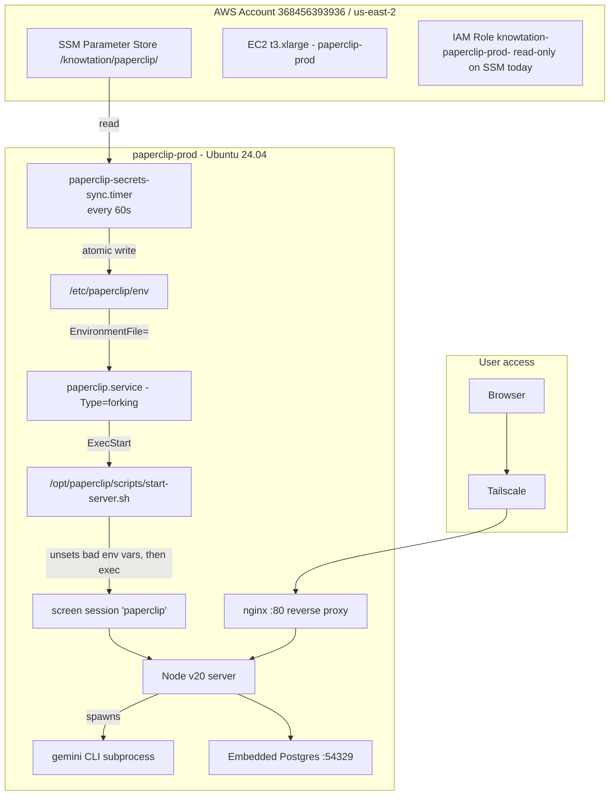

# Paperclip — AWS setup, root-cause notes, and iMac transition plan

**Status as of 2026-05-11**: Paperclip is **live and healthy** at `paperclip-prod` on AWS EC2. Onboarding completed, UI accessible via Tailscale at `http://paperclip-prod/onboarding`. The Gemini CLI adapter authenticates correctly. The CEO agent runs and retries on Gemini API timeouts (a free-tier quirk, not infrastructure).

This document exists so that:
1. You can pick up exactly where we left off when the iMac arrives.
2. You can reconnect to AWS later if you ever need to.
3. The two days of debugging are not lost.

---

## TL;DR for future-you

| Question | Answer |
|---|---|
| Is the AWS Paperclip server working? | Yes. Port 3000 listening, nginx 200, all 5 verification layers pass. |
| Is anything left to do on AWS? | Optional: rotate exposed secrets (see below), apply terraform IAM update. |
| What's the failure mode the user hit? | CEO agent calls Gemini → free-tier API is slow → Paperclip's internal probe times out. Cosmetic, not infrastructure. |
| When iMac arrives, do I redo all this? | No. ~95% of the AWS pain is Linux/systemd/SSM specific and won't apply. ~2-3 hours from box-open to working Paperclip on macOS. |
| Should I open a PR with these doc changes? | No PR right now. Per repo rule, docs-only PRs to `main` are forbidden. Bundle with the next code PR (e.g. when push-secrets.sh changes are tested). |

---

## Architecture as deployed (AWS)



Key external touchpoints from the running server:
- **Google AI Studio** — Gemini CLI calls `generativelanguage.googleapis.com` with `GEMINI_API_KEY`
- **DeepInfra, HeyGen, ElevenLabs, Descript** — adapter HTTP clients (not yet exercised end-to-end at time of writing)
- **Knowtation Hub** — at `https://knowtation-gateway.netlify.app` with `KNOWTATION_HUB_JWT`

---

## What ate two days (root causes)

Every single failure traced back to one of these three problems. Documenting them so neither you nor a future operator falls into the same traps.

### Trap 1: SSM sync timer silently overwrote every manual env edit

**File**: [`deploy/paperclip/install.sh`](../deploy/paperclip/install.sh) line 294

```bash
mv "$TMP_FILE" "$ENV_FILE"
```

The `paperclip-secrets-sync.timer` runs `/usr/local/bin/paperclip-secrets-sync` every 60 seconds and **atomically replaces** `/etc/paperclip/env` with whatever is in AWS SSM at `/knowtation/paperclip/*`. Manual edits via `nano`, `tee -a`, or `echo >>` are wiped on the next sync cycle.

**Symptom**: nano "saves" successfully, then `grep` returns nothing. Looks like the edit failed. It actually succeeded — the timer just deleted it.

**Fix**: never edit `/etc/paperclip/env` directly. Push to SSM instead:

```bash
aws ssm put-parameter \
  --region us-east-2 \
  --name /knowtation/paperclip/<KEY_NAME> \
  --type SecureString \
  --overwrite \
  --value "<value>"
sudo systemctl start paperclip-secrets-sync.service  # immediate sync
```

### Trap 2: systemd-injected env vars break Node v20 + pino + embedded Postgres

When systemd (PID 1) launches a service, it injects:
- `MEMORY_PRESSURE_WATCH`, `MEMORY_PRESSURE_WRITE` — Node v20 reads these and misbehaves with v8 heap sizing
- `JOURNAL_STREAM`, `INVOCATION_ID`, `SYSTEMD_EXEC_PID` — pino detects them and switches to a buffering mode that never flushes, so logs vanish
- `NOTIFY_SOCKET`, `WATCHDOG_PID`, `WATCHDOG_USEC`, `LISTEN_*` — sd_notify / socket-activation hooks

**Symptom**: Node process consumes 1024MB → 4096MB heap, OOMs, crashes in a loop. Memory growth is linear and fast (~50MB/s during startup). Same code under `screen` works fine in <5 seconds at 230MB RSS.

**`UnsetEnvironment=` does not fix it** — those vars are injected after `UnsetEnvironment=` is processed.

**Fix**: launch via a wrapper script that does `unset` immediately before `exec node`. The current production wrapper at `/opt/paperclip/scripts/start-server.sh`:

```bash
#!/usr/bin/env bash
set -euo pipefail
unset MEMORY_PRESSURE_WATCH MEMORY_PRESSURE_WRITE INVOCATION_ID JOURNAL_STREAM SYSTEMD_EXEC_PID NOTIFY_SOCKET WATCHDOG_PID WATCHDOG_USEC LISTEN_PID LISTEN_FDS LISTEN_FDNAMES
set -a
source /etc/paperclip/env
set +a
export PORT=3000
export NODE_ENV=production
export NODE_OPTIONS="--max-old-space-size=1024"
export GEMINI_SANDBOX=false
export GEMINI_NO_SANDBOX=1
export GEMINI_CLI_TRUST_WORKSPACE=true
cd /opt/paperclip/server
exec /usr/bin/node dist/index.js
```

And the systemd unit launches via `screen` so the wrapper's clean env stays clean:

```ini
[Service]
Type=forking
User=paperclip
Group=paperclip
ExecStart=/usr/bin/screen -dmS paperclip /opt/paperclip/scripts/start-server.sh
ExecStop=/usr/bin/screen -S paperclip -X quit
Restart=on-failure
RestartSec=15
```

This pattern (`Type=forking` + screen + wrapper) is **AWS+Linux specific**. macOS launchd does not have this problem.

### Trap 3: Gemini CLI v0.41 stopped storing the API key in settings.json

Earlier Gemini CLI versions wrote `apiKey` into `~/.gemini/settings.json`. Starting in v0.41, the file only stores the **auth method** (`gemini-api-key`). The actual key MUST come from the `GEMINI_API_KEY` environment variable on every invocation.

**Symptom**: `Please set an Auth method in your /opt/paperclip/.gemini/settings.json or specify GEMINI_API_KEY` even though `settings.json` is correct.

**Fix**: ensure `GEMINI_API_KEY` is in the parent process env so the spawned `gemini` subprocess inherits it. This is now handled by SSM → env file → systemd → wrapper → Node → spawn.

### Two minor traps along the way

- **Region mismatch**: `terraform.tfvars` says `aws_region = "us-east-2"`, but several earlier debug commands used `--region us-west-2`. The secrets-sync script at line 282 of install.sh dynamically reads region from EC2 IMDS, so production is fine — but manual aws CLI calls must use `us-east-2`.
- **terraform IAM policy not applied**: Local [`deploy/paperclip/terraform/main.tf`](../deploy/paperclip/terraform/main.tf) was updated to grant `ssm:PutParameter`, but the change was never `terraform apply`'d. Currently the EC2 role is read-only on SSM. We pushed `GEMINI_API_KEY` from your laptop's admin creds. Run `terraform apply` later if you want `push-secrets.sh` to work from inside the EC2 instance.

---

## Current production state (verified 2026-05-11 22:48 UTC)

```
paperclip.service                    active (running) enabled
paperclip-secrets-sync.timer         active (waiting) enabled
Node process                         PID 41095, RSS 167MB, 0.8% CPU (steady, no leak)
Port 3000                            LISTEN on 127.0.0.1
nginx /onboarding                    HTTP 200
SSM /knowtation/paperclip/*          14 parameters (13 original + GEMINI_API_KEY)
Gemini auth probe                    PASS (manual `gemini -p "Respond with hello"` works)
```

---

## SECURITY — all keys exposed in chat must be rotated

During debugging, a `cat /proc/<pid>/environ` dump exposed every secret in the chat transcript. Treat them as compromised.

| Secret | Where it lives | Rotation URL |
|---|---|---|
| Old Gemini key (`...ZdOYc`) | Born Free `bornfree-hub/.env` (active!) and Netlify env | [aistudio.google.com/app/apikey](https://aistudio.google.com/app/apikey) — delete |
| Current Gemini key (`...LS-4rs`) | Paperclip SSM | Same — delete + create new + push via `aws ssm put-parameter` |
| `DEEPINFRA_API_KEY` | Paperclip SSM | [deepinfra.com/dash/api_keys](https://deepinfra.com/dash/api_keys) |
| `HEYGEN_API_KEY` | Paperclip SSM | HeyGen → Settings → API |
| `ELEVENLABS_API_KEY` | Paperclip SSM | ElevenLabs → Profile → API Keys |
| `DESCRIPT_API_KEY` (bearer + secret) | Paperclip SSM | Descript → Account → API & Integrations |
| `KNOWTATION_HUB_JWT` | Paperclip SSM | Hub → Settings → Integrations |

**Recommended pattern going forward**: separate keys per service. `BornFree Chat` and `Paperclip Server` should be two different Gemini keys so a leak in one doesn't compromise the other.

After rotating, push to SSM with:
```bash
aws ssm put-parameter --region us-east-2 \
  --name /knowtation/paperclip/<KEY_NAME> \
  --type SecureString --overwrite --value "<new_value>"
sudo systemctl start paperclip-secrets-sync.service
```

For Born Free, edit `bornfree-hub/.env` directly (gitignored) and update the Netlify env var via the Netlify dashboard.

---

## Day-2 ops — how to manage the running AWS server

### SSH in
```bash
ssh ubuntu@paperclip-prod   # via Tailscale; will fall back to home IP via SG
```

### Restart Paperclip
```bash
sudo systemctl restart paperclip.service
sleep 8
sudo ss -tlnp | grep :3000   # should show node listening
```

### Tail logs (the screen session)
```bash
sudo -u paperclip screen -S paperclip -X hardcopy /tmp/pc.log
sudo cat /tmp/pc.log
# Or attach interactively (Ctrl-A then D to detach):
sudo -u paperclip screen -r paperclip
```

### Verify a key from SSM all the way through
```bash
KEY_PREFIX=$(sudo grep GEMINI_API_KEY /etc/paperclip/env | cut -c1-25)
echo "env file: $KEY_PREFIX"
PID=$(pgrep -f "node dist/index.js" | head -1)
sudo cat /proc/$PID/environ | tr '\0' '\n' | grep GEMINI_API_KEY | cut -c1-25
echo "above is: process env"
```

### Push a new secret
```bash
aws ssm put-parameter --region us-east-2 \
  --name /knowtation/paperclip/<KEY_NAME> \
  --type SecureString --overwrite --value "<value>"
sudo systemctl start paperclip-secrets-sync.service
sleep 3
sudo grep <KEY_NAME> /etc/paperclip/env | cut -c1-25
```

### Reboot survival
Both `paperclip.service` and `paperclip-secrets-sync.timer` are `enabled` — they auto-start on EC2 reboot. No manual action required.

---

## Files changed in this session

### Local repo (uncommitted)

| Path | Purpose | Commit advice |
|---|---|---|
| [`deploy/paperclip/scripts/push-secrets.sh`](../deploy/paperclip/scripts/push-secrets.sh) | Added `GEMINI_API_KEY` to REQUIRED list and header comment | **Commit** — code change, useful for future operators |
| [`docs/PAPERCLIP-AWS-SETUP-AND-IMAC-TRANSITION.md`](PAPERCLIP-AWS-SETUP-AND-IMAC-TRANSITION.md) | This doc | **Commit** with the push-secrets change above (so PR isn't docs-only) |
| [`deploy/paperclip/terraform/main.tf`](../deploy/paperclip/terraform/main.tf) | Already had ssm:PutParameter additions before this session | **Commit** if you intend to apply, else leave alone |
| [`deploy/paperclip/terraform/variables.tf`](../deploy/paperclip/terraform/variables.tf) | Already modified before this session | Inspect with `git diff` and decide |
| `deploy/paperclip/install.sh` | Already modified before this session | Inspect with `git diff` and decide |
| `deploy/paperclip/terraform/.terraform.lock.hcl` | Generated lock file | Commit (locks provider versions) |
| `deploy/paperclip/terraform/terraform.tfstate*` | **State files — do NOT commit** | Should be in .gitignore. Verify. |
| `deploy/paperclip/terraform/terraform.tfvars` | Contains Tailscale auth key, your home IP | **DO NOT commit** — should be in .gitignore |

### On the AWS server (already in place)

| Path | What it is |
|---|---|
| `/etc/systemd/system/paperclip.service` | The `Type=forking` + screen unit |
| `/opt/paperclip/scripts/start-server.sh` | The wrapper that strips bad env vars |
| AWS SSM `/knowtation/paperclip/GEMINI_API_KEY` | The key, encrypted with default KMS |

These need to be replicated to a new install (e.g. iMac), but their forms will differ on macOS. The patterns transfer; the exact files do not.

### Recommended commit + PR strategy

Per the repo rule [`/.cursor/rules/no-docs-only-pr-to-main.mdc`](../.cursor/rules/no-docs-only-pr-to-main.mdc), do **not** open a docs-only PR to `main`.

**Recommended sequence** when you're ready:

1. Commit `deploy/paperclip/scripts/push-secrets.sh` + this doc together on a feature branch:
   ```bash
   git checkout -b feat/paperclip-gemini-onboarding
   git add deploy/paperclip/scripts/push-secrets.sh \
           docs/PAPERCLIP-AWS-SETUP-AND-IMAC-TRANSITION.md
   git commit -m "Paperclip: add GEMINI_API_KEY to push-secrets, document AWS setup + iMac transition"
   git push -u origin feat/paperclip-gemini-onboarding
   ```
2. Open the PR. The bundle is code + docs, so it satisfies the no-docs-only rule.
3. Hold off on the terraform IAM update PR until you decide whether to keep AWS or migrate. If migrating, terraform will be deleted entirely.
4. The other pre-existing local changes (`install.sh`, `variables.tf`, etc.) are unrelated to this session — review with `git diff` separately and decide their fate independently.

---

## iMac transition plan

### Why most of this work doesn't transfer

| AWS pain | iMac equivalent |
|---|---|
| AWS SSM Parameter Store | macOS Keychain or local `.env` (no sync timer needed) |
| systemd hardening fights | `launchd` LaunchAgent — much simpler |
| `paperclip-secrets-sync.timer` overwrites | Doesn't exist on iMac; static env file |
| MEMORY_PRESSURE_WATCH / JOURNAL_STREAM injection | launchd does not inject these |
| Tailscale + nginx for routing | Localhost-only; or `tailscale-on-mac` if remote access wanted |
| t3.xlarge OOMs | iMac has 32GB+ RAM, no OOM concerns |
| terraform state | Doesn't apply |

### What does transfer

- **Knowledge of Paperclip's startup sequence** (embedded PG init takes ~3-5s, server binds 3000 after)
- **Gemini CLI v0.41 quirks** (key in env var, not settings.json; sandbox needs Docker installed OR `GEMINI_SANDBOX=false`)
- **Adapter list**: `acpx_local`, `claude_local`, `codex_local`, `cursor` (39 models), `gemini_local`, `hermes_local`, `opencode_local`, `pi_local`. **Strong recommendation: use the `cursor` adapter on iMac since you already pay for Cursor and it gives you 39 models without per-API cost.**
- **The runbook** at [`docs/marketing-internal/RUNBOOK-VIDEO-FACTORY-2026-04-30.md`](marketing-internal/RUNBOOK-VIDEO-FACTORY-2026-04-30.md) — the SaaS signups, voice clone, etc. all carry over
- **Rotated API keys** — once you rotate them post-leak, they live forever in your password manager regardless of where Paperclip runs

### Recommended iMac install sequence (estimated 2-3 hours total)

1. **Hardware unbox + macOS first-boot** (15 min)
2. **Install Docker Desktop** (15 min) — required for Gemini CLI sandbox; or skip and set `GEMINI_SANDBOX=false`
3. **Install Node 20 + pnpm via Homebrew** (10 min)
   ```bash
   brew install node@20 pnpm postgresql@16 nginx
   brew install --cask tailscale  # if remote access wanted
   ```
4. **Clone Paperclip + install** (30 min)
   ```bash
   git clone https://github.com/paperclipai/paperclip.git ~/paperclip
   cd ~/paperclip
   pnpm install --frozen-lockfile
   pnpm -r build
   ```
5. **Create `~/paperclip/.env`** with rotated keys (10 min)
6. **Install Gemini CLI**:
   ```bash
   npm install -g @google/gemini-cli
   ```
7. **Run Paperclip directly** (no launchd/systemd wrapper drama on macOS):
   ```bash
   cd ~/paperclip/server
   set -a; source ~/paperclip/.env; set +a
   PORT=3000 node dist/index.js
   ```
   Should bind in <10 seconds. ~200MB RSS.
8. **Optional — make it auto-start with launchd** (15 min) — simpler than systemd; create `~/Library/LaunchAgents/com.knowtation.paperclip.plist`
9. **Open browser to `http://127.0.0.1:3000/onboarding`** — repeat the Paperclip onboarding (issue tracker workspace, agent setup, etc.)
10. **Recommended: pick the `Cursor` adapter** instead of Gemini CLI to skip the API key juggling entirely
11. **Wire Knowtation Hub MCP** per `deploy/paperclip/scripts/wire-knowtation-mcp.sh`
12. **First real video render test** per the runbook

### iMac storage consideration

Paperclip's data dir is **70MB** on AWS today. Your video assets render in cloud (HeyGen, Descript). **256GB iMac storage is plenty.** Get more RAM, not more storage. Recommended: 32GB RAM minimum.

---

## Decommissioning AWS (when you're ready to fully migrate)

Single command from your laptop:

```bash
cd /Users/aaronrenecarvajal/knowtation/deploy/paperclip/terraform
terraform destroy
```

This tears down:
- EC2 instance
- Security group
- IAM role + policies
- SSM parameters under `/knowtation/paperclip/*` (only the ones managed by terraform — currently `KNOWTATION_HUB_URL` and `KNOWTATION_VAULT_ID`)

**Manually delete after `terraform destroy` (terraform doesn't manage these):**
- The 11 secrets in SSM you pushed via `push-secrets.sh` (DEEPINFRA, HEYGEN, ELEVENLABS, DESCRIPT, KNOWTATION_HUB_JWT, GEMINI_API_KEY)
- The `aaron-admin` IAM user's access keys if you no longer need AWS

**Cost stop**: ~$140/mo savings (t3.xlarge + EBS + outbound bandwidth).

---

## Lessons learned (worth re-reading on iMac)

1. **A 60-second sync timer that atomically replaces a config file is a debugging nightmare.** If you ever build something similar, log every overwrite or use a separate file for ephemeral additions.

2. **systemd's "secure" defaults break Node v20.** Use a wrapper script that `unset`s `MEMORY_PRESSURE_*`, `JOURNAL_STREAM`, etc. before exec'ing node. Or use `Type=forking` + a session manager (screen, tmux) so node runs in a clean user-session env.

3. **Gemini CLI v0.41+ requires `GEMINI_API_KEY` in env**, not just settings.json. Same for Born Free if it ever upgrades.

4. **Always verify auth with the same user/HOME the server uses.** `sudo -u paperclip env HOME=/opt/paperclip GEMINI_API_KEY=$KEY gemini -p "Respond with hello."` is the canonical probe.

5. **`/proc/<pid>/environ` dumps reveal every env var in plaintext.** Never run that command on a process holding secrets unless you're prepared to rotate everything. If you must debug env vars, use a redacting script.

6. **AWS region matters.** `terraform.tfvars` is the source of truth — `us-east-2` for this project.

7. **terraform state lives in `terraform.tfstate*` and contains secrets.** Should be in `.gitignore`. Verify before any commit.

8. **Don't fight systemd if a 5-line wrapper script makes everything work.** Pragmatism beats purity.

---

## Quick links

- **Live UI**: http://paperclip-prod/onboarding (Tailscale only)
- **Paperclip source**: https://github.com/paperclipai/paperclip
- **AWS console (us-east-2)**: https://us-east-2.console.aws.amazon.com/
- **AI Studio (Gemini keys)**: https://aistudio.google.com/app/apikey
- **Original runbook**: [`docs/marketing-internal/RUNBOOK-VIDEO-FACTORY-2026-04-30.md`](marketing-internal/RUNBOOK-VIDEO-FACTORY-2026-04-30.md)
- **Repo rule on docs-only PRs**: [`.cursor/rules/no-docs-only-pr-to-main.mdc`](../.cursor/rules/no-docs-only-pr-to-main.mdc)
