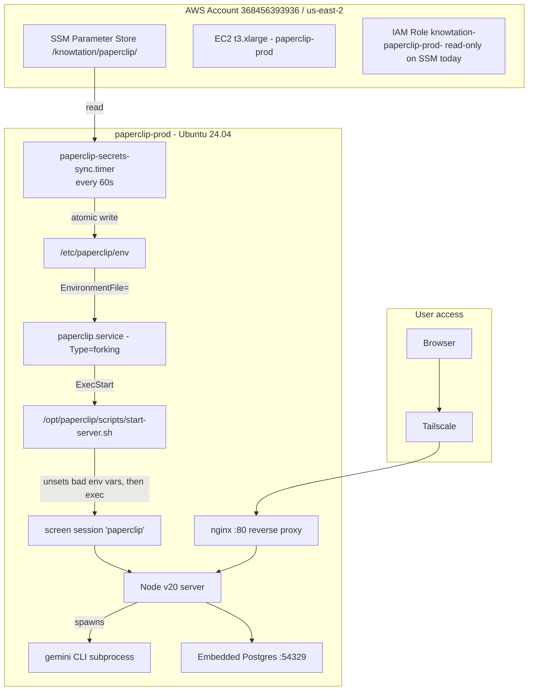

# Paperclip — AWS setup, root-cause notes, and iMac transition plan

**Status as of 2026-05-11 (AWS)**: Paperclip was **live and healthy** at `paperclip-prod` on AWS EC2 (Tailscale, onboarding, Gemini CLI path validated). **Status as of 2026-05-14 (handoff)**: This doc now includes a **full Mac setup checklist**, **environment prep**, and a **copy-paste next-session prompt** for Cursor on the new machine.

This document exists so that:
1. You can pick up exactly where we left off when the iMac (or any Mac server) is ready.
2. You can reconnect to AWS later if you ever need to.
3. The two days of debugging are not lost.
4. A new agent chat has everything needed without re-reading the whole thread.

---

## TL;DR for future-you

| Question | Answer |
|---|---|
| Is the AWS Paperclip server working? | Yes. Port 3000 listening, nginx 200, all 5 verification layers pass. |
| Is anything left to do on AWS? | Optional: rotate exposed secrets (see below), apply terraform IAM update. |
| What's the failure mode the user hit? | CEO agent calls Gemini → free-tier API is slow → Paperclip's internal probe times out. Cosmetic, not infrastructure. |
| When iMac arrives, do I redo all this? | No. ~95% of the AWS pain is Linux/systemd/SSM specific. Follow the **iMac checklist** below (about 2–4 hours first time). |
| Should I open a PR with these doc changes? | No PR right now. Per repo rule, docs-only PRs to `main` are forbidden. Bundle with the next code PR (e.g. when push-secrets.sh changes are tested). Prefer **Muse** for canonical commits per [`AGENTS.md`](../AGENTS.md) unless the task explicitly targets GitHub only. |

---

## Architecture as deployed (AWS)



Key external touchpoints from the running server:
- **Google AI Studio** — Gemini CLI calls `generativelanguage.googleapis.com` with `GEMINI_API_KEY`
- **DeepInfra, HeyGen, ElevenLabs, Descript** — adapter HTTP clients (not yet exercised end-to-end at time of writing)
- **Knowtation Hub** — at `https://knowtation-gateway.netlify.app` with `KNOWTATION_HUB_JWT`

---

## What ate two days (root causes)

Every single failure traced back to one of these three problems. Documenting them so neither you nor a future operator falls into the same traps.

### Trap 1: SSM sync timer silently overwrote every manual env edit

**File**: [`deploy/paperclip/install.sh`](../deploy/paperclip/install.sh) line 294

```bash
mv "$TMP_FILE" "$ENV_FILE"
```

The `paperclip-secrets-sync.timer` runs `/usr/local/bin/paperclip-secrets-sync` every 60 seconds and **atomically replaces** `/etc/paperclip/env` with whatever is in AWS SSM at `/knowtation/paperclip/*`. Manual edits via `nano`, `tee -a`, or `echo >>` are wiped on the next sync cycle.

**Symptom**: nano "saves" successfully, then `grep` returns nothing. Looks like the edit failed. It actually succeeded — the timer just deleted it.

**Fix**: never edit `/etc/paperclip/env` directly. Push to SSM instead:

```bash
aws ssm put-parameter \
  --region us-east-2 \
  --name /knowtation/paperclip/<KEY_NAME> \
  --type SecureString \
  --overwrite \
  --value "<value>"
sudo systemctl start paperclip-secrets-sync.service  # immediate sync
```

### Trap 2: systemd-injected env vars break Node v20 + pino + embedded Postgres

When systemd (PID 1) launches a service, it injects:
- `MEMORY_PRESSURE_WATCH`, `MEMORY_PRESSURE_WRITE` — Node v20 reads these and misbehaves with v8 heap sizing
- `JOURNAL_STREAM`, `INVOCATION_ID`, `SYSTEMD_EXEC_PID` — pino detects them and switches to a buffering mode that never flushes, so logs vanish
- `NOTIFY_SOCKET`, `WATCHDOG_PID`, `WATCHDOG_USEC`, `LISTEN_*` — sd_notify / socket-activation hooks

**Symptom**: Node process consumes 1024MB → 4096MB heap, OOMs, crashes in a loop. Memory growth is linear and fast (~50MB/s during startup). Same code under `screen` works fine in <5 seconds at 230MB RSS.

**`UnsetEnvironment=` does not fix it** — those vars are injected after `UnsetEnvironment=` is processed.

**Fix**: launch via a wrapper script that does `unset` immediately before `exec node`. The current production wrapper at `/opt/paperclip/scripts/start-server.sh`:

```bash
#!/usr/bin/env bash
set -euo pipefail
unset MEMORY_PRESSURE_WATCH MEMORY_PRESSURE_WRITE INVOCATION_ID JOURNAL_STREAM SYSTEMD_EXEC_PID NOTIFY_SOCKET WATCHDOG_PID WATCHDOG_USEC LISTEN_PID LISTEN_FDS LISTEN_FDNAMES
set -a
source /etc/paperclip/env
set +a
export PORT=3000
export NODE_ENV=production
export NODE_OPTIONS="--max-old-space-size=1024"
export GEMINI_SANDBOX=false
export GEMINI_NO_SANDBOX=1
export GEMINI_CLI_TRUST_WORKSPACE=true
cd /opt/paperclip/server
exec /usr/bin/node dist/index.js
```

And the systemd unit launches via `screen` so the wrapper's clean env stays clean:

```ini
[Service]
Type=forking
User=paperclip
Group=paperclip
ExecStart=/usr/bin/screen -dmS paperclip /opt/paperclip/scripts/start-server.sh
ExecStop=/usr/bin/screen -S paperclip -X quit
Restart=on-failure
RestartSec=15
```

This pattern (`Type=forking` + screen + wrapper) is **AWS+Linux specific**. macOS launchd does not have this problem.

### Trap 3: Gemini CLI v0.41 stopped storing the API key in settings.json

Earlier Gemini CLI versions wrote `apiKey` into `~/.gemini/settings.json`. Starting in v0.41, the file only stores the **auth method** (`gemini-api-key`). The actual key MUST come from the `GEMINI_API_KEY` environment variable on every invocation.

**Symptom**: `Please set an Auth method in your /opt/paperclip/.gemini/settings.json or specify GEMINI_API_KEY` even though `settings.json` is correct.

**Fix**: ensure `GEMINI_API_KEY` is in the parent process env so the spawned `gemini` subprocess inherits it. This is now handled by SSM → env file → systemd → wrapper → Node → spawn.

### Two minor traps along the way

- **Region mismatch**: `terraform.tfvars` says `aws_region = "us-east-2"`, but several earlier debug commands used `--region us-west-2`. The secrets-sync script at line 282 of install.sh dynamically reads region from EC2 IMDS, so production is fine — but manual aws CLI calls must use `us-east-2`.
- **terraform IAM policy not applied**: Local [`deploy/paperclip/terraform/main.tf`](../deploy/paperclip/terraform/main.tf) was updated to grant `ssm:PutParameter`, but the change was never `terraform apply`'d. Currently the EC2 role is read-only on SSM. We pushed `GEMINI_API_KEY` from your laptop's admin creds. Run `terraform apply` later if you want `push-secrets.sh` to work from inside the EC2 instance.

---

## Current production state (verified 2026-05-11 22:48 UTC)

```
paperclip.service                    active (running) enabled
paperclip-secrets-sync.timer         active (waiting) enabled
Node process                         PID 41095, RSS 167MB, 0.8% CPU (steady, no leak)
Port 3000                            LISTEN on 127.0.0.1
nginx /onboarding                    HTTP 200
SSM /knowtation/paperclip/*          14 parameters (13 original + GEMINI_API_KEY)
Gemini auth probe                    PASS (manual `gemini -p "Respond with hello"` works)
```

---

## SECURITY — all keys exposed in chat must be rotated

During debugging, a `cat /proc/<pid>/environ` dump exposed every secret in the chat transcript. Treat them as compromised.

| Secret | Where it lives | Rotation URL |
|---|---|---|
| Old Gemini key (`...ZdOYc`) | Born Free `bornfree-hub/.env` (active!) and Netlify env | [aistudio.google.com/app/apikey](https://aistudio.google.com/app/apikey) — delete |
| Current Gemini key (`...LS-4rs`) | Paperclip SSM | Same — delete + create new + push via `aws ssm put-parameter` |
| `DEEPINFRA_API_KEY` | Paperclip SSM | [deepinfra.com/dash/api_keys](https://deepinfra.com/dash/api_keys) |
| `HEYGEN_API_KEY` | Paperclip SSM | HeyGen → Settings → API |
| `ELEVENLABS_API_KEY` | Paperclip SSM | ElevenLabs → Profile → API Keys |
| `DESCRIPT_API_KEY` (bearer + secret) | Paperclip SSM | Descript → Account → API & Integrations |
| `KNOWTATION_HUB_JWT` | Paperclip SSM | Hub → Settings → Integrations |

**Recommended pattern going forward**: separate keys per service. `BornFree Chat` and `Paperclip Server` should be two different Gemini keys so a leak in one doesn't compromise the other.

After rotating, push to SSM with:
```bash
aws ssm put-parameter --region us-east-2 \
  --name /knowtation/paperclip/<KEY_NAME> \
  --type SecureString --overwrite --value "<new_value>"
sudo systemctl start paperclip-secrets-sync.service
```

For Born Free, edit `bornfree-hub/.env` directly (gitignored) and update the Netlify env var via the Netlify dashboard.

---

## Day-2 ops — how to manage the running AWS server

### SSH in
```bash
ssh ubuntu@paperclip-prod   # via Tailscale; will fall back to home IP via SG
```

### Restart Paperclip
```bash
sudo systemctl restart paperclip.service
sleep 8
sudo ss -tlnp | grep :3000   # should show node listening
```

### Tail logs (the screen session)
```bash
sudo -u paperclip screen -S paperclip -X hardcopy /tmp/pc.log
sudo cat /tmp/pc.log
# Or attach interactively (Ctrl-A then D to detach):
sudo -u paperclip screen -r paperclip
```

### Verify a key from SSM all the way through
```bash
KEY_PREFIX=$(sudo grep GEMINI_API_KEY /etc/paperclip/env | cut -c1-25)
echo "env file: $KEY_PREFIX"
PID=$(pgrep -f "node dist/index.js" | head -1)
sudo cat /proc/$PID/environ | tr '\0' '\n' | grep GEMINI_API_KEY | cut -c1-25
echo "above is: process env"
```

### Push a new secret
```bash
aws ssm put-parameter --region us-east-2 \
  --name /knowtation/paperclip/<KEY_NAME> \
  --type SecureString --overwrite --value "<value>"
sudo systemctl start paperclip-secrets-sync.service
sleep 3
sudo grep <KEY_NAME> /etc/paperclip/env | cut -c1-25
```

### Reboot survival
Both `paperclip.service` and `paperclip-secrets-sync.timer` are `enabled` — they auto-start on EC2 reboot. No manual action required.

---

## Files changed in this session

### Local repo (uncommitted)

| Path | Purpose | Commit advice |
|---|---|---|
| [`deploy/paperclip/scripts/push-secrets.sh`](../deploy/paperclip/scripts/push-secrets.sh) | Added `GEMINI_API_KEY` to REQUIRED list and header comment | **Commit** — code change, useful for future operators |
| [`docs/PAPERCLIP-AWS-SETUP-AND-IMAC-TRANSITION.md`](PAPERCLIP-AWS-SETUP-AND-IMAC-TRANSITION.md) | This doc | **Commit** with the push-secrets change above (so PR isn't docs-only) |
| [`deploy/paperclip/terraform/main.tf`](../deploy/paperclip/terraform/main.tf) | Already had ssm:PutParameter additions before this session | **Commit** if you intend to apply, else leave alone |
| [`deploy/paperclip/terraform/variables.tf`](../deploy/paperclip/terraform/variables.tf) | Already modified before this session | Inspect with `git diff` and decide |
| `deploy/paperclip/install.sh` | Already modified before this session | Inspect with `git diff` and decide |
| `deploy/paperclip/terraform/.terraform.lock.hcl` | Generated lock file | Commit (locks provider versions) |
| `deploy/paperclip/terraform/terraform.tfstate*` | **State files — do NOT commit** | Should be in .gitignore. Verify. |
| `deploy/paperclip/terraform/terraform.tfvars` | Contains Tailscale auth key, your home IP | **DO NOT commit** — should be in .gitignore |

### On the AWS server (already in place)

| Path | What it is |
|---|---|
| `/etc/systemd/system/paperclip.service` | The `Type=forking` + screen unit |
| `/opt/paperclip/scripts/start-server.sh` | The wrapper that strips bad env vars |
| AWS SSM `/knowtation/paperclip/GEMINI_API_KEY` | The key, encrypted with default KMS |

These need to be replicated to a new install (e.g. iMac), but their forms will differ on macOS. The patterns transfer; the exact files do not.

### Recommended commit + PR strategy

Per the repo rule [`/.cursor/rules/no-docs-only-pr-to-main.mdc`](../.cursor/rules/no-docs-only-pr-to-main.mdc), do **not** open a docs-only PR to `main`.

**Recommended sequence** when you're ready:

1. Commit `deploy/paperclip/scripts/push-secrets.sh` + this doc together on a feature branch:
   ```bash
   git checkout -b feat/paperclip-gemini-onboarding
   git add deploy/paperclip/scripts/push-secrets.sh \
           docs/PAPERCLIP-AWS-SETUP-AND-IMAC-TRANSITION.md
   git commit -m "Paperclip: add GEMINI_API_KEY to push-secrets, document AWS setup + iMac transition"
   git push -u origin feat/paperclip-gemini-onboarding
   ```
2. Open the PR. The bundle is code + docs, so it satisfies the no-docs-only rule.
3. Hold off on the terraform IAM update PR until you decide whether to keep AWS or migrate. If migrating, terraform will be deleted entirely.
4. The other pre-existing local changes (`install.sh`, `variables.tf`, etc.) are unrelated to this session — review with `git diff` separately and decide their fate independently.

---

## iMac transition plan

### Why most of this work doesn't transfer

| AWS pain | iMac equivalent |
|---|---|
| AWS SSM Parameter Store | macOS Keychain or local `.env` (no sync timer needed) |
| systemd hardening fights | `launchd` LaunchAgent or LaunchDaemon |
| `paperclip-secrets-sync.timer` overwrites | Does not exist on Mac; you own the file |
| MEMORY_PRESSURE_WATCH / JOURNAL_STREAM injection | Not a launchd issue like systemd; no screen wrapper required |
| Tailscale + nginx for routing | Localhost-only is fine; Tailscale Mac app if you want phone/laptop access without port forwarding |
| t3.xlarge OOMs | Desktop-class RAM; tune `NODE_OPTIONS` only if you hit limits |
| terraform state | Only if you keep AWS |

### What does transfer

- **Knowledge of Paperclip's startup sequence** (embedded PG init takes ~3-5s, server binds 3000 after)
- **Gemini CLI v0.41 quirks** (key in env var, not settings.json; sandbox needs Docker Desktop OR set `GEMINI_SANDBOX=false` / `GEMINI_NO_SANDBOX=1`)
- **Adapter list**: `acpx_local`, `claude_local`, `codex_local`, `cursor` (39 models), `gemini_local`, `hermes_local`, `opencode_local`, `pi_local`. **Strong recommendation on Mac: prefer the `cursor` adapter** if you want fewer moving API keys (you already pay for Cursor).
- **The runbook** at [`docs/marketing-internal/RUNBOOK-VIDEO-FACTORY-2026-04-30.md`](marketing-internal/RUNBOOK-VIDEO-FACTORY-2026-04-30.md)
- **Rotated API keys** in a password manager; never commit `.env`

### Environment ready before you open Cursor on the new Mac

Do these once so the first agent session is productive:

| Step | Notes |
|---|---|
| **Apple ID / iCloud** | Sign in if you use iCloud Keychain or want continuity; optional for a dedicated “server” user. |
| **Software Update** | Install latest macOS for your hardware. |
| **FileVault** | On (recommended). After reboot, a **logged-in user session** is usually required before **LaunchAgents** in `~/Library/LaunchAgents` run. Plan for that (see persistence below). |
| **Time Machine or backup** | External drive or network backup before you rely on the machine for production workflows. |
| **Knowtation repo on disk** | Clone or sync `knowtation` (this doc lives at `docs/PAPERCLIP-AWS-SETUP-AND-IMAC-TRANSITION.md`). Muse users: pull/snapshot per your normal Muse workflow so the doc is present. |
| **Paperclip repo** | Clone `https://github.com/paperclipai/paperclip` (or your fork) to a fixed path, e.g. `~/paperclip`. |
| **Secrets** | Prepare **rotated** keys in a password manager. Create `~/paperclip/.env` locally; do **not** paste keys into Cursor chat. Match variable names to what Paperclip expects (mirror AWS `/etc/paperclip/env` names if migrating). |
| **AWS CLI (optional)** | Only if you will run `terraform destroy` or read SSM from this Mac; configure a profile with least privilege. |
| **Cursor** | Install Cursor, sign in, **Open Folder** on `knowtation` and/or `paperclip`. New chat: paste the prompt in [Next session prompt (copy-paste)](#next-session-prompt-copy-paste) below. |
| **Muse CLI (optional)** | If commits go to MuseHub staging, ensure Muse is installed and authenticated per [`AGENTS.md`](../AGENTS.md). |

### Display off, Mac stays on (headless-friendly)

Use **System Settings** (names vary slightly by macOS version):

1. **Battery** or **Energy**: set **Turn display off after** to a few minutes.
2. On **Power Adapter**: enable **Prevent automatic sleeping when the display is off** (or equivalent: keep system awake while display sleeps).
3. Enable **Wake for network access** if you will SSH or use Tailscale while the display is asleep.
4. On desktops: **Start up automatically after a power failure** (Energy), if available.

This gives you: screen dark, CPU and services running. **Laptop lid closed** behavior differs; for an iMac / Mac mini / Studio, the above is the right model.

### Software to install (checklist)

Install in roughly this order. Adjust if you use **nvm** or **fnm** instead of Homebrew for Node.

| # | Software | Role | Install notes |
|---:|---|---|---|
| 1 | **Xcode Command Line Tools** | Compilers for Homebrew / native deps | `xcode-select --install` |
| 2 | **Homebrew** | Package manager | https://brew.sh |
| 3 | **Git** | Clone Paperclip + knowtation | `brew install git` |
| 4 | **Docker Desktop** | Gemini CLI sandbox, future OpenClaw/containers | https://www.docker.com/products/docker-desktop/ — allocate enough **disk** and **RAM** in Docker Settings |
| 5 | **Node.js 20 LTS** | Match AWS runtime | `brew install node@20` then `echo 'export PATH="/opt/homebrew/opt/node@20/bin:$PATH"' >> ~/.zshrc` (Apple Silicon path; on Intel use `/usr/local/opt/node@20/bin`) |
| 6 | **pnpm** | Paperclip build | `brew install pnpm` |
| 7 | **Gemini CLI** (if using `gemini_local`) | Subprocess adapter | `npm install -g @google/gemini-cli` |
| 8 | **Tailscale** (optional) | Remote access without opening router ports | `brew install --cask tailscale` or App Store |
| 9 | **jq** / **curl** (optional) | API and JSON debugging | `brew install jq` |
| 10 | **PostgreSQL / nginx via brew** (optional) | Paperclip ships **embedded Postgres** on the paths we used; brew Postgres is only if you intentionally run an external DB. **nginx** only if you want a local reverse proxy (usually unnecessary on Mac; use `127.0.0.1:3000`). |

**Paperclip embedded Postgres**: default install uses embedded Postgres on a high port (e.g. `:54329` on AWS). Do not install brew `postgresql@16` unless you are switching architectures on purpose.

**Docker without Paperclip**: If you set `GEMINI_SANDBOX=false` and use the **Cursor** adapter, Docker is optional for day one; still recommended for parity and future OpenClaw.

### Recommended iMac install sequence (estimated 2–4 hours first time)

**Phase A — OS (15–30 min)**  
1. Complete macOS setup wizard, Software Update, FileVault on.  
2. Apply [Display off, Mac stays on](#display-off-mac-stays-on-headless-friendly) settings.  
3. Optional: create a **dedicated macOS user** (e.g. `factory`) for long-running services vs. your daily user.

**Phase B — Toolchain (45–60 min)**  
4. Xcode CLT → Homebrew → `git`, `node@20`, `pnpm`.  
5. Docker Desktop install, one test `docker run hello-world`.  
6. Optional: Tailscale, log in, approve machine in admin console.

**Phase C — Paperclip (60–90 min)**  
7. Clone Paperclip, `pnpm install --frozen-lockfile`, `pnpm -r build`.  
8. Create `~/paperclip/.env` with rotated secrets (never commit).  
9. Configure `~/.gemini/settings.json` if using Gemini CLI: auth type `gemini-api-key`; key still from **`GEMINI_API_KEY` in env**.  
10. First run (foreground):  
    ```bash
    cd ~/paperclip/server
    set -a; source ~/paperclip/.env; set +a
    export PORT=3000
    export NODE_ENV=production
    # Optional if using Gemini subprocess:
    export GEMINI_SANDBOX=false
    export GEMINI_NO_SANDBOX=1
    export GEMINI_CLI_TRUST_WORKSPACE=true
    node dist/index.js
    ```  
11. Browser: `http://127.0.0.1:3000/onboarding` — complete onboarding. Prefer **Cursor** adapter if you want less Gemini quota pain.

**Phase D — Persistence with launchd (30–60 min)**  
12. Choose one model:  
    - **LaunchAgent** (`~/Library/LaunchAgents/*.plist`): starts when **that user logs in**. Simple; requires a login session after reboot (FileVault unlock + login).  
    - **LaunchDaemon** (`/Library/LaunchDaemons/` + `UserName` key): closer to “true server”; more setup and permission care.  
13. Point `StandardOutPath` / `StandardErrorPath` at files under `~/Library/Logs/` (or `/usr/local/var/log/`) so failures are visible without Cursor.  
14. `launchctl bootstrap` / `kickstart -k` as appropriate for your macOS version; test **reboot** once.

**Phase E — Knowtation integration (later same day or next)**  
15. Open **knowtation** repo in Cursor; run or adapt [`deploy/paperclip/scripts/wire-knowtation-mcp.sh`](../deploy/paperclip/scripts/wire-knowtation-mcp.sh) per your vault path.  
16. Video factory content steps: [`docs/marketing-internal/RUNBOOK-VIDEO-FACTORY-2026-04-30.md`](marketing-internal/RUNBOOK-VIDEO-FACTORY-2026-04-30.md).

**Phase F — Messaging (later milestone)**  
17. **Discord** before WhatsApp (simpler bot token flow). WhatsApp usually means **Meta Cloud API** or a bridge—plan separately. Optional architecture: **OpenClaw** or MCP bridges for chat → Paperclip backlog (see prior strategy discussions).

**Phase G — Turn off AWS cost**  
18. When iMac is proven: from a machine with Terraform state, `terraform destroy` for Paperclip (see [Decommissioning AWS](#decommissioning-aws-when-youre-ready-to-fully-migrate)). Manually remove SSM secrets terraform does not own. Rotate any key that ever lived on EC2 or in chat.

### iMac storage consideration

Paperclip's data dir was **~70MB** on AWS. Renders live in HeyGen/Descript cloud. **256GB storage is plenty** for this stack; prioritize **RAM** (32GB+ comfortable for Docker + Paperclip + Cursor).

### Cursor on the new machine (how “pick up” works)

1. Install Cursor, sign in with your account.  
2. **Clone repos on the Mac first** — Cursor does not move code between computers.  
3. **File → Open Folder** → `knowtation` (for this doc and deploy scripts) and/or `~/paperclip`.  
4. Start a **new chat** and paste the [Next session prompt](#next-session-prompt-copy-paste). Attach `@docs/PAPERCLIP-AWS-SETUP-AND-IMAC-TRANSITION.md` if the picker supports it.  
5. Chats do not always carry over as one thread; the doc + prompt replace that gap.

### Muse vs Git for commits

Per [`AGENTS.md`](../AGENTS.md): default product history on MuseHub uses **`muse status` → `muse code add` → `muse commit` → `muse push staging <branch>`**. Use Git only when the task explicitly targets GitHub PRs/CI. Bundling **code + this doc** avoids a docs-only PR to `main` per [`.cursor/rules/no-docs-only-pr-to-main.mdc`](../.cursor/rules/no-docs-only-pr-to-main.mdc).

---

## Next session prompt (copy-paste)

Use this as the **first message** in a new Cursor chat on the Mac (adjust paths if yours differ):

```
You are helping me finish local "video factory" setup on a new Mac (Apple Silicon, plenty of RAM).

Context: read @docs/PAPERCLIP-AWS-SETUP-AND-IMAC-TRANSITION.md in the knowtation repo — especially the iMac checklist, launchd persistence, and security rotation notes. We previously ran Paperclip on AWS; the Mac does NOT need systemd/SSM/screen wrappers.

Goals (in order):
1. Verify or install: Xcode CLT, Homebrew, git, Docker Desktop, Node 20, pnpm; optional Tailscale.
2. Ensure macOS Energy settings: display can sleep, system stays awake on AC, wake for network access on if we use SSH/Tailscale.
3. Clone/build Paperclip at ~/paperclip (or confirm existing clone), create ~/paperclip/.env from my password manager — do not ask me to paste secrets into chat; use .env file edits locally.
4. Run Paperclip once in foreground; confirm http://127.0.0.1:3000/onboarding loads.
5. Add a LaunchAgent plist to auto-start Paperclip on login, with log files under ~/Library/Logs/, and document how to restart it.
6. Optional: wire Knowtation MCP using deploy/paperclip/scripts/wire-knowtation-mcp.sh from knowtation repo.
7. When stable, give exact steps to terraform destroy AWS Paperclip stack from the machine that still has state, and remind me to delete remaining SSM secrets and rotate keys if anything was ever exposed.

Constraints: follow knowtation AGENTS.md — prefer Muse for commits when working inside knowtation. Minimal scope; no unrelated refactors. Ask only if blocked (e.g. missing path to paperclip repo).
```

---

## Decommissioning AWS (when you're ready to fully migrate)

Single command from your laptop:

```bash
cd /Users/aaronrenecarvajal/knowtation/deploy/paperclip/terraform
terraform destroy
```

This tears down:
- EC2 instance
- Security group
- IAM role + policies
- SSM parameters under `/knowtation/paperclip/*` (only the ones managed by terraform — currently `KNOWTATION_HUB_URL` and `KNOWTATION_VAULT_ID`)

**Manually delete after `terraform destroy` (terraform doesn't manage these):**
- The 11 secrets in SSM you pushed via `push-secrets.sh` (DEEPINFRA, HEYGEN, ELEVENLABS, DESCRIPT, KNOWTATION_HUB_JWT, GEMINI_API_KEY)
- The `aaron-admin` IAM user's access keys if you no longer need AWS

**Cost stop**: ~$140/mo savings (t3.xlarge + EBS + outbound bandwidth).

---

## Lessons learned (worth re-reading on iMac)

1. **A 60-second sync timer that atomically replaces a config file is a debugging nightmare.** If you ever build something similar, log every overwrite or use a separate file for ephemeral additions.

2. **systemd's "secure" defaults break Node v20.** Use a wrapper script that `unset`s `MEMORY_PRESSURE_*`, `JOURNAL_STREAM`, etc. before exec'ing node. Or use `Type=forking` + a session manager (screen, tmux) so node runs in a clean user-session env.

3. **Gemini CLI v0.41+ requires `GEMINI_API_KEY` in env**, not just settings.json. Same for Born Free if it ever upgrades.

4. **Always verify auth with the same user/HOME the server uses.** `sudo -u paperclip env HOME=/opt/paperclip GEMINI_API_KEY=$KEY gemini -p "Respond with hello."` is the canonical probe.

5. **`/proc/<pid>/environ` dumps reveal every env var in plaintext.** Never run that command on a process holding secrets unless you're prepared to rotate everything. If you must debug env vars, use a redacting script.

6. **AWS region matters.** `terraform.tfvars` is the source of truth — `us-east-2` for this project.

7. **terraform state lives in `terraform.tfstate*` and contains secrets.** Should be in `.gitignore`. Verify before any commit.

8. **Don't fight systemd if a 5-line wrapper script makes everything work.** Pragmatism beats purity.

---

## Quick links

- **Live UI**: http://paperclip-prod/onboarding (Tailscale only)
- **Paperclip source**: https://github.com/paperclipai/paperclip
- **AWS console (us-east-2)**: https://us-east-2.console.aws.amazon.com/
- **AI Studio (Gemini keys)**: https://aistudio.google.com/app/apikey
- **Original runbook**: [`docs/marketing-internal/RUNBOOK-VIDEO-FACTORY-2026-04-30.md`](marketing-internal/RUNBOOK-VIDEO-FACTORY-2026-04-30.md)
- **Repo rule on docs-only PRs**: [`.cursor/rules/no-docs-only-pr-to-main.mdc`](../.cursor/rules/no-docs-only-pr-to-main.mdc)
