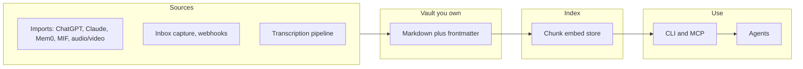

# Knowtation — Whitepaper V2

**Version:** 2.1 (March 2026)  
**Product:** Knowtation (*know* + *notation*) — personal and team knowledge vault with CLI, optional MCP, indexing, search, and imports.

---

## Abstract

What teams and individuals know ends up in a wide variety of places: messaging apps, ticketing tools, wikis, inboxes, and AI-assisted sessions. The scarce resource is not the bytes—it is **the relationships** among decisions, reasoning, and changes over time. Modern language models can work with large inputs, but **volume** is not the same as **precision**. Knowtation takes a different approach: **your canonical material lives in files you control** (Markdown, frontmatter, media), gets **indexed** with filters for projects, tags, time, and optional causal links, and is **invokable by any agent** via a lightweight CLI and skill manifest—so your notation stays movable, auditable, and yours. This document outlines the problem behind that design, how Knowtation responds to it without claiming to replace full enterprise platforms, and next steps.

---

## 1. The problem: knowledge is everywhere

Useful knowledge rarely lives in one place. It is distributed across tools and threads: what was decided, why an option was dropped, what changed last quarter. Each tool owns a piece. **Weaving those pieces into answers**—e.g., "why did we do X?" or "what preceded Y?"—still depends on people who were present. When they leave, the artifacts often remain; the **mental model** of how things fit degrades.

The shortage is not information. It is a lack of **shared, lasting coherence** at the layer where work happens. Knowtation provides **one place you choose** to bring notation together: imports, captures, transcripts, and notes in a single vault with a consistent shape—so coherence can rest on a stable foundation instead of transient UI state alone.

---

## 2. The shift with AI

Assistants and agents need background. Shoving a full history into the model window costs money and often **hurts**: word overlap is not semantic relevance; the wrong material leads to assertive but false answers. The bottleneck is not only model strength—it is **fetching**: bringing **a small, relevant subset** that matches intent, time, and (where modeled) cause and effect.

Knowtation treats **fetching as a core problem**: semantic search over an index, with CLI knobs for payload size and scope (`--project`, `--tag`, `--fields`, snippet length, count-only). Optional metadata and filters enable **time-bounded** and **chain-aware** queries so the system can address "what preceded this?" without pretending the vault is a limitless opaque pile. See [INTENTION-AND-TEMPORAL.md](./INTENTION-AND-TEMPORAL.md) and [RETRIEVAL-AND-CLI-REFERENCE.md](./RETRIEVAL-AND-CLI-REFERENCE.md).

---

## 3. Persistence, fetch, and truth

**Persistence** is required but not enough. **Truth**—what is current—requires practice: dated notes, superseding docs, optional links (`follows`, `causal_chain_id`, entities, episodes). **Fetching** must mix embedding search with structure so "same term, different period" does not get flattened into one undifferentiated mass.

Knowtation’s stance:

- **Vault as canonical source** — Markdown on disk; editor-agnostic; versionable for audit and rollback ([PROVENANCE-AND-GIT.md](./PROVENANCE-AND-GIT.md)).
- **Index** — Chunks embedded in a vector store (Qdrant or sqlite-vec); metadata for path, project, tags, dates, optional causal chains and entities.
- **CLI** — Same operations for humans and agents; JSON output for pipelines; no vendor lock on a single chat surface.

Naive "load all and ask" RAG breaks on long-horizon, causal questions; Knowtation’s schema and flags are a **concrete step** toward structured recall at vault scale.

---
## 4. Token minimization: right information at best cost

The bottleneck in many agent setups is **over-fetch**—pulling 2000+ tokens for a simple question wastes cost and context. Knowtation gives agents explicit knobs to stay lean.

**Tiered retrieval pattern:** (1) **Narrow scope** — `--project`, `--tag`, `--since`, `--until`, `--chain`, `--entity`; (2) **Cheap first** — `search` or `list-notes` with `--limit 5 --fields path` returns paths or short snippets; (3) **Fetch only what's needed** — `get-note <path>` for the 1–2 paths that matter; use `--body-only` or `--frontmatter-only` when one part is enough.

**Examples:** *"What did we decide about auth?"* → `search "decisions about auth" --entity auth --limit 5 --json` → then `get-note` for top paths. *"How many match X?"* → `search "X" --count-only --json`. **Levers:** `--fields`, `--snippet-chars`, `--count-only`; optional `summarizes` / `state_snapshot` for range compression. See [RETRIEVAL-AND-CLI-REFERENCE.md](./RETRIEVAL-AND-CLI-REFERENCE.md).

---

## 5. Imports, capture, and transcription

**Imports:** ChatGPT, Claude, Mem0, NotebookLM, Google Drive, MIF, generic Markdown. Each produces vault notes with `source`, `source_id`, `date`; re-imports idempotent. **Capture:** Message-interface plugins (file, webhooks for Slack/Discord) write to `vault/inbox/` per [CAPTURE-CONTRACT.md](./CAPTURE-CONTRACT.md). **Transcription:** Audio/video → one note per recording; smart glasses, wearables, webhooks supported. All lands in one vault, one index. See [IMPORT-SOURCES.md](./IMPORT-SOURCES.md).

---

## 6. Agent integration

Knowtation is designed as a **knowledge backend** for multi-agent orchestration systems. Any orchestrator and its agents can read from and write to the vault via **CLI** or **MCP**.

- **Vault as input** — Brain dumps, specs, or prior context can live in the vault. A planner (or human) pulls from the vault to build plans; agents run as usual with that context.
- **Agents read** — Search and list with filters; `get-note` for chosen paths. Use tiered retrieval to minimize tokens.
- **Agents write** — Pipe summaries, decisions, or phase outputs into `knowtation write ... --stdin` with frontmatter so the vault accumulates shared context.
- **MCP** — When the runtime speaks MCP (Cursor, Claude, or an orchestrator), tools (`search`, `get_note`, `list_notes`, `write`, etc.) appear directly. **CLI** — When agents run in containers or worktrees without MCP, they exec `knowtation ... --json` and parse output.
- **Hub as agent backend** — Agents can use the Hub REST API with `KNOWTATION_HUB_TOKEN` (JWT). `knowtation propose --hub <url>` creates a proposal for human review before commit; approved proposals are written to the vault. See [HUB-API.md](./HUB-API.md), [AGENT-INTEGRATION.md](./AGENT-INTEGRATION.md).

See [AGENT-ORCHESTRATION.md](./AGENT-ORCHESTRATION.md) for setup and patterns.

---

## 7. Vault Git and messaging

**Vault under Git:** The vault can live in a Git repo for backup and version history. Config: `vault.git.enabled`, `vault.git.remote`; optional `knowtation vault sync` to commit and push. No PR creation—proposals remain Hub-only. See [PROVENANCE-AND-GIT.md](./PROVENANCE-AND-GIT.md).

**Messaging integration:** Slack, Discord, Telegram (and similar) can send messages into the vault via Hub capture (`POST /api/v1/capture`) or standalone adapters. Inbox notes get `source`, `source_id`, `date`. See [MESSAGING-INTEGRATION.md](./MESSAGING-INTEGRATION.md).

---

## 8. Knowtation's thesis

1. **Data liberation** — Your vault is yours. Export, copy, and host where policy demands. SPEC §0 and the README state vendor independence explicitly.
2. **Open brain** — Agents learn behavior via `SKILL.md` and invoke `knowtation` (or MCP) without stuffing large tool specs into every prompt.
3. **Notation over hype** — Value comes from **regular capture**, **re-indexing after edits**, and **queries that match how you organize**—not from any one model drop.

---

## 9. Architecture at a glance

- **Config** — `config/local.yaml`; vault path, embedding provider, vector backend (Qdrant or sqlite-vec), optional memory and AIR ([SPEC.md](./SPEC.md)).
- **Indexer** — Walk vault, chunk by heading or size, embed, upsert idempotently; metadata includes date, optional `causal_chain_id`, `entity`, `episode_id`.
- **Search / list / get-note** — Ranked hits with filters (`--project`, `--tag`, `--since`, `--until`, `--chain`, `--entity`, `--episode`, `--order`); token levers: `--fields`, `--snippet-chars`, `--count-only`, `--body-only`, `--frontmatter-only`.
- **Write / export / import** — Create notes, export to md/html with provenance; import from external platforms.

Full detail: [ARCHITECTURE.md](../ARCHITECTURE.md), [SPEC.md](./SPEC.md), [IMPLEMENTATION-PLAN.md](./IMPLEMENTATION-PLAN.md).

---

## 10. Who it serves — and who it does not

**Serves:** Individuals and teams who want **one movable vault**, **agent-invocable search**, imports from common tools, transcription pipelines, and optional Hub-style review—without betting organizational recall on a single hosted "reasoning layer" they cannot take with them.

**Does not serve:** Replacing ERP, CRM, or org-wide canonical-source mandates. Knowtation is **not** a hyperscale enterprise recall platform competing with cloud giants; it is a **practical tool** for notation, fetch, and ownership at repo and team scale.

---

## 11. Roadmap, Hub, and optional layers

Core development follows [IMPLEMENTATION-PLAN.md](./IMPLEMENTATION-PLAN.md): Phases 1–10 complete (config, vault, indexer, search, write, export, capture, import, transcription, memory, AIR, MCP, sqlite-vec). Phase 11: **Knowtation Hub** — hosted or self-hosted vault, proposals, review queue, web UI. Hub is **convenience**; file semantics and export remain the portability story. **AgentCeption hackathon** (March 2026): Knowtation as knowledge backend for multi-agent orchestration; see [AGENTCEPTION-HACKATHON.md](./AGENTCEPTION-HACKATHON.md).

**Optional:** Memory layer (e.g. Mem0) for "last query + results" and provenance; AIR (intent attestation) before write/export; Phase 12 reserves blockchain/wallet frontmatter and filters for agent payments when needed. **Hosted plug-and-play:** A future offering where we host and maintain the platform; paid users get a zero-config experience (no YAML, no server setup), with optional "Connect GitHub" for backup and "Connect an agent" for API access. See [HOSTED-PLUG-AND-PLAY.md](./HOSTED-PLUG-AND-PLAY.md).

---

## 12. Questions before you commit to a knowledge system

1. **Where does your team’s real understanding actually form?** If each team uses a different assistant with no shared corpus, you rebuild walls. A vault plus discipline is one way to **unify notation** while using any model for reasoning.

2. **Does fetch quality improve over time?** Re-index after edits; use projects, tags, and dates; narrow agent input with `--fields` and filters so each call brings **clarity**, not clutter.

3. **How expensive is exit?** If your recall lives only inside a vendor’s closed graph, migration will lose data. Markdown, git, and explicit frontmatter keep **egress** defined: copy the folder, re-embed elsewhere, preserve meaning in the files.

---

## References (in-repo)

| Document | Role |
|----------|------|
| [SPEC.md](./SPEC.md) | Formats, CLI, config, contracts |
| [IMPLEMENTATION-PLAN.md](./IMPLEMENTATION-PLAN.md) | Phases and deliverables |
| [INTENTION-AND-TEMPORAL.md](./INTENTION-AND-TEMPORAL.md) | Time, causation, hierarchical memory |
| [RETRIEVAL-AND-CLI-REFERENCE.md](./RETRIEVAL-AND-CLI-REFERENCE.md) | Commands, token levers, tiered retrieval |
| [IMPORT-SOURCES.md](./IMPORT-SOURCES.md) | Import types and how to run |
| [CAPTURE-CONTRACT.md](./CAPTURE-CONTRACT.md) | Message-interface plugin contract |
| [AGENT-ORCHESTRATION.md](./AGENT-ORCHESTRATION.md) | MCP and CLI for agent orchestration |
| [PROVENANCE-AND-GIT.md](./PROVENANCE-AND-GIT.md) | Provenance and version history |
| [HUB-API.md](./HUB-API.md) | Hub REST API and auth |
| [AGENT-INTEGRATION.md](./AGENT-INTEGRATION.md) | CLI, MCP, Hub API for agents |
| [MESSAGING-INTEGRATION.md](./MESSAGING-INTEGRATION.md) | Slack, Discord, capture adapters |
| [AGENTCEPTION-HACKATHON.md](./AGENTCEPTION-HACKATHON.md) | Hackathon integration |

---

*Knowtation: your notation, your data, your fetch path.*
