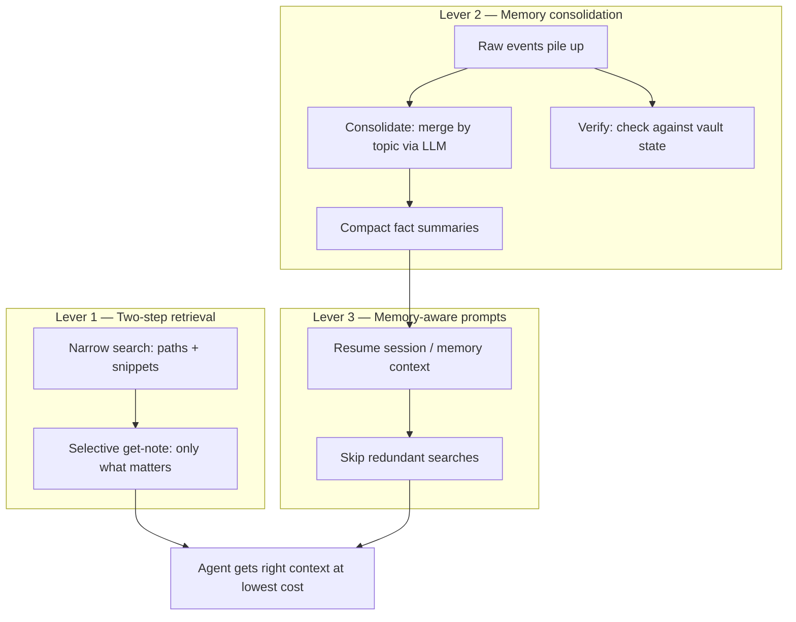
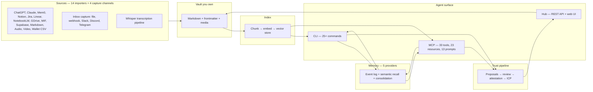

# Knowtation — Whitepaper

**Version:** 3.2 (April 2026)  
**Product:** Knowtation (*know* + *notation*) — a personal and team knowledge vault with CLI, MCP, semantic search, memory, attestation, and a full import pipeline. Self-hosted or hosted at [knowtation.store](https://knowtation.store).

---

## 📖 How to read this document

| Block | What to expect |
|--------|----------------|
| **📌 Abstract** | Thesis in one pass — why Knowtation exists and what “good retrieval” means here. |
| **§1–2** | The problem with naive context + the **three levers** (search → memory → prompts). |
| **§3–4** | Why one vault, and how **persistence, fetch, and trust** fit together. |
| **§5 onward** | **Imports, memory, consolidation, Hub, MCP, attestation, billing** — reference depth for builders and buyers. |

**Tip:** Read the abstract first; open numbered sections when you need detail. Long subsections use **bold lead-ins** so you can scan.

---

## 📌 Abstract

Knowtation was built to solve one problem: **agents waste tokens and get worse answers when retrieval is dumb.** Shoving a full history into the model window is expensive and often harmful — word overlap is not semantic relevance, and the wrong material produces confident but wrong answers. The bottleneck in agent-powered work is not model strength. It is **fetching the right context at the lowest cost.**

Knowtation addresses this with three mechanisms that work together: **two-step retrieval** (narrow search, then selective expansion), **memory consolidation** (compress operational history so future context is smaller), and **memory-aware prompts** (avoid re-searching what the agent already knows). These three levers — retrieval precision, history compression, and session continuity — are the founding thesis of the platform. Everything else (vault, imports, MCP, Hub, attestation, billing) exists to make those levers practical and production-ready.

Your canonical material lives in files you control (Markdown, frontmatter, media), gets indexed with filters for projects, tags, time, entities, causal chains, and episodes, and is invokable by any agent via a CLI, 33-tool MCP server, or Hub REST API — so your notation stays movable, auditable, and yours.

**In plain terms:** *Precise retrieval* means faster answers and lower token cost — *narrow search first, open only what matters*; *constant memory consolidation* and flexible context; your Markdown vault stays yours, with optional **Discover** for **cross-topic insights**. **Run locally** or use **hosted** access on **decentralized Internet Computer canisters**. **Attestation records** can **anchor to the Internet Computer blockchain** for **immutable audit** — a differentiator for **legal, compliance, finance**, and any team that must show *who approved a change* and *that the record was not silently rewritten*.

---

## 1. 🎯 The founding problem: agents need better retrieval

AI agents need background context to do useful work. The naive approach — dump everything into the prompt — fails in two ways:

1. **Cost.** Every token costs money. An agent that pulls 5,000 tokens of context when 500 would suffice is 10x more expensive per call. Over thousands of agent interactions, this adds up to real budget impact.
2. **Accuracy.** More context is not better context. Irrelevant material dilutes the signal, causes the model to latch onto the wrong passage, and produces answers that sound right but are not. Retrieval precision is the difference between an agent that helps and an agent that confidently misleads.

Knowtation was built from the start to give agents **the right information at the best cost** — not the most information at any cost.

---

## 2. ⚡ Three levers for token savings

Knowtation reduces agent cost and improves accuracy through three mechanisms that reinforce each other:

### Lever 1: Two-step retrieval — narrow first, expand selectively

Instead of fetching full documents, agents follow a **cheap-then-precise** pattern:

1. **Narrow search** — `search "auth decisions" --entity auth --limit 5 --fields path` returns only paths and short snippets. Cost: minimal tokens.
2. **Selective expansion** — `get-note <path> --body-only` fetches the one or two documents that actually matter. Cost: only the tokens you need.

**Filters** make the first step cheaper and more accurate: `--project`, `--tag`, `--since`, `--until`, `--chain`, `--entity`, `--episode`. **Token levers** control payload size: `--fields`, `--snippet-chars`, `--count-only`, `--body-only`, `--frontmatter-only`.

The result: an agent answering "what did we decide about auth?" sends two small requests instead of one large dump — fewer tokens in, better answer out.

### Lever 2: Memory consolidation — compress history, shrink future context

Raw memory events accumulate. Without compression, an agent's context grows linearly with usage. The **consolidation engine** addresses this with three passes:

1. **Consolidate** (LLM) — Group events by topic, merge overlapping facts, deduplicate. One LLM call per topic (only topics with 2+ events). Output: compact `consolidation` fact strings that replace dozens of raw events.
2. **Verify** (filesystem, no LLM) — Check consolidated memories against current vault state. Flag stale references. Emit `maintenance` events for cleanup.
3. **Discover** (LLM, optional) — **Discover discovers cross-topic insights:** surface connections, contradictions, and open questions across topics (as `insight` events). Off by default; enable when insight value exceeds the additional LLM cost.

**Guardrails that cap spend:** configurable lookback hours, max events/topics per pass, daily USD cost cap, hosted 30-minute cooldown between manual runs, and billing meters that enforce consolidation pass quotas per tier.

After consolidation, future context includes compact summaries instead of raw event logs — so the next session starts cheaper.

### Lever 3: Memory-aware prompts — don't re-search what you already know

Three MCP prompts inject recent memory into agent context:

- **`memory-context`** — What has the agent been doing? Recent events formatted for context.
- **`memory-informed-search`** — Vault search augmented with memory: what was searched before, what is new.
- **`resume-session`** — Pick up where you left off: recent events and session summaries.

Session summaries (`memory_summarize`) compress a session into one event, so the next session loads a paragraph instead of replaying a conversation. The result: agents avoid redundant searches and start with relevant context pre-loaded.

### How the three levers work together

**Without Knowtation:** Agent dumps 5,000 tokens of unfiltered context, pays for all of it, gets a mediocre answer, and starts from scratch next session.

**With Knowtation:** Agent narrows to 500 tokens via two-step retrieval, loads compressed memory from prior sessions, skips searches it already did, and gets a precise answer at a fraction of the cost.

### 2.1 Operational program: token savings in production

The three levers above are the thesis. **Shipped after the original v3.0 narrative**, Knowtation adds a concrete **operational layer** so teams can enforce and tune savings in hosted and self-hosted deployments:

- **Advanced consolidation knobs** — Per-run scope caps: lookback hours, max events and topics per pass, and LLM output token limits. Self-hosted: `config/local.yaml` and Hub **Settings → Consolidation → Advanced**. Hosted: fields persisted on the billing user record and merged into gateway settings, scheduler payloads, and bridge requests so serverless runs honor the same limits.
- **Discover pass** — Optional third stage after consolidate + verify: one additional model pass can emit **insight** events (cross-topic connections, contradictions, open questions). Default **off**; enabling it adds LLM cost inside the same consolidate operation (hosted billing counts one consolidate pass per request; Discover does not double the pass meter). See [TOKEN-SAVINGS.md](./TOKEN-SAVINGS.md) and [MEMORY-CONSOLIDATION-GUIDE.md](./MEMORY-CONSOLIDATION-GUIDE.md).
- **Encrypt-aware consolidation** — When `memory.encrypt` is enabled, consolidation prompts redact event payloads so ciphertext is not expanded into the model context; merge quality trades off against privacy. Configurable self-hosted and via bridge env on hosted.
- **Hosted MCP parity** — Hosted `search` supports HTTP POST and field parity with self-hosted paths so agents can keep result sets small through the gateway without awkward workarounds.
- **Metering and plans** — Stripe-backed tiers enforce or shadow-log searches, index jobs, consolidation allowances, and related caps; token packs can bundle extra headroom. Details evolve with product; authoritative behavior is in gateway and billing code plus [TOKEN-SAVINGS.md](./TOKEN-SAVINGS.md).

The [Token savings](./TOKEN-SAVINGS.md) doc is the living checklist for this layer; the sections above remain the **why**, while 2.1 is the **what shipped** to make savings repeatable.

---

## 3. 🌍 The broader problem: knowledge is everywhere

The token-savings problem exists because useful knowledge rarely lives in one place. It is distributed across tools and threads: what was decided, why an option was dropped, what changed last quarter. Each tool owns a piece. Weaving those pieces into answers still depends on people who were present. When they leave, the artifacts remain; the mental model degrades.

Knowtation provides **one place you choose** to bring notation together: imports, captures, transcripts, media pointers, and notes in a single vault with a consistent shape — so coherence rests on a stable foundation and agents have a single, well-organized corpus to search against.

---

## 4. 🗄️ Persistence, fetch, and trust

**Persistence** is required but not enough. **Truth** — what is current — requires practice: dated notes, superseding documents, optional links (`follows`, `causal_chain_id`, entities, episodes). **Fetching** must mix embedding search with structure so "same term, different period" does not collapse into one undifferentiated mass.

Knowtation's stance:

- **Vault as canonical source** — Markdown on disk; editor-agnostic (Obsidian, SilverBullet, Foam, VS Code); versionable via Git for audit and rollback.
- **Index** — Chunks embedded in a vector store (Qdrant or sqlite-vec); metadata for path, project, tags, dates, optional causal chains, entities, and episodes.
- **CLI** — Same operations for humans and agents; JSON output for pipelines; no vendor lock on a single chat surface.
- **Trust pipeline** — Proposals, human review with LLM-assisted rubric scoring, and optional attestation before anything commits.

---

## 5. 📥 Imports: 14 sources, one vault

Knowtation ships importers for fourteen external sources. Each produces vault notes with `source`, `source_id`, `date`; re-imports are idempotent.

| Source | What it imports |
|--------|-----------------|
| **ChatGPT export** | `conversations.json` from the OpenAI data export |
| **Claude export** | Markdown or JSON from Anthropic export or third-party tools |
| **Mem0 export** | JSON export — one note per memory |
| **NotebookLM** | Folder of Markdown or JSON array export |
| **Google Drive** | Folder of Markdown (e.g. Docs export) |
| **Notion** | Pages via Notion API (`NOTION_API_KEY`) |
| **Jira export** | CSV export from Jira |
| **Linear export** | CSV from Linear's "Export Data" |
| **MIF** | Memory Interchange Format `.memory.md` files |
| **Supabase memory** | Any Supabase table → memory event log + optional vault notes |
| **Generic Markdown** | Markdown files or folders |
| **Audio** | Audio file → Whisper transcription → vault note |
| **Video** | Video file → Whisper transcription → vault note |
| **Wallet CSV** | Exchange/wallet transaction CSV (Coinbase, Binance, Ledger Live, etc.) → per-transaction notes with blockchain frontmatter |

Beyond imports, four **capture channels** ingest live messages: file/stdin, HTTP webhooks, and adapter scripts for Slack, Discord, and Telegram — all writing to `vault/inbox/` per a documented contract.

**Transcription** uses OpenAI Whisper. Audio and video files become vault notes; the same pipeline backs the `transcribe` MCP tool and the CLI `npm run transcribe` script.

---

## 6. 🧠 Memory: five providers, persistent recall

Unlike systems where memory is an afterthought bolted onto chat history, Knowtation treats operational memory as **structured, queryable data** with event types, timestamps, topics, and optional semantic search.

### Event model

Fifteen event types are captured automatically after search, export, write, import, index, propose, capture, and error operations: `search`, `export`, `write`, `import`, `index`, `propose`, `agent_interaction`, `capture`, `error`, `session_summary`, `user`, `consolidation`, `consolidation_pass`, `maintenance`, `insight`. Each event carries an `air_id` when attestation is active, enabling provenance tracking across the memory layer.

### Providers

| Provider | Storage | Semantic search | Encryption |
|----------|---------|-----------------|------------|
| **file** (default) | Append-only `events.jsonl` + `state.json`; optional topic-partitioned JSONL | — | — |
| **vector** | File + embeddings in vector store (`_memory` collection) | Yes | — |
| **mem0** | File + Mem0 REST API dual-write | Yes (via Mem0) | — |
| **supabase** | File + `knowtation_memory_events` table with pgvector | Yes (via `match_memory_events` RPC) | — |
| **encrypted** | AES-256-GCM at rest (`events.jsonl.enc`, `state.json.enc`); scrypt key derivation | — | Yes |

Provider selection is config-driven (`memory.provider`). When `memory.encrypt` is set with a secret, the encrypted provider wraps file storage with AES-256-GCM — the secret never leaves the local environment.

### Cross-vault and global scope

`memory.scope` can be `vault` (per-vault directory) or `global` (shared `memory/_global`). Hosted mode partitions by user ID regardless, so one user's memory never leaks to another.

### Retention enforcement

`pruneExpired(retentionDays)` is implemented across all providers. The memory manager throttles pruning to once per hour to avoid I/O on every write.

### Session summaries

`memory_summarize` generates an LLM-powered summary of recent session activity and stores it as a `session_summary` event — giving agents a compressed starting point for the next session.

### Memory-aware MCP prompts

Three prompts — `memory-context`, `memory-informed-search`, and `resume-session` — inject recent memory events and session summaries into agent context, so agents pick up where they left off without re-searching.

### CLI surface

Seven `memory` subcommands: `query`, `list`, `store`, `search`, `clear`, `export`, `stats`, plus `index` (regenerates a lightweight pointer index) and `consolidate`.

---

## 7. 🔄 Consolidation daemon: memory that gets smarter

Raw memory events accumulate. The consolidation engine compresses them into actionable knowledge through three LLM-powered passes:

1. **Consolidate** — Group events by topic, merge overlapping facts, deduplicate, and store summary `consolidation` events.
2. **Verify** — Check consolidated memories against current vault state; flag stale references; emit `maintenance` events for cleanup.
3. **Discover** — **Discover discovers cross-topic insights:** surface connections, contradictions, and open questions across topics; emit `insight` events so agents and humans see patterns that per-topic consolidation alone would miss.

The daemon runs as a background process (`knowtation daemon start`) with configurable interval, lookback window, and pass selection. Hosted mode enforces a 30-minute cooldown on manual runs, tracks LLM cost per pass, and respects a configurable cost cap (`CONSOLIDATION_COST_CAP_USD`).

---

## 8. 🔗 Wallet and blockchain imports

The `wallet-csv` importer ingests transaction CSVs from major exchanges and wallets — Coinbase, Coinbase Pro, Binance, Ledger Live, and generic formats. Each row becomes a vault note under `inbox/wallet-import/` with blockchain-oriented frontmatter: transaction hash, date, amount, chain (Ethereum, Bitcoin, Solana, ICP, etc.), and labels. This gives agents and humans a searchable, filterable record of on-chain activity inside the same vault that holds meeting notes and project docs.

---

## 9. 🔏 Attestation and ICP anchoring

**AIR (Attestation Integrity Records)** provides an intent-attestation step before writes and exports. When `air.required` is enabled, every write to the vault records who authorized it and why.

**Business, legal, and finance:** Teams under regulatory or contractual pressure need more than “we logged it in Postgres.” HMAC-signed attestations plus optional **Internet Computer blockchain anchoring** support a narrative of *provable intent* and *tamper-evident history* — who approved a write, when, and that the record was not silently replaced. This is **not legal advice** and does not replace counsel or your compliance program; it is a **technical control** that pairs well with human-in-the-loop **proposals** so agent-suggested changes do not land without review.

- **Local mode:** `attestBeforeWrite` and `attestBeforeExport` hooks in the CLI and MCP.
- **Hosted mode:** The gateway auto-provisions an attestation endpoint; HMAC-signed records are stored in Netlify Blobs or local JSON.
- **ICP blockchain anchor:** Attestation records can be dual-written to an Internet Computer canister (`hub/icp/src/attestation/main.mo`) for immutable, decentralized audit trails. Pending attestations are anchored in batch via `POST /api/v1/attest/anchor-pending`.
- **Memory integration:** Supabase memory events carry `air_id` fields, linking memory provenance to attestation records.

---

## 10. 🔌 Supabase bridge: optional, not required

Knowtation is vault-first. Supabase is an **optional bridge**, not a dependency.

- **Import:** `supabase-memory` imports from any Supabase table into the memory event log and optionally into vault notes.
- **Memory provider:** `SupabaseMemoryProvider` dual-writes events to a `knowtation_memory_events` table with pgvector columns for semantic search.
- **Migration path:** Users with existing PostgreSQL-based memory stores (from any tool) can import into Knowtation's event log or keep dual-write active during transition.

The contrast with database-centric systems is architectural: in Knowtation, the vault is the canonical source and the database is a performance layer. In database-centric systems, the database *is* the source, and portability depends on the vendor's export tools.

---

## 11. 🤖 MCP: 33 tools, 23 resources, 13 prompts

Knowtation exposes one of the deepest MCP surfaces available for a knowledge tool.

### Tools (33)

**Vault operations:** `search`, `get_note`, `list_notes`, `write`, `export`, `import`, `capture`, `transcribe`, `vault_sync`, `index`, `relate`, `backlinks`, `extract_tasks`, `cluster`, `tag_suggest`, `summarize`, `enrich`.

**Memory operations:** `memory_query`, `memory_store`, `memory_list`, `memory_search`, `memory_clear`, `memory_verify`, `memory_consolidate`, `memory_summarize`, `daemon_status`, `consolidation_history`, `consolidation_settings`.

**Hub operations:** `hub_list_proposals`, `hub_get_proposal`, `hub_create_proposal`, `hub_submit_proposal_evaluation`.

### Resources (23)

Vault browsing (`knowtation://vault/`, `/inbox`, `/captures`, `/imports`, `/media/audio`, `/media/video`, `/templates`), template and note access by path (`knowtation://vault/{+path}`, `knowtation://vault/templates/{+name}`), media access (`knowtation://vault/{+notePath}/image/{index}`, `…/video/{index}`), index stats and graph (`knowtation://index/stats`, `knowtation://index/graph`), tags and projects (`knowtation://tags`, `knowtation://projects`), config snapshot (`knowtation://config`), AIR log (`knowtation://air/log`), and seven memory resources including topic-partitioned access (`knowtation://memory/topic/{slug}`).

### Prompts (13)

**Workflow prompts:** `daily-brief`, `search-and-synthesize`, `project-summary`, `write-from-capture`, `temporal-summary`, `extract-entities`, `meeting-notes`, `knowledge-gap`, `causal-chain`, `content-plan`.

**Memory-aware prompts:** `memory-context`, `memory-informed-search`, `resume-session`.

### Hosted MCP

The Hub gateway exposes a separate `knowtation-hosted` MCP server with role-gated tool access (viewer, editor, admin) and a `knowtation://hosted/vault-info` resource. Both stdio and HTTP transports are supported; the hosted variant adds OAuth 2.1 authentication.

---

## 12. 🌐 Hub: proposals, review, and collaboration

The Knowtation Hub is an optional web interface and API layer — self-hosted or hosted at [knowtation.store](https://knowtation.store).

**Authentication:** Google and GitHub OAuth via Passport; JWT-based API access; admin designation via `HUB_ADMIN_USER_IDS`.

**Proposals and review:** Agents and users create proposals (`knowtation propose` or `hub_create_proposal` via MCP). Proposals enter a review queue with:
- LLM-assisted enrichment and review hints
- Configurable evaluation rubric with pass/fail/needs-changes outcomes
- Admin-configurable proposal policy
- Merge into the vault only after human approval

**Team collaboration:** Role-based access control (viewer, editor, admin), team invites, workspace scoping, and multi-vault support with per-vault isolation.

**Notes UX:** Faceted browsing, folder navigation, project rename and bulk delete, image upload and proxy, GitHub backup connection.

**Settings:** Consolidation preferences, proposal policy, integrations, and billing — all configurable through the Hub web interface.

---

## 13. 💳 Billing and monetization

Knowtation includes a Stripe-backed billing system with tiered plans:

| Tier | Included |
|------|----------|
| **Free** | Basic note count cap, limited monthly searches and index jobs |
| **Plus** | Higher caps, monthly indexing tokens, consolidation passes |
| **Growth** | Expanded limits across all dimensions |
| **Pro** | Highest caps, priority access |

Token packs can be purchased for additional indexing capacity, bundled with consolidation passes. The billing gate classifies operations (search, index, consolidation, note write, proposal write) and enforces caps when `BILLING_ENFORCE=true`; shadow mode logs usage without blocking.

---

## 14. 💡 Knowtation's thesis

1. **Right context, lowest cost** — The platform exists to give agents accurate retrieval without overspending. Two-step retrieval, memory consolidation, and memory-aware prompts are the three levers. Everything else supports them.

2. **Data liberation** — Your vault is yours. Export, copy, and host where policy demands. The format is Markdown and frontmatter; migration means copying a folder.

3. **Agent depth** — 33 MCP tools, 23 resources, 13 prompts, a full CLI with JSON output, and a Hub REST API. Agents do not need a thin search-and-return interface; they get memory, verification, consolidation, proposals, enrichment, clustering, and task extraction.

4. **Memory as a first-class primitive** — Structured, queryable operational memory with five provider tiers, encrypted storage, cross-vault scope, retention enforcement, LLM consolidation, and session summaries. Memory is not an afterthought — it is what lets context compound instead of reset.

5. **Trust pipeline** — Proposals, human review with rubric scoring, attestation with optional ICP blockchain anchoring. Agents can suggest; humans approve; the audit trail is immutable.

6. **Vault-centric vs. database-centric** — Some systems put a PostgreSQL database at the center and treat files as an export artifact. Knowtation puts files at the center and treats databases as optional performance layers. The difference shows at exit: vault users copy a folder; database users hope the vendor's export is complete.

7. **Notation over hype** — Value comes from regular capture, re-indexing after edits, and queries that match how you organize — not from any one model drop.

---

## 15. 🏛️ Architecture at a glance

- **Config** — `config/local.yaml`; vault path, embedding provider (Ollama or OpenAI), vector backend (Qdrant or sqlite-vec), memory provider and settings, AIR, billing, daemon, capture.
- **Indexer** — Walk vault, chunk by heading or size, embed, upsert idempotently; optional post-index enrichment (per-note summaries via LLM sampling).
- **Search / list / get-note** — Ranked hits with filters; token levers; keyword and semantic modes.
- **Write / export / import** — Create notes, export to Markdown/HTML with provenance; import from fourteen external platforms.
- **Memory** — Five provider tiers; fifteen event types; session summaries; three-pass consolidation; retention enforcement; topic partitioning; AES-256-GCM encryption at rest.
- **Attestation** — Intent attestation before write/export; HMAC-signed records; optional ICP canister anchor for immutable audit trail.
- **Hub** — OAuth, proposals, review queue, rubric scoring, team roles, multi-vault, billing, settings, GitHub backup.

---

## 16. 🚀 Deployment

Knowtation runs in two modes:

**Self-hosted:** Clone the repo, `npm install`, configure `config/local.yaml`, run `npm run index` and optionally `npm run hub`. Everything stays on your machine. Vault under Git for backup. Full control, zero dependencies on external services beyond your chosen embedding provider.

**Hosted:** [knowtation.store](https://knowtation.store) runs the Hub gateway, bridge, and ICP canister. Users sign in with Google or GitHub OAuth, get a managed vault with billing, and can optionally connect GitHub for backup. The same CLI and MCP tools work against the hosted API.

Both paths use the same codebase, the same vault format, and the same MCP surface. Migration between them is copying a folder.

---

## 17. 👥 Who it serves — and who it does not

**Serves:** Individuals and teams who want **one movable vault**, **agent-invokable search and memory**, imports from common tools, transcription, wallet tracking, and optional Hub-style review — without betting organizational recall on a single hosted "reasoning layer" they cannot take with them.

**Does not serve:** Replacing ERP, CRM, or org-wide canonical-source mandates. Knowtation is not a hyperscale enterprise recall platform competing with cloud giants; it is a practical tool for notation, fetch, memory, and ownership at repo and team scale.

---

## 18. ❓ Questions before you commit to a knowledge system

1. **Where does your team's real understanding actually form?** If each team uses a different assistant with no shared corpus, you rebuild walls. A vault plus discipline is one way to unify notation while using any model for reasoning.

2. **Does fetch quality improve over time?** Re-index after edits; use projects, tags, and dates; narrow agent input with `--fields` and filters so each call brings clarity, not clutter. Layer memory on top so agents learn from their own history.

3. **How expensive is exit?** If your recall lives only inside a vendor's closed graph, migration will lose data. Markdown, Git, and explicit frontmatter keep egress defined: copy the folder, re-embed elsewhere, preserve meaning in the files.

4. **Does your agent remember?** If every session starts from scratch, you are paying for the same context assembly over and over. Persistent memory with semantic search, consolidation, and session summaries means the agent's second question costs less than the first.

---

## 📚 References (in-repo)

| Document | Role |
|----------|------|
| [SPEC.md](./SPEC.md) | Formats, CLI, config, contracts |
| [IMPLEMENTATION-PLAN.md](./IMPLEMENTATION-PLAN.md) | Phases and deliverables |
| [INTENTION-AND-TEMPORAL.md](./INTENTION-AND-TEMPORAL.md) | Time, causation, hierarchical memory |
| [RETRIEVAL-AND-CLI-REFERENCE.md](./RETRIEVAL-AND-CLI-REFERENCE.md) | Commands, token levers, tiered retrieval |
| [IMPORT-SOURCES.md](./IMPORT-SOURCES.md) | Import types and how to run |
| [CAPTURE-CONTRACT.md](./CAPTURE-CONTRACT.md) | Message-interface plugin contract |
| [AGENT-ORCHESTRATION.md](./AGENT-ORCHESTRATION.md) | MCP and CLI for agent orchestration |
| [AGENT-INTEGRATION.md](./AGENT-INTEGRATION.md) | CLI, MCP, Hub API for agents |
| [PROVENANCE-AND-GIT.md](./PROVENANCE-AND-GIT.md) | Provenance and version history |
| [HUB-API.md](./HUB-API.md) | Hub REST API and auth |
| [MESSAGING-INTEGRATION.md](./MESSAGING-INTEGRATION.md) | Slack, Discord, capture adapters |
| [MEMORY-AUGMENTATION-PLAN.md](./MEMORY-AUGMENTATION-PLAN.md) | Memory architecture and providers |
| [MEMORY-CONSOLIDATION-GUIDE.md](./MEMORY-CONSOLIDATION-GUIDE.md) | Consolidation daemon operation |
| [DAEMON-CONSOLIDATION-SPEC.md](./DAEMON-CONSOLIDATION-SPEC.md) | Daemon spec and configuration |
| [TEAMS-AND-COLLABORATION.md](./TEAMS-AND-COLLABORATION.md) | Team roles and collaboration |
| [MULTI-VAULT-AND-SCOPED-ACCESS.md](./MULTI-VAULT-AND-SCOPED-ACCESS.md) | Multi-vault and scoped access |
| [TWO-PATHS-HOSTED-AND-SELF-HOSTED.md](./TWO-PATHS-HOSTED-AND-SELF-HOSTED.md) | Self-hosted vs hosted deployment |

---

*Knowtation: accurate context, lowest cost, your data.*
