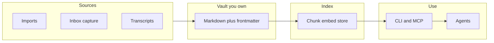

# Knowtation — Whitepaper

**Version:** 1.0 (March 2026)  
**Product:** Knowtation (*know* + *notation*) — personal and team knowledge vault with CLI, optional MCP, indexing, and search.

---

## Abstract

Organizations and individuals keep what they know in many places: chat threads, issue trackers, wikis, inboxes, and model-assisted sessions. The valuable part is rarely the raw storage—it is **how** isolated facts relate: decisions, rationale, and change over time. Large language models amplify what you feed them, but **dumping everything in** is not the same as **pulling the right slice**. Knowtation is built on a different bet: **canonical knowledge lives in files you own** (Markdown, frontmatter, media), is **indexed for retrieval** with filters that respect projects, tags, time, and optional causal structure, and is **callable by any agent** through a small CLI and skill manifest—so your notation stays portable, inspectable, and under your control. This document states the problem that motivates that design, how Knowtation addresses it without claiming to replace full enterprise data platforms, and where the project goes next.

---

## 1. The fragmentation problem

Meaningful knowledge is rarely confined to one system. It is scattered across tools and conversations: what was decided, why an alternative was rejected, what changed last quarter. Each tool holds a slice. **Piecing those together**—so that a question about “why we did X” or “what happened before Y”—still depends heavily on people who were there. When they move on, the records often remain; the **map** of how pieces fit together weakens.

The gap is not lack of data. It is the absence of **shared, durable sense-making** at the layer where work actually happens. Knowtation does not pretend one vault fixes org-wide politics or process. It does offer a **single place you choose** to consolidate notation: imports, captures, transcripts, and notes in one vault with consistent structure—so that sense-making has a stable base instead of living only in ephemeral UI state.

---

## 2. What changes with AI

Assistants and agents need context. Pushing an entire history into a model window is expensive and often **harmful**: superficial resemblance is not relevance; the wrong slice yields confident but incorrect answers. The limiting factor is not only model capability—it is **retrieval**: pulling a **small, high-signal** set of segments that match intent, time, and (where modeled) causality.

Knowtation treats **retrieval as a first-class problem**: semantic search over an index, with CLI controls to limit payload size and scope (`--project`, `--tag`, `--fields`, snippet length, count-only). Optional metadata and filters support **time-bounded** and **chain-aware** queries so the system can grow toward “what led to this?” without pretending the vault is a massive opaque store. See [INTENTION-AND-TEMPORAL.md](./INTENTION-AND-TEMPORAL.md) and [RETRIEVAL-AND-CLI-REFERENCE.md](./RETRIEVAL-AND-CLI-REFERENCE.md).

---

## 3. Storage, retrieval, and authority

**Storage** is necessary but not sufficient. **Authority**—what counts as current—requires habits: dated notes, superseding documents, optional links between notes (`follows`, `causal_chain_id`, entities, episodes). **Retrieval** must combine embedding-based search with structure so that “same keyword, wrong era” does not collapse into one undifferentiated blob.

Knowtation’s approach:

- **Vault as source of truth** — Markdown on disk; editor-agnostic; amenable to version control for audit and rollback ([PROVENANCE-AND-GIT.md](./PROVENANCE-AND-GIT.md)).
- **Index** — Chunks embedded into a vector store (e.g. Qdrant or sqlite-vec); metadata for path, project, tags, dates.
- **CLI** — Same operations for humans and agents; JSON output for pipelines; no lock-in to a single vendor’s chat surface.

Naive “dump and ask” RAG fails on long-horizon, causal questions; Knowtation’s schema and flags are a **practical step** toward structured memory at vault scale—not a claim to solve all enterprise retrieval in one product.

---

## 4. Knowtation’s thesis

1. **Data liberation** — Your vault is yours. Export, copy, and host where policy requires. SPEC §0 and the README state vendor independence explicitly.
2. **Open brain** — Agents discover behavior via `SKILL.md` and invoke `knowtation` (or MCP) without embedding huge tool definitions in every prompt.
3. **Notation over hype** — Value comes from **consistent capture**, **re-indexing after change**, and **queries that match how you organize work**—not from any single model release.

---

## 5. Architecture at a glance

- **Config** — `config/local.yaml`; vault path, embedding provider, vector backend ([SPEC.md](./SPEC.md)).
- **Indexer** — Walk vault, chunk, embed, upsert idempotently.
- **Search / list / get-note** — Ranked results with filters; optional temporal and chain dimensions as implemented.

Full detail: [ARCHITECTURE.md](../ARCHITECTURE.md), [SPEC.md](./SPEC.md).

---

## 6. Who it is for — and who it is not

**For:** Individuals and teams who want **one portable vault**, **agent-callable search**, imports from common tools, transcription pipelines, and optional Hub-style review—without staking organizational memory on a single hosted “interpretation layer” they cannot export.

**Not for:** Replacing ERP, CRM, or company-wide system-of-record mandates. Knowtation is **not** a planet-scale enterprise context platform competing with hyperscaler roadmaps; it is a **grounded tool** for notation, retrieval, and ownership at a scale that matches a repo and a team.

---

## 7. Roadmap and Hub

Core development follows [IMPLEMENTATION-PLAN.md](./IMPLEMENTATION-PLAN.md): CLI, indexer, capture, imports, optional memory and intent attestation (AIR), optional **Knowtation Hub** for hosted vault and proposals. Hub is **convenience**—the file semantics and export path remain the portability story.

---

## 8. Questions to ask before you invest in any knowledge system

1. **Where does your team's real understanding actually get built?** If every team uses a different assistant with no shared corpus, you recreate silos. A vault plus discipline is one way to **centralize notation** while still using any model for reasoning.

2. **Is retrieval improving with use?** Re-index after real edits; use projects, tags, and dates; narrow agent context with `--fields` and filters so each call carries **signal**, not noise.

3. **How hard is it to leave?** If your memory lives only inside a vendor’s opaque graph, migration may be lossy. Markdown, git, and explicit frontmatter keep **exit** defined: copy the folder, re-embed elsewhere, keep meaning in the files.

---

## References (in-repo)

| Document | Role |
|----------|------|
| [SPEC.md](./SPEC.md) | Formats, CLI, config, contracts |
| [IMPLEMENTATION-PLAN.md](./IMPLEMENTATION-PLAN.md) | Phases and deliverables |
| [INTENTION-AND-TEMPORAL.md](./INTENTION-AND-TEMPORAL.md) | Time, causation, hierarchical memory |
| [RETRIEVAL-AND-CLI-REFERENCE.md](./RETRIEVAL-AND-CLI-REFERENCE.md) | Commands, token-aware output |
| [PROVENANCE-AND-GIT.md](./PROVENANCE-AND-GIT.md) | Provenance and version history |
| [AGENT-ORCHESTRATION.md](./AGENT-ORCHESTRATION.md) | MCP and agent workflows |

---

*Knowtation: your notation, your data, your retrieval path.*
